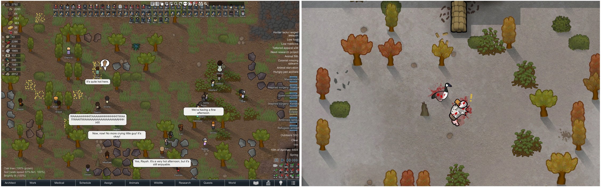
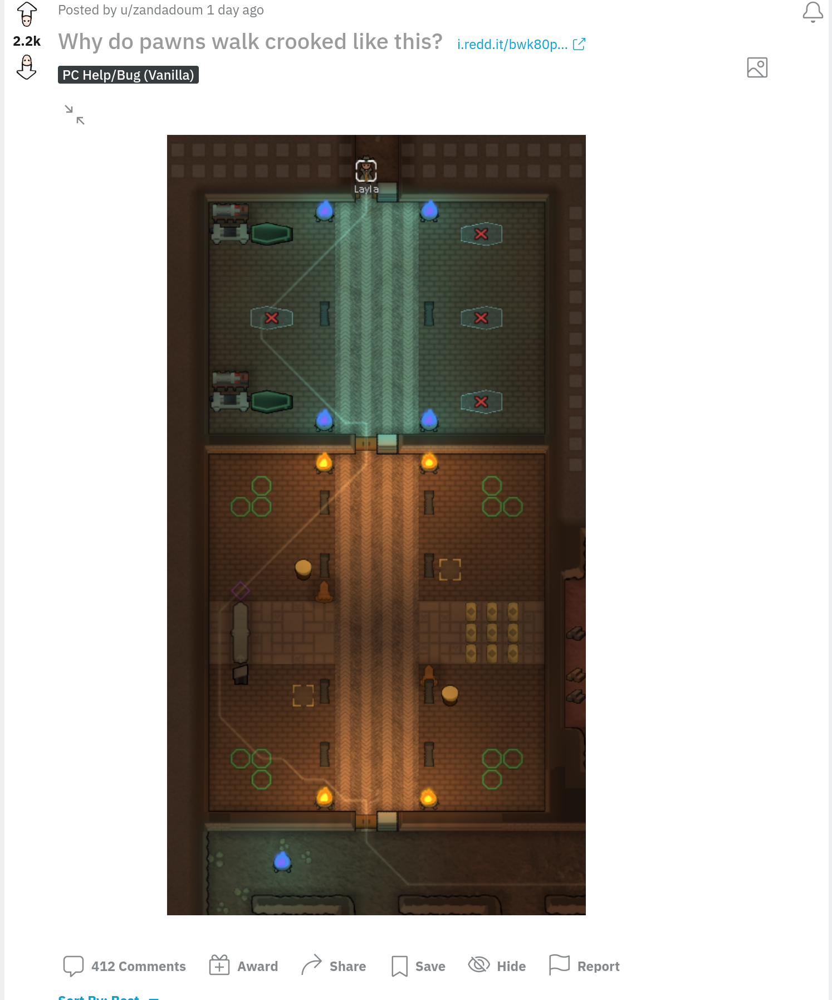
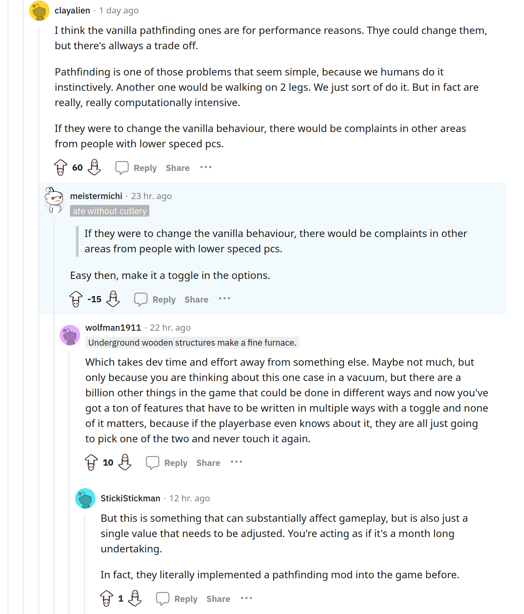
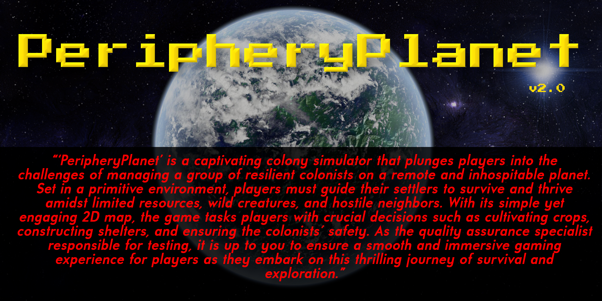
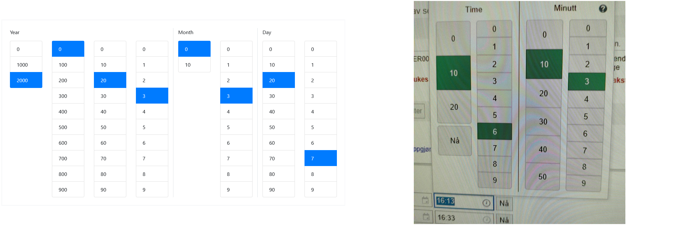
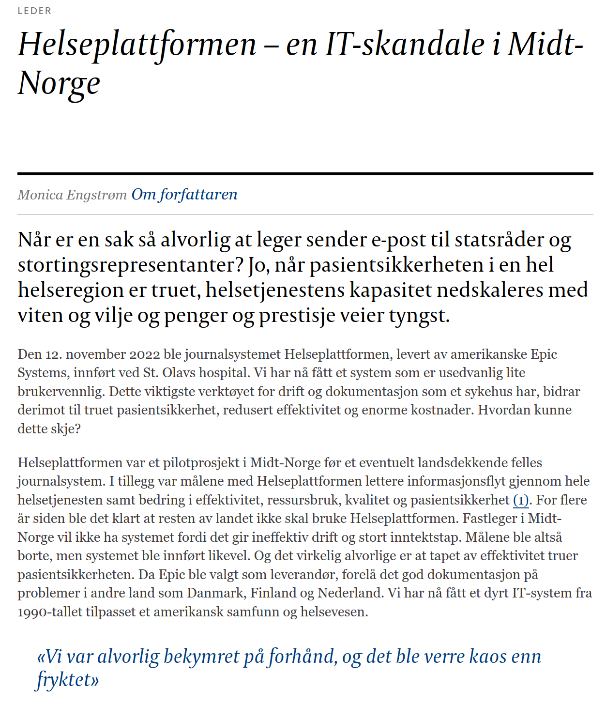
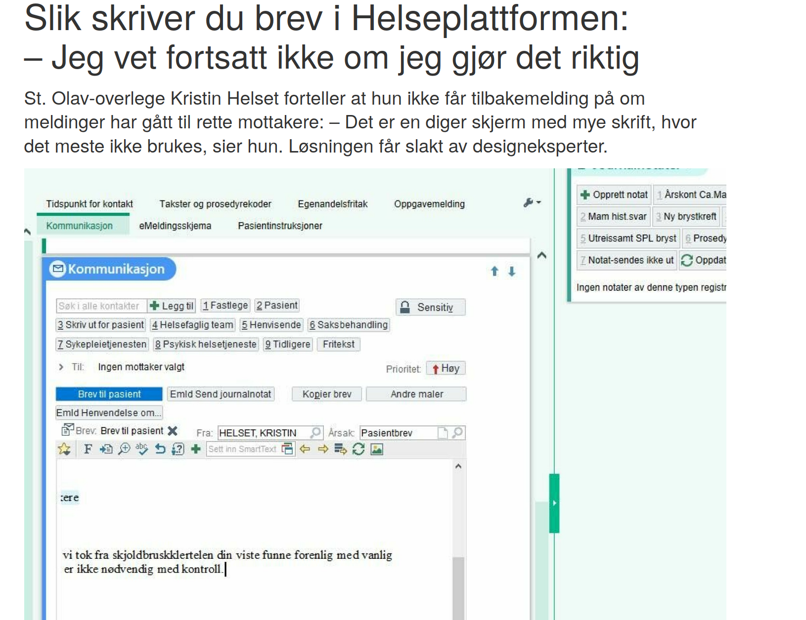
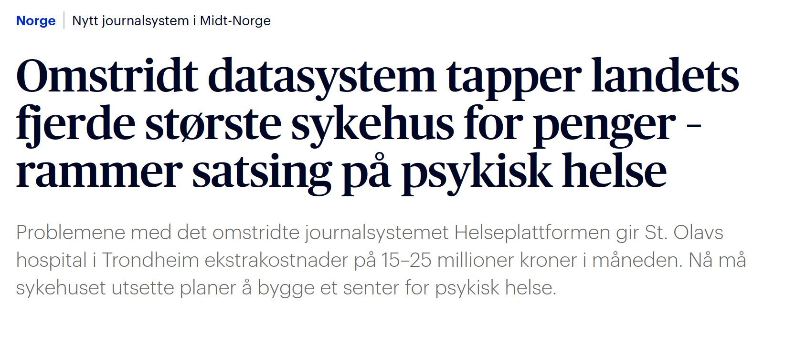

# Eksamen INF112 Våren 2023
## Løsningsforslag / sensorveiledning
**Universitetet i Bergen, Institutt for informatikk**
 
**07.06.2023, 15:00–18:00**

***Se også:** [Eksamen uten løsning](eksamen-23v/eksamen-inf112-23v) – Vedlegg: [Oversikt over pensum](eksamen-23v/oversikt), [Oppsummering av prosjekter](eksamen-23v/presentasjoner)*

 
[[_TOC_]]
 
## Generell info om eksamen
 
> * *Oppgaver:* Oppgavesettet består av 4 oppgaver («Oppgave» 5 og 6 skal ikke besvares).
> * *Besvare deloppgaver:* Hver oppgave har to eller tre deloppgaver + én bonusoppgave. Del opp svaret på oppgavene slik at det er lett å skille de ulike delene av besvarelsen fra hverandre (du står fritt til å bruke feks overskrifter og punktlister om du ønsker det).
> * *Bonusoppgaver:* Hver oppgave har en ekstra deloppgave (merket z). Du kan gjøre disse hvis du har god tid, eller (i praksis) i stedet for andre deloppgaver.
> * *Vekting:* Alle fire oppgavene teller 15% hver, og utgjør til sammen 60%, og prosjektet teller de siste 40% av karaktergrunnlaget. Bonusdeloppgavene gir inntil +3%, men du kan likevel ikke få mer enn totalt 60% på eksamen.
> * *Hjelpemidler:* Alle skrevne og trykte hjelpemidler er tillatt.
> * *Jukselapp:* Blant vedleggene nederst på skjermen finner du følgende fra pensum: pensumoversikten, referat fra gruppepresentasjonene, og Kanban/Scrum boken. Merk: At disse ressursene er vedlagt betyr ikke nødvendigvis at de vil være nyttige for å løse oppgavene. De følger med så du skal slippe å skrive de ut og ta dem med selv.
> * **OBS!** Selv om du har tilgang på hjelpemidler/vedlegg, så betyr ikke det at du kan kopiere svarene derfra – vanlige regler for sitering, plagiat og fusk gjelder fortsatt, og du må skrive hele besvarelsen selv.
> * *Tid:* Bruk gjerne tid i begynnelsen på å få oversikt over alle oppgavene. Selv om oppgavene er vektet likt, vil noen ta lengre tid enn andre. Pass på å ikke svare for mye på noen oppgaver slik at du slipper opp for tid før du er ferdig! Du har kun tre timer til rådighet.
> * *Spørsmål:* Jeg (Anya) stikker innom etter 1–2 timer for å svare på spørsmål om noe er uklart. Les alle oppgavene på forhånd så du vet om du trenger å spørre om noe. Om det er krise kan også eksamensvaktene ta kontakt per telefon.
> * *Uklarheter:* Oppfatter du oppgaven som uklar, oppgi hvilke antagelser du gjør i besvarelsen.
> * *Programkode:* Hvis du føler behov for å legge ved kode, så finner du en Java-editor i «Oppgave» 6. Du kan klippe/lime derfra til den vanlige tekstboksen, eller evt. tydelig henvise til kodevedlegg i «Oppgave» 6.
> 
> 
> **Lykke til!**
> 
> *Anya Helene Bagge*


## 1 – Metodikk (a/b – totalt 15% + bonus)
 
> For semesterprosjektet kunne dere selv velge utviklingsmetodikk (Scrum, Kanban, Lean, XP, osv) og teknikker/praksis (f.eks. parprogrammering, continuous integration, TDD/BDD e.l.) dere ville bruke i prosjektarbeidet.
> 
> 
> 
> **a) [5%]** 
> 
> **Forklar kort hva gruppen din ble enige om å gjøre, og hva dere gjorde i praksis.**
> 
> *(F.eks. «Vi planla å bruke Kanban, men det var vanskelig å følge opp tavlen, så utover i semesteret endte vi opp med å gjøre …». Ca 1 avsnitt.)*

Eksempel: Siden vi ikke hadde tidligere erfaring fra teamprosjekter hadde vi ikke så mye grunnlag for å velge, men vi syntes Scrum virket som en god løsning. I tillegg likte vi ideen om å visualisere fremgangen med en Kanban-tavle, så vi valgte å bruke Trello til det. Vi møttes to ganger i uken, oftere før innleveringene. De første ukene slet vi litt med å venne oss til prosessen, og i praksis «glemte» vi Trello-tavlen, så vi brukte mest issues i GitLab. Det tok også tid å bli vant til å lage issues med overkommelige oppgaver, så vi endte opp med å gjøre mye parprogrammering med en litt løsere form for planlegging.


> **b) [10%]**
> 
> Velg enten Scrum eller Kanban og sammenlikn metodikken med hva gruppen gjorde. **Hvilke av metodikkens retningslinjer fulgte dere / hva gjorde dere annerledes? Hva endte dere opp med å tilpasse eller evt. sløyfe?**
>  
> *(Ca. 1–3 avsnitt.)*

* Nevne og sammenlikne de viktigste punktene for Scrum 
   * Roller: Kanban – velg selv; Scrum – product owner, developers, scrum master
   * Iterasjoner: Kanban – velg selv; Scrum – alltid tidsbegrenset (sprint)
   * Pågående arbeid/work-in-progress: Kanban – alltid begrenset antall; Scrum – kun begrenset av sprint
   * Kanban bruker tavle for å visualisere arbeidsflyt
   * Review
   * Retrospektiv

Eksempel (Scrum): *Daily scrum* var vanskelig å passe inn i studenthverdagen, men vi valgte å begynne de to ukentlige møtene på den måten. Vi planla sprints i begynnelsen, men det var vanskelig å vite hvor mye tid ting ville ta, så det ble mer til at vi fordelte ut arbeidsoppgaver (f.eks. «undersøk lydeffekter i libGDX», «lag en kanin») og delte oss i par som utforsket og laget løsninger i løpet av uken. Så koordinerte vi på neste møte og valgte hvordan vi skulle gå videre. Noen av løsningene droppet vi, andre brukte vi direkte, noen ble tilpasset til hvordan resten av systemet funket, og andre førte til endringer/forbedringer i resten av systemet. I praksis ble det vel litt som enkle, ukentlige «sprints», med kort review og retrospektiv. I motsetning til Scrum hadde vi ikke nødvendigvis planlagt helt konkrete mål eller at man skulle ende opp med en «deliverable», bortsett fra i innleveringsukene.


> **z) [bonus, +3%]**
> 
> Du blir ansatt som INF112 gruppeleder våren 2024. Basert på erfaringene dine og det du har lært, hva slags råd vil du gi 2024-studentene om valg og tilpasning av metodikk? **Skriv 1–3 avsnitt der du forklarer og anbefaler en passende metodikk for en INF112-gruppe.**
> 
> *Svaret skal være skrevet slik at det vil være forståelig for en fersk INF112-student.*

*Her er det selvfølgelig ikke noe enkelt «korrekt» svar. Vi ser etter gjennomtenkte svar som er konsistente med erfaringene (fra oppgavene over, om de er besvart).*

For eksempel:

* Det viktigste i starten er å lære seg å kommunisere godt med de andre teammedlemmene.
* Det tar uansett tid å bli kjent med metodikkene og hvordan man arbeider, så det er kanskje best å lese bøkene og få litt erfaring før man gjør konkrete valg eller bruker veldig mye tid på planlegging eller rollefordeling.
* Kanban-tavle kan være veldig nyttig for å holde oversikten, prøv å bruke det i starten og se om det fungerer bra for dere.
* Alle angrer på at de ikke begynte å teste tidligere.


> ## 2 – Testing (a/b – totalt 15% + bonus)
> 
> 
> 
> Etter studiene har du fått jobb som spillutvikler i et lite selskap. Dere lager en kolonisimulator – *PeripheryPlanet* – der spilleren skal administrere en mengde (ganske hjelpeløse) kolonister som prøver å overleve på en avsidesliggende planet under primitive forhold. Spillet foregår på et relativt enkelt 2D-kart, og kolonistene må dyrke mat, bygge hus, og beskytte seg mot ville dyr og aggressive naboer. Du er ansvarlig for QA (Quality Assurance / testing).
> 
> *Relevante biter av koden til spillet er lagt ved (`HumanColonist.java.pdf`, `PathFindingTest.java`), i tilfelle det hjelper deg å forstå ting bedre – men det er ikke nødvendig å lese koden for å løse oppgavene.*
> 
> **a) [5%]** 
> 
> **Forklar kort** hvilke former for testing (unit testing, etc) spillet bør gjennom før det er klart for salg, og om det er noe du mener er ekstra viktig eller mindre viktig.

*Det er OK å tolke «former for testing» på forskjellige måter, så lenge det er et fornuftig svar på testing før release – vanskelig å gi nok eksempler i spørsmålet til at det er utvetydig uten å liste opp svaret :)*

Spill må testes på samme måte som annen programvare, det vil si:

* Enhetstester (unit testing) – teste hver kodeenhet for seg for å se at den oppfører seg som den skal. Små bugs i én del av koden kan fort gi underlige, vanskelig-å-debugge effekter et helt annet sted, så det lønner seg å bruke tid på enhetstesting, særlig av komponenter som er brukt mange steder.

* Integrasjonstester – teste at kodeenhetene og større komponenter, som kanskje er laget av forskjellige teams, virkelig fungerer sammen. Man må også teste integrasjon mot biblioteker / eksterne komponenter (grafikkbibliotek, Steam client). Ekstra viktig når spillet skal fungere med forskjellige utvidelser (DLC).

* Systemtester – sjekke at hele systemet oppfyllet kravene i designet, både funksjonelle og ikke-funksjonelle krav.

* Akseptansetester – sjekke at spillet er slik kunden/spillerne vil ha det; inkl. alpha- og beta-testing på (potensielle) sluttbrukere.

*Enhetstester er mest sentralt i pensum, integrasjonstester er nevnt en del, system- og akseptansetester er studentene noe mindre kjent med. Svaret bør minst nevne automatiske tester av implementasjonen og at man tester hvordan brukerne opplever spillet. Et godt svar nevner flere relevante ting fra listen over eller under.*

Ting som kan være viktig å teste:

* Brukeropplevelse
* «Spillbarhet» (play testing) – at det er gøy/interessant/utfordrende, at reglene er balanserte osv.
* Sikkerhet – veldig aktuelt for online multiplayer eller for integrasjon med online butikk/tjenester (Steam, PlayStation Store, Nintendo eShop, osv)
* Ytelse – kan være viktig, avhengig av sjanger
* Kompatibilitet – særlig viktig når brukerne har forskjellig maskinvare og operativsystem (spillkonsoller har mindre problemer med det)
* Regresjon – at ikke tidligere bugs dukker opp igjen
* Tilgjengelighet – om det er brukbart for døve, svaksynte, fargeblinde, osv
* Internasjonalisering - er nynorskutgaven like god som bokmål? Inneholder fonten skrifttegnet «ʒ», eller får vi trøbbel med den skoltesamiske oversettelsen?


> **b) [10%]**
> 
> Spillet blir fort veldig populært og blir mye diskutert på sosiale medier. Selv om spillerne generelt er fornøyde, klager de på flere ting i spillet, blant annet at stifinningsalgoritmen er dårlig: kolonistene ser ut til å foretrekke å bevege seg på skrå, og benytter seg ikke av de fine brolagte veiene som spilleren bygger. *(Se vedlagt skjermbilde av Reddit-post (fig.1))*
> 
> Dere mangler dessverre gode tester for stifinning – forrige QA-ansvarlige hadde laget noen tester som satte en spillfigur på kartet, ba den gå til et gitt sted, og deretter sjekket ruten den fulgte, men testene feilet allerede i `@BeforeEach`-metoden hvor spillfiguren ble opprettet (`new HumanColonist(x,y)`):
> 
> ```java
> java.lang.NullPointerException: Cannot invoke "com.badlogic.gdx.Files.internal(String)"
> because "com.badlogic.gdx.Gdx.files" is null
> 	at com.badlogic.gdx.graphics.Texture.<init>(Texture.java:110)
> 	at inf112.peripheryplanet.pawns.HumanColonist.<init>(HumanColonist.java:22)
> 	at inf112.peripheryplanet.test.PathFindingTest.setupBeforeEach(PathFindingTest.java:27)
> ```
> 
> Du skjønner at konstruktøren prøver å laste inn et bilde (og feiler), så du prøver å gi den et tomt bilde i stedet, men da får du en annen (verre?) feilmelding:
> 
> ```java
> java.lang.UnsatisfiedLinkError: 'java.nio.ByteBuffer com.badlogic.gdx.graphics
> .g2d.Gdx2DPixmap.newPixmap(long[], int, int, int)'
> 	at com.badlogic.gdx.graphics.g2d.Gdx2DPixmap.newPixmap(Native Method)
> 	at com.badlogic.gdx.graphics.g2d.Gdx2DPixmap.<init>(Gdx2DPixmap.java:136)
> 	at com.badlogic.gdx.graphics.Pixmap.<init>(Pixmap.java:137)
> 	at com.badlogic.gdx.graphics.Texture.<init>(Texture.java:138)
> 	at inf112.peripheryplanet.pawns.HumanColonist.<init>(HumanColonist.java:21)
> 	at inf112.peripheryplanet.test.PathFindingTest.setupBeforeEach(PathFindingTest.java:27)
> ```
> 
> Siden du prøver å teste stifinning, og ikke grafikken, tenker du det er unødvendig å stresse med å sette opp grafikksystemet og laste inn bilder for å opprette testobjektene. 
> 
> Hvilke løsninger kan du se for å teste stifinning og spillfigurenes oppførsel generelt, på en måte som er uavhengig av grafikksystemet? **Forklar, og nevn gjerne flere muligheter.**
> 
> *OBS! Figuren er bare en illustrasjon, og du trenger ikke løse/finne ut av selve stifinningsproblemet*

Problemet er at koden med spill-logikken (*model* i MVC) er avhengig av grafikksystemet (som hører til *view* i MVC), og når vi kjører enhetstester tester vi per definisjon én kodeenhet (mest mulig) isolert fra resten av systemet (inkl grafikksystemet).

*De fleste gruppene har støtt på akkurat dette problemet, og vi har diskutert det en god del på forelesning og på Discord. Alle løsningene under, med unntak av den siste, burde være kjent. Poeng per nevnte løsning (5) og for kvalitet på forklaringen (5).*

For å løse problemet, kan vi:

* Fortsette med ideen over, og lage en konstruktør for `HumanColonist` som ikke trenger grafikk (f.eks. setter `texture` til `null`)
* Redesigne til MVC-arkitektur, slik at `HumanColonist` ikke lengre vil være koblet til og avhengig av grafikken. (Kanskje en god idé å gjøre uansett)
* Bruke Mockito eller et liknende bibliotek til å «mocke» grafikksystemet
* Bruke en «headless» utgave av grafikksystemet (en «ferdig-mocket» backend som ikke tegner på skjermen)
* For akkurat denne testen, men ikke for andre tester av `HumanColonist`-oppførsel: Innse at stifinningen er implementert i `PathFinder`/`PathFinderImpl`, og at det kanskje er bedre å teste algoritmen direkte med en enhetstest for `PathFinder`. (Kanskje en god idé å gjøre uansett)


> 
> 
> **z)  [bonus, +3%]**
> 
> Brukerne fortsetter å klage på dårlig stifinning, og på Reddit blir det fremmet krav om at *PeripheryPlanet* bør ha valgfri stifinningsalgoritme: den vanlige/dårlige, som er laget for å kjøre raskt, og en som gir perfekt resultat, men gjør spillet tregere. Da blir alle fornøyde – de med eldre datamaskin kan fortsatt spille, mens de med ny, kraftig datamaskin kan nyte bedre stifinning. *(Se vedlagt skjermbilde av Reddit-kommentarer (fig.2))*
> 
> Sjefen din synes dette er en genial idé, og foreslår at spille utvides med et helt sett av forskjellige konfigurerbare valgmuligheter for spillfigurenes oppførsel. Du tenker at det kanskje vil gjøre jobben din vanskeligere. **Hvorfor kan dette være problematisk for kvalitetssikringen? Er det noe spesielt du bør passe på – eventuelt, noe som kan gjøre jobben lettere? Forklar.**

Hver kombinasjon av valgmuligheter gir oss (i prinsippet) en ny utgave av spillet, som krever egne tester på integrasjon-/system-nivå. Dette er ikke nødvendigvis et problem – det er kanskje ikke alle endringer som har effekt på andre deler av systemet, eller vi kan kanskje leve med at spillet fungerer dårligere/annerledes hvis brukeren gjør ikke-standard valg. I beste fall må vi teste (og implementere) hver ny valgmulighet, i verste fall må vi teste *hver kombinasjon* av *alle valgmuligheter*.

For stifinningen sin del er det kanskje andre ting som er avhengig av at den fungerer slik den gjør nå – kanskje vi har implementert fancy jakt/flukt-oppførsel for rovdyr og byttedyr som er avhengig av sikksakk-bevegelsene, og så blir balansen i økosystemet ødelagt.

(Merk at hvis vi følger [LSP](https://en.wikipedia.org/wiki/Liskov_substitution_principle) må alle forskjellige implementasjoner/subtyper (f.eks. FastPathFinder, SmartPathFinder) av et interface/supertype (PathFinder) oppfylle kontrakten i interfacet, og altså være «like gode» å bruke der vi ber om noe av interface-typen. Hvis noen deler av programmet er avhengig av en spesifikk implementasjon, så har vi et design-problem i tillegg til et teste-problem. Enten har vi ikke spesifisert grensesnittet godt nok, eller så er en eller fler av implementasjonene feil ift. grensesnittet, eller så har vi en uheldig kobling til implementasjonsdetaljer som «lekker» gjennom grensesnittet, eller så har vi rett og slett ikke dokumentert at oppførselen til f.eks. rovdyr er avhengig av hvilken implementasjon av PathFinder vi bruker. Det er ikke egentlig noe problem å si at PathFinder finner en vilkårlig [A*](https://en.wikipedia.org/wiki/A*_search_algorithm) rute fra A til B, men spillerne kan selvfølgelig ha rimelig sterke meninger om hvilke rutevalg som er «fornuftige» selv når alle alternativene er like «optimale».)

*Inntil 2 poeng: Nevne/forklare problemet med mange kombinasjoner av oppførsel ; for 3 poeng, nevn/reflekter også over effekten av 

> *(Vedlegg: `HumanColonist.java.pdf`, `PathFindingTest.java`)*
> 


## 3 – Programmering og Design Patterns (a/b/c – totalt 15% + bonus)

<!-- https://www.deviantart.com/xanindigo/art/Stock-Earth-like-planet-361762442 
https://www.deviantart.com/danielmathews/art/Starfield-Nebula-326638887 -->

> La oss titte litt mer på implementasjonen av *PeripheryPlanet*.
> 
> **a) [5%]**
> 
> Se på grensesnittet `PathFinder.java` i vedlegget. Stifinning skjer ved å lage et `PathFinder`-objekt, kalle forskjellige metoder og så kalle `calculate()`. Hvorfor tror du det er gjort slik? Ville det ikke vært bedre å bare ha en `pathFind()` metode som returnerer stien direkte, i stedet for å gå via et eget `PathFinder`-objekt? **Forklar.**
> 
> Kjenner du igjen denne teknikken som en *design pattern* (mønster)? I såfall, **hva heter mønsteret?**

Fordelen med å gjøre det slik er at det går an spesifisere bare noen av innstillingene til stifinneren, og la resten ha default verdier (f.eks.: start på A, gå til B – eller start på A, gå via B, C og D til E, og velg den korteste veien). I Python kunne vi gjort dette med keyword parameters, men i Java er argumentene alltid basert på posisjon, og man må alltid inkludere alle.

Dvs.:
* Vi kan velge å ha med noen eller alle parametrene
* Det er tydelig i koden hvilken verdi som hører til hver parameter (nevnes ved navn, ikke ved posisjon – se *Connascence of Position* i *Agile*-boken)
* Det er lett å finne frem i IDE-en, siden den (antakelig) vil foreslå lovlige muligheter for hver `.` (en del IDE-er kan også gi hjelp med parameternavn i en lang argumentliste, men støtte for dette er som regel dårligere)
* Det er mulig at den ferdig konfigurerte stifinneren kan gjenbrukes flere ganger (litt avhengig av hvordan vi gjør det – grensesnittet er litt tvetydig her på om man kan kalle `calculate` flere ganger og med forskjellig `to` og `from`)

Teknikken med å lage lange [kjeder av metoder](https://en.wikipedia.org/wiki/Method_chaining) kalles gjerne [*fluent interface*](https://en.wikipedia.org/wiki/Fluent_interface). [Builder pattern](https://en.wikipedia.org/wiki/Builder_pattern) bruker denne teknikken til å lage et objekt (typisk ved at det siste metodekallet er til en metode som heter `build()`, `done()`, `getResult()` e.l.). `PathFinder` fungerer liknende til dette.


> **b) [5%]**
> 
> Design-teamet vil gjerne gjøre oppførselen til kolonistene og de andre spillfigurene (*«pawns»*) litt mer variert og interessant, og trenger en mer fleksibel utgave av stifinningen. De vil gjerne…
> 
> * at forskjellige typer pawns kan ha litt forskjellige regler for hvordan de beveger seg. F.eks., fugler kan fly og blir ikke hindret av sperringer; ender kan svømme og blir ikke hindret av vann; smådyr er sky og vil holde seg unna mennesker; barn er redde for mørke kroker osv.
> * at ting som man har på seg også kan utgjøre en forskjell – f.eks., hvis man har rulleskøyter, så kan man bevege seg ekstra raskt, men bare på asfaltert vei
> 
> Dette burde kunne ordnes ved (blant annet) å justere kostnadene i stifinningsalgoritmen. F.eks., «rulleskøyter på vei» har 25% av kostnaden til «vasse i bekken», så da vil spillfigurene foretrekke veien med lavest kostnad. Design-teamet har foreslått en endring til `PathFinderImpl.java` (se vedlegg) som gjør dette, men koden ble ganske rotete (se forskjell på OLD og NEW `calculateCostForMapCell`).
> 
> Du titter på koden og ser raskt at dette bryter med alt du har lært i INF112, blant annet om SOLID-prinsippene. **Hvilke(t) SOLID-prinsipp(er) tenker du blir brutt i den nye `calculateCostForMapCell`? Forklar.**

Bruken av `if(a instanceof C) … else if(a instanceof D) …` er et typisk rødt flagg for dårlig kode som bryter med vanlige designprinsipper. I de aller fleste tilfeller vil vi skille mellom forskjellige typer objekter (i samme typehierarki) ved å kalle en metode, slik at korrekt funksjonalitet blir valgt ved kjøretid basert på den konkrete klassen til objektet. Det kan av og til være nødvendig å bruke `instanceof`, men det er sjelden, og denne typen `if`/`else if`/`else if` er nesten aldri en god idé.

SOLID-prinsippene:
* *The Single-responsibility principle: "There should never be more than one reason for a class to change."* – brytes grovt: her må vi endre `PathFinderImpl` ikke bare for å gjøre endringer i algoritmen, men også for endringer i forskjellige typer `Pawn`s. Hvis du skal endre oppførselen til `Cat`, eller legge til ett nytt dyr som flyr (f.eks. `Bat`) er det neppe opplagt at du kanskje også må gjøre endringer i `PathFinderImpl`.
* *The Open–closed principle: "Software entities ... should be open for extension, but closed for modification."* – dette er kanskje ikke helt direkte aktuelt her, men bruken av `instanceof`-tester gjør oss litt mer lukket for utvidelser (du kan ikke f.eks. legge til en ny type fottøy bare ved å utvide et `FootWear`-interface, du må også endre koden i `calculateCostForMapCell`) og litt mer åpen for endring (du kan f.eks. endre oppførselen til `Dodo` uten å endre `Dodo`-klassen) enn det som er ideelt.
* *The Liskov substitution principle (LSP): "Functions that use pointers or references to base classes must be able to use objects of derived classes without knowing it."* – ikke så veldig aktuelt her, men bruken av `instanceof` for å velge funksjonalitet gjør forsåvidt at vi lett kan komme til å bryte LSP. For eksempel, `Penguin extends Bird`, så `penguin instanceof Bird`, men pingviner kan ikke fly. Med mindre vi legger til et spesialtilfelle for `Penguin` slik vi har gjort for `Dodo`, har vi et tilfelle av en `Bird` som ikke kan brukes korrekt som `Bird`. (Vanligvis bryter man LSP ved at en overstyrt metode i subklassen bryter kontrakten til metoden i superklassen/interfacet – men denne metoden er allerede dårlig designet, så da får vi lett ekstra designproblemer.)
* *The Interface segregation principle: "Clients should not be forced to depend upon interfaces that they do not use."* – ikke så veldig aktuelt her, bortsett fra at vi har gjort oss avhengige av `Pawn`, selv om vi egentlig bare er avhengig av "hvordan kan denne tingen bevege seg" – kunne vært et mer begrensett grensesnitt, som `PawnMovementRules` eller `WalkStrategy`. 
* *The Dependency inversion principle: "Depend upon abstractions, [not] concretions."* – også et grovt brudd. Det er flere typiske røde flagg her: vi bruker navn på (formodentlig) konkrete klasser direkte (`Dodo`, `Cat`, `RollerSkates` osv); selv om vi hadde *bare* brukt interfaces, så har vi koblet oss til en hel mengde forskjellige typer, i stedet for å forholde oss til bare de relevante høynivå abstraksjonene: I dette tilfellet er det f.eks. `Pawn` og `Terrain` – vi kan ha forskjellig kostnad basert på disse, men vi burde ikke måtte forholde oss til alle de forskjellige (lavere nivå, mer konkrete) typene som utvider/implementerer `Pawn` og `Terrain`.

*Viktigst å nevne single responsibilty og dependency inversion og forklare **hvorfor**, men poeng også for **relevant** omtale av de andre*

> **c) [5%]**
> 
> Hva ville vært en bedre løsning for å justere oppførselen til stifinneren avhengig av figuren som beveger seg? Finnes det design patterns som passer for dette, eller har du sett liknende problemer tidligere? **Skissér en løsning.** Du kan vise kode hvis det gjør det lettere å forkare, men det er ikke nødvendig.

Vi har en stifinner med implementasjon av algoritme (`PathFinder`) og flere forskjellige figurer (`Pawn`s, f.eks. `HumanColonist`, `GigaMoose`), og algoritmen skal være litt forskjellig avhengig av figuren. Vi kan løse dette ved å gi en `Pawn` (eller annet objekt med informasjon om hvordan en figur kan bevege seg – kanskje `PawnMovementRules` eller `WalkStrategy`?) som argument til stifinneren. Stifinneren kan så kalle en metode for å finne kostnaden for et spesifikt felt.

Dette er samme teknikk som i [*strategy pattern*](https://refactoring.guru/design-patterns/strategy), og er også et veldig enkelt eksempel på [*dependency injection*](https://en.wikipedia.org/wiki/Dependency_injection): `PathFinder` er «avhengig» av noe av `Pawn`-oppførselen – f.eks. hvor stor kostnad forskjellig kart-felter har – vi «injiserer» denne varierende oppførselen (strategien) som et objekt. 

Et liknende problem er hvordan elementer skal sammenliknes når vi sorterer: *forlengs? baklengs? etternavn først? skal `"Aanderaa"` sorteres under `"Å"` eller `"Aa"`?* Løsningen her er å bruke et `Comparator`-objekt til å styre oppførselen til `sort()`-metoden.

*Poeng for: løsning der kostnadsutregningen er skilt fra algoritmen og sendt inn som objekt (inntil 3 poeng); 1 poeng for å relatere til noe man har sett før; 1 poeng for å nevne strategy, dependency injection e.l.*


> **z) [bonus, +3%]**
> 
> Spillet ser ut til å lagre kartet som et vanlig Java hash map indeksert med 2D-vektorer – `Map<Vector2,MapElement>`.
> 
> * `Vector2`-klassen (fra `com.badlogic.gdx.math`) er *muterbar*, dvs. feltvariablene kan endres etter at objektet er opprettet. Kan det skape problemer slik som kartet er representert? **Forklar kort**
> 
> * Ville du valgt et annet API for kartet om du kunne velge? **Forklar kort**

Et HashMap gjør oppslag basert på hash-koden (`obj.hashCode()`) til nøklene. Hvis verdien til nøkkelen endrer seg, endrer hash-koden seg, og da vil hashtabellen ikke finne kartelementet. (F.eks., hvis `pos` er *(2,3)* og vi gjør `map.put(pos, elt)`, så er kanskje `pos` lagret på indeks 11 i hashtabellen. Hvis vi deretter endrer `pos` til *(3,3)*, og gjør et oppslag på *(2,3)*, så vil hashtabellen sjekke indeks 11, finne `pos` som nå er *(3,3)* og ikke *(2,3)*, og oppslaget feiler. Tilsvarende vil gjelde for TreeMap eller andre datastrukturer som bruker en spesiell ordning av nøklene – hvis nøklene endres er ordningen ikke lenger riktig.)

Siden kartet formodentlig er en ganske sentral ting i spillet, er det antakelig noe som fortjener sin egen abstraksjon – f.eks `GameMap` (for å unngå forvirring med Javas `Map`), hvor `get()`/`set()` tar `(x,y)` parametre, og ikke bare `Vector2`, og hvor det kanskje er mulighet for å lettvint håndtere terreng, bygninger, flere ting på samme posisjon, osv. Kanskje også med innebygget (eller metoder som gir tilgang til) stifinning, søk osv. Alternativt kan man lage en mer generell 2D-datastruktur, eventuelt som basis for GameMap.

(Éndimensjonale datastrukturer er dårlig egnet – enten ender man opp med `MapElement[]`/`List<MapElement>` og må regne ut index (`i = x + y * w`) for hver access, eller så lager man den «flerdimensjonal» ved nøsting: `MapElement[][]`/`List<List<MapElement>>` – gir trøbbel ved initialisering, ingen garanti for at alle rader er like lange, og (for `List`-varianten) litt klønete bruk (`map.get(x).get(y)`).

*Maks 5 poeng – inntil 3 poeng for å påpeke feil med muterbar nøkkel, inntil 3 for å anbefale egen kart-abstraksjon og/eller 2D-abstraksjon*

> *(Vedlegg: `PathFinder.java`, `PathFinderImpl.java`, `MapCell.java`)*
> 
> ## 4 – Helseproblemer (a/b – totalt 15% + bonus)
> 
> 
> 
> Helse Midt-Norge har siden 2015 jobbet med å få på plass et nytt, felles pasientjournalsystem, pasientadministrasjon og helseportal for innbyggerne i Midt-Norge (ca. 700000 innbyggere). Arbeidet ledes av *Helseplattformen AS*, et offentlig eiet selskap med ca. 320 ansatte. I 2019 signerte de kontrakt med det amerikanske selskapet *Epic Systems* som utvilker journalsystemet som er basis for Helseplattformen. Epics system dekker 78% av amerikanske pasienter – systemene deres er også innført i andre land, bla. Danmark og Finland, med varierende hell. Selv om Epic har laget den underliggende teknologien, har Helseplattformen selv gjort betydelig utviklingsarbeide for å tilpasse til norske forhold og brukere: *«​På Epics «foundation system», som er plattformen med alt det grunnleggende innholdet i journalløsningen, er det bygd et stort antall applikasjoner og integrasjoner etter spesifikasjoner fra helsetjenesten i regionen.» (Fra helseplattformen.no)*
> 
> Helseplattformen har skapt en god del avisoverskrifter i løpet av våren (se diverse avisklipp under). Opprinnelig budsjett for innføringen var på ca. 3,3 mrd NOK (hvorav 1,2 mrd til Epic) – men hittil er det brukt over 4 mrd kroner, uten at innføringen er ferdig. St. Olavs hospital i Trondheim har ekstrakostnader på 25 millioner i uken og må kutte i psykisk helse.
> 
> Helsepersonell klager på at systemet er tungrodd og vanskelig å bruke:
> 
> * Viktige henvisninger, blant annet for kreftpasienter, har ikke blitt sendt fordi legene ikke har skjønt meldingssystemet. Helseplattformens nå avgåtte direktør skyldte på «brukerfeil».
> * Pasienter har fått feile medisiner eller feil dose
> * En pasient er død av slag etter feil i journalføring
> * Helsepersonell blir slitne, stresset og har lettere for å gjøre feil
> 
> *(Systemet har også sine styrker – bla. med analyse av helsedata, og nyttige funksjoner som å advare om et nytt legemiddel til en pasient er i konflikt eksisterende medisiner eller sykehistorie. Dette er noe legene har måttet gjøre manuelt tidligere.)*
> 
> **a) [7%]**
> 
> Bildet øverst viser brukergrensesnittet for å velge dato og klokkeslett (dato: 2000+0+20+3, 0+3, 20+7 → 2023-03-27; tid: 10+6, 10+3 → 16:13).
> 
> Hvis du tenker tilbake på hva du har lært om å utarbeide krav, spesifikasjon, brukerhistorier, akseptansekriterier, arbeidsoppgaver osv. – **WTF??** Hva kan ha gått galt i utviklingsprosessen til dato/tid-velgeren? **Forklar kort.**
> 
> *(For akkurat denne oppgaven kan du dette ikke er den foretrukne måten å håndtere dato/tid på for helsepersonell i Midt-Norge.)*


> **b) [8%]**
> 
> Helseplattformen bygger på et anerkjent, ferdig utviklet system, støttet av tusenvis av utviklere (Epic har 10000 ansatte). Helseplattformen AS har ca. 320 ansatte som har jobbet med prosjektet gjennom flere år, i samarbeid med hundrevis av fageksperter (både medisinsk, administrativt og IT-faglig) fra helseforetakene og kommunene (se sitat under – *Slik taes beslutninger i felleskap*). De har laget kravspesifikasjon, hatt ukentlige møter med faglig ledergruppe, og et budsjett på flere milliarder kroner. Likevel har de støtt på store problemer når systemet skulle taes i bruk.
> 
> Som programvareutvikler, hva slags råd ville du gitt til helseforetak som skal utvikle/anskaffe liknende systemer? Hva tenker du er viktigst å legge vekt på i utviklingsprosessen? **Forklar kort.**


> **z) [bonus, +3%]**
> 
> Hva tenker du selv om gjennomføring av store IT-prosjekter i samfunnet? Er det umulig å gjøre en god jobb, eller kommer problemene av dårlige avgjørelser? Kunne INF112-kullet våren 2023 gjort en bedre jobb? **Forklar kort hva du selv mener.**


(Det viktigste er ikke å unngå å gjøre feil, men å planlegge godt for å redusere feil, og håndtere feilene man definitivt kommer til å gjøre. Helseplattformen svikter både med at brev ikke kommer frem uten at noen oppdager det, og at ledelsen svarer “det er brukerfeil” når noe går galt.)


> ### Vedlegg
> 
> *Vedleggene er bare til illustrasjon, det er ikke nødvendig å studere dem nøye. Avisklippene lenker til sakene.*
> 
> Sitat fra Helseplattformen.no → Om Oss → Prosjektet:
> 
> > ​Slik taes beslutninger i fellesskap 
> 
> > Det er helsepersonell som tar beslutninger om utviklingen av journalløsningen. En faglig beslutningsstruktur er etablert for å ta felles beslutninger om hvordan løsningen skal settes opp og brukes. Her har over 400 fageksperter deltatt fra alle fagområder i helsetjenesten. Over 220 fageksperter har vært involvert fra mer enn 20 kommuner, de fleste fra Trondheim kommune. Fra helseforetakene er det enda flere, med overvekt fra St.Olavs hospital.
> 
> > De fleste fagekspertene er helsepersonell, men det er også egne team for data og IKT, administrative oppgaver og så videre. Den faglige beslutningsstrukturen fatter faglige beslutninger som berører helse, data og teknlogiske problemstillinger i løsningen.
> 
> > Det samme prinsippet ble brukt i anskaffelsesprosjektet, der helsepersonell fra hele regionen deltok i arbeidet med kravspesifikasjon og evaluering av tilbud i konkurransen om å levere journalløsningen.
> 
> > Det fagekspertene ikke har blitt enige om, det som ligger utenfor mandatet og beslutninger som vil utløse store endringer eller kostnader,  løftes videre til Felles beslutningsgruppe. Dette er en faglig ledergruppe med ukentlige møter, der alle organisasjonene som skal ta i bruk løsningen er representert. Denne strukturen skal bestå også etter innføring slik at videreutvikling av løsningen bestemmes i fellesskapet.​
> 
> > I den faglige beslutningsstrukturen inngår også flere råd som er oppnevnt av Felles beslutningsgruppe. 
> 
> [](https://www.dagensmedisin.no/helseplattformen-legevakt-trondheim-kommune/helseplattformens-versjon-av-klokka-hvis-du-ikke-skjonner-det-er-det-vel-en-brukerfeil/555796)
> 
> [](https://tidsskriftet.no/2023/01/leder/helseplattformen-en-it-skandale-i-midt-norge)
> [](https://www.nrk.no/trondelag/direktor-for-helseplattformen-skylder-pa-brukerne-for-at-16.000-brev-ikke-kom-dit-de-skulle-1.16327273)
> [](https://www.dagensmedisin.no/epic-helseplattformen-st-olavs-hospital/slik-skriver-du-brev-i-helseplattformen-jeg-vet-fortsatt-ikke-om-jeg-gjor-det-riktig/555068)
> [](https://www.vi.no/helse/vi-har-opplevd-at-pasienter-har-fatt-medisiner-det-ikke-er-ment-at-de-skal-ha/78247922)
> [](https://www.aftenposten.no/norge/i/WRdoa2/omstridt-datasystem-tapper-landets-fjerde-stoerste-sykehus-for-penger-rammer-satsing-paa-psykisk-helse)
> [](https://www.nrk.no/trondelag/pasient-ved-st.-olavs-hospital-dode-av-slag_-fylkeslege-kobler-dodsfallet-til-helseplattformen-1.16256179)
> [](https://www.nrk.no/norge/datasystem-pa-sykehus-er-utskjelt-i-danmark_-skal-innfores-i-norge-1.14440929)
> [](https://helvetesplattformen.no/)
> 
> 
> ## Kodevedlegg til oppgave 2 og 3
> ### HumanColonist.java
> 
> ```java
> package inf112.peripheryplanet.pawns;
> 
> import java.util.List;
> import java.util.Map;
> 
> import com.badlogic.gdx.Gdx;
> import com.badlogic.gdx.graphics.Pixmap;
> import com.badlogic.gdx.graphics.Pixmap.Format;
> import com.badlogic.gdx.graphics.Texture;
> import com.badlogic.gdx.graphics.g2d.SpriteBatch;
> import com.badlogic.gdx.math.Vector2;
> 
> import inf112.peripheryplanet.map.MapCell;
> import inf112.peripheryplanet.map.PathFinder;
> 
> public class HumanColonist implements Pawn {
> 	private Texture image;
> 	private Vector2 position;
> 	private Vector2 target;
> 
> 	public HumanColonist(int x, int y) {
> 		this.position = new Vector2(x, y);
> 		//this.image = new Texture("colonist.png");
> 		this.image = new Texture(100, 100, Format.RGB888);
> 	}
> 
> 	public void setTarget(int destX, int destY) {
> 		target = new Vector2(destX, destY);
> 	}
> 
> 	public void step(Map<Vector2,MapCell> world) { // do single timestep
> 		if (target != null) {
> 			if (position.equals(target)) { // are we there yet?
> 				target = null; // yes!
> 			} else {
> 				List<Vector2> path = PathFinder.finder(world).from(position).to(target).calculate();
> 				if (path != null) {
> 					// take one step & update map
> 					world.get(position).pawn(null);
> 					position = path.remove(0);
> 					world.get(position).pawn(this);
> 				} else {
> 					// ??? target is unreachable
> 				}
> 			}
> 		}
> 		// ... or do something else
> 	}
> 
> 	public void draw(SpriteBatch batch) {
> 		batch.draw(image, position.x, position.y);
> 	}
> 
> 	public Vector2 position() {
> 		return position;
> 	}
> }
> 
> ```
> 
> ### PathFindingTest.java
> 
> ```java
> package inf112.peripheryplanet.test;
> 
> import static org.junit.jupiter.api.Assertions.assertEquals;
> 
> import java.util.HashMap;
> import java.util.List;
> import java.util.Map;
> 
> import org.junit.jupiter.api.BeforeEach;
> import org.junit.jupiter.api.Test;
> 
> import com.badlogic.gdx.math.Vector2;
> 
> import inf112.peripheryplanet.pawns.HumanColonist;
> import inf112.peripheryplanet.pawns.Pawn;
> 
> 
> public class PathFindingTest {
> 
> 	private HumanColonist player;
> 	private List<Vector2> correctPath = List.of(new Vector2(2, 2), 
> 			new Vector2(2, 3), new Vector2(2, 4), new Vector2(3, 5));
> 	private Map<Vector2,Pawn> world;
> 
> 	@BeforeEach
> 	void setupBeforeEach() {
> 		player = new HumanColonist(2, 2);
> 		world = new HashMap<>();
> 		world.put(player.position(), player);
> 	}
> 	
> 	@Test
> 	void testPathFinding() {
> 		player.setTarget(3, 5);
> 		for(Vector2 step : correctPath) {
> 			assertEquals(step, player.position());
> 			player.step(world);
> 		}
> 	}
> }
> 
> ```
> 
> ### PathFinder.java
> 
> ```java
> package inf112.peripheryplanet.map;
> 
> import java.util.List;
> import java.util.Map;
> 
> import com.badlogic.gdx.math.Polygon;
> import com.badlogic.gdx.math.Vector2;
> 
> public interface PathFinder {
> 
> 	/** create a new path finder */
> 	static PathFinder finder(Map<Vector2, MapCell> map) {
> 		return new PathFinderBaseImpl(map);
> 	}
> 
> 	/** where to start from */
> 	PathFinder from(Vector2 pos);
> 
> 	/** where we want to go to */
> 	PathFinder to(Vector2 pos);
> 
> 	/**
> 	 * a waypoint we want to include in the path (can be given multiple times)
> 	 */
> 	PathFinder via(Vector2 pos);
> 
> 	/**
> 	 * a (dangerous?) area we should avoid (can be given multiple times)
> 	 */
> 	PathFinder avoid(Polygon area);
> 
> 	/** prefer the shortest path */
> 	PathFinder shortest();
> 
> 	/** prefer the safest path */
> 	PathFinder safest();
> 
> 	/** prefer the fastest path */
> 	PathFinder fastest();
> 
> 	/**
> 	 * calculate and return the path (null if destination is unreachable)
> 	 */
> 	List<Vector2> calculate();
> }
> ```
> 
> ### PathFinderImpl.java
> 
> ```java
> package inf112.peripheryplanet.map;
> 
> import java.util.ArrayList;
> import java.util.List;
> import java.util.Map;
> 
> import com.badlogic.gdx.math.Vector2;
> 
> import inf112.peripheryplanet.pawns.Bird;
> import inf112.peripheryplanet.pawns.Cat;
> import inf112.peripheryplanet.pawns.Dodo;
> import inf112.peripheryplanet.pawns.Duck;
> import inf112.peripheryplanet.pawns.Pawn;
> 
> // pathfinder algorithm implemented here
> public class PathFinderImpl extends PathFinderBaseImpl implements PathFinder {
> 	public PathFinderImpl(Map<Vector2, MapCell> map) {
> 		super(map);
> 	}
> 
> 	// OLD: pathfinder will prefer cells with *low* cost
> 	protected double calculateCostForMapCell(MapCell mapCell) {
> 		if(mapCell == null)
> 			return 1; // default cost
> 		else if(mapCell.pawn() != null)
> 			return Double.POSITIVE_INFINITY; // already occupied
> 		else
> 			return mapCell.terrain().movementCost();
> 	}
> 
> 	// NEW: pathfinder will prefer cells with *low* cost
> 	protected double calculateCostForMapCell(MapCell mapCell, Pawn pawn) {
> 		if(mapCell == null)
> 			return 1; // default cost
> 		else if(pawn instanceof Bird && !(pawn instanceof Dodo))
> 			return 1; // birds (except dodos) can fly, ignore terrain
> 		else if(mapCell.pawn() != null && !(pawn instanceof Cat)) // cats can sneak past other pawns
> 			return Double.POSITIVE_INFINITY; // already occupied
> 		else if(mapCell.terrain() instanceof Water && pawn instanceof Duck) // can swim
> 			return 1;
> 		else if(pawn.footwear() instanceof RollerSkates && mapCell.terrain() instanceof Paved)
> 			// roller skates are extra fast on paved terrain
> 			return mapCell.terrain().movementCost() / 2;
> 		else
> 			return mapCell.terrain().movementCost();
> 	}
> 
> 	protected List<Vector2> calculatePath() {
> 		List<Vector2> result = new ArrayList<>();
> 		// …
> 		return result;
> 	}
> 
> }
> 
> ```
> 
> ### MapCell.java
> 
> ```java
> package inf112.peripheryplanet.map;
> 
> import java.util.List;
> 
> import inf112.peripheryplanet.pawns.Pawn;
> import inf112.peripheryplanet.terrain.Terrain;
> 
> public interface MapCell {
> 	/** terrain at this location (determines movement cost) */
> 	Terrain terrain();
> 
> 	/**
> 	 * the pawn (colonist, animal, etc) currently at this location (only one
> 	 * allowed!)
> 	 */
> 	Pawn pawn();
> 
> 	/**
> 	 * replace the pawn (colonist, animal, etc) currently at this location (only one
> 	 * allowed!)
> 	 */
> 	Pawn pawn(Pawn newPawn);
> 
> 	/** other items at this location (latest added first) */
> 	List<MapElement> items();
> 
> }
> 
> ```
> 
