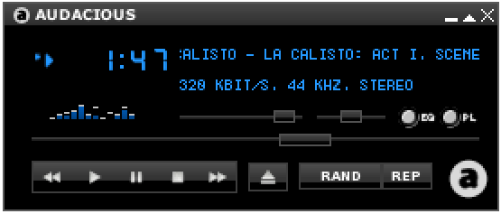

# Eksamen INF112 Høsten 2024

**Universitetet i Bergen, Institutt for informatikk**

**23.09.2024, 09:00–12:00**

<div class="">
<fieldset>
<legend>Variant</legend>
<input type="radio" name="variant" id="uten-svar" ></input> <label for="uten-svar">Kun oppgave</label>
<input type="radio" name="variant" id="med-svar" checked="true"></input> <label for="med-svar">Med løsningsforslag/sensorveiledning</label>
</fieldset>
<fieldset>
<legend>Målform</legend>
<input type="radio" name="lang" id="lang-nbnn" checked="true"></input> <label for="lang-nbnn">Begge</label>
<input type="radio" name="lang" id="lang-nb"></input> <label for="lang-nb">Bokmål</label>
<input type="radio" name="lang" id="lang-nn"></input> <label for="lang-nn">Nynorsk</label>
</fieldset>

<div class="    ">

## Generell info om eksamen

<div class="oppgave">
<div lang="nb">

***Oppgaver:*** Oppgavesettet består av 4 oppgaver («Oppgave» 5 skal ikke besvares).

***Lese oppgaver:*** **Uthevet skrift** brukes for å markere konkrete ting du skal gjøre eller svare på i oppgavene. Les hver (del)oppgåve nøye!

***Besvare deloppgaver:*** Hver oppgave har flere deloppgaver. Del opp svaret på oppgavene slik at det er lett å skille de ulike delene av besvarelsen fra hverandre (du står fritt til å bruke feks overskrifter og punktlister om du ønsker det).

***Bonusoppgaver:*** En oppgave har en ekstra deloppgave (merket *z*). Du kan gjøre denne hvis du har god tid, eller (i praksis) i stedet for andre deloppgaver.

***Vekting:*** Alle oppgavene utgjør tilsammen 40%, og aktiviteter fra semesteret utgjør de siste 60% av karaktergrunnlaget. Bonusdeloppgaven gir inntil +2 poeng, men du kan likevel ikke få mer enn totalt 40 poeng på selve eksamen.

***Hjelpemidler:*** Alle skrevne og trykte hjelpemidler er tillatt.

***Jukselapp:*** Blant vedleggene nederst på skjermen finner du følgende fra pensum: pensumoversikten, referat fra gruppepresentasjonene, teksten til semesteroppgaven og Kanban/Scrum boken. Merk: At disse ressursene er vedlagt betyr ikke nødvendigvis at de vil være nyttige for å løse oppgavene. De følger med så du skal slippe å skrive de ut og ta dem med selv.
**OBS!** Selv om du har tilgang på hjelpemidler/vedlegg, så betyr ikke det at du kan kopiere svarene derfra – vanlige regler for sitering, plagiat og fusk gjelder fortsatt, og du må skrive hele besvarelsen selv.

***Tid:*** Bruk gjerne tid i begynnelsen på å få oversikt over alle oppgavene. Selv om oppgavene er vektet likt, vil noen ta lengre tid enn andre. Pass på å ikke svare for mye på noen oppgaver slik at du slipper opp for tid før du er ferdig! Du har kun tre timer til rådighet.

***Spørsmål:*** Jeg (Anya) stikker innom etter 1–2 timer for å svare på spørsmål om noe er uklart. Les alle oppgavene på forhånd så du vet om du trenger å spørre om noe. Om det er krise kan også eksamensvaktene ta kontakt per telefon.

***Uklarheter:*** Oppfatter du oppgaven som uklar, oppgi hvilke antagelser du gjør i besvarelsen.


##### Lykke til!


*Anya*

</div><div lang="nn">

***Oppgåver:*** Oppgåvesettet består av 4 oppgåver («Oppgåve» 5 skal ikkje svarast på).

***Lese oppgåver:*** **Utheva skrift** vert nytta for å markera konkrete ting du skal gjere eller svara på i oppgåvene. Les kvar (del)oppgåve nøye!

***Svare på deloppgåver:*** Kvar oppgåve har fleire deloppgåver. Del opp svaret på oppgåvene slik at det er lett å skilje dei ulike delane av besvarelsen frå kvarandre (du står fritt til å bruke f.eks. overskrifter og punktlister om du ønskjer det).

***Bonusoppgåver:*** Ei oppgåve har ei ekstra deloppgåve (merka *z*). Du kan gjere denne viss du har god tid, eller (i praksis) i staden for andre deloppgåver.

***Vekting:*** Alle oppgåvene utgjer til saman 40 %, og aktivitetar frå semesteret utgjer dei siste 60 % av karaktergrunnlaget. Bonusdeloppgåva gir inntil +2 poeng, men du kan likevel ikkje få meir enn totalt 40 poeng på sjølve eksamen.

***Hjelpemiddel:*** Alle skrivne og trykte hjelpemiddel er tillatne.

***Jukselapp:*** Blant vedlegga nederst på skjermen finn du følgjande frå pensum: pensumoversikta, referat frå gruppepresentasjonane, teksten til semesteroppgåva og Kanban/Scrum-boka. Merk: At desse ressursane er vedlagt betyr ikkje nødvendigvis at dei vil vere nyttige for å løyse oppgåvene. Dei følgjer med slik at du skal sleppe å skrive dei ut og ta dei med sjølv.
**OBS!** Sjølv om du har tilgang på hjelpemiddel/vedlegg, så betyr ikkje det at du kan kopiere svara derfrå – vanlege reglar for sitering, plagiat og fusk gjeld framleis, og du må skrive heile besvarelsen sjølv.

***Tid:*** Bruk gjerne tid i starten på å få oversikt over alle oppgåvene. Sjølv om oppgåvene er vekta likt, vil nokre ta lengre tid enn andre. Pass på å ikkje svare for mykje på nokre oppgåver slik at du går tom for tid før du er ferdig! Du har kun tre timar til disposisjon.

***Spørsmål:*** Eg (Anya) stikk innom etter 1–2 timar for å svare på spørsmål om noko er uklart. Les alle oppgåvene på førehand så du veit om du treng å spørje om noko. Om det er krise, kan også eksamensvaktene ta kontakt per telefon.

***Uklarleikar:*** Oppfattar du oppgåva som uklar, oppgi kva for antakingar du gjer i besvarelsen.

##### Lukke til!

*Anya*

</div>
</div>


## 1 – Erfaringer [7 poeng]

<div class="oppgave">
<div lang="nb">

    Tenk gjennom erfaringene dine fra vårens prosjektarbeid.

***a)** [4 poeng]*

Forklar hvordan du og gruppen din brukte Git/versjonskontroll i arbeidet med semesterprosjektet. Hvordan brukte dere grener (branches) – Brukte dere en spesifikk Git workflow? Brukte dere andre ting som var innebygget i GitLab, f.eks. bugtracking, issueboard, wiki, continuous integration, etc? 

*(1–2 avsnitt)*

</div><div lang="nn">

Tenk gjennom erfaringane dine frå vårens prosjektarbeid.

***a)** [4 poeng]*

Forklar korleis du og gruppa di brukte Git/versjonskontroll i arbeidet med semesterprosjektet. Korleis brukte de greiner (branches) – Brukte de ein spesifikk Git workflow? Brukte de andre ting som var innebygd i GitLab, f.eks. bugtracking, issueboard, wiki, continuous integration, osv.?

*(1–2 avsnitt)*

</div><div class="svar"></div><div lang="nb">

***b)** [3 poeng]*

Basert på erfaringene dine, hvordan vil du anbefale neste års INF112 studenter å bruke Git/GitLab i prosjektarbeidet?

*(Ca 1 avsnitt)*

</div><div lang="nn">

***b)** [3 poeng]*

Basert på erfaringane dine, korleis vil du anbefale neste års INF112-studentar å bruke Git/GitLab i prosjektarbeidet?

*(Ca 1 avsnitt)*

</div><div class="svar"></div>
</div>


## 2 – Muspera [10 poeng + 2 bonus]
<div class="oppgave">
<div lang="nb">

Mange studenter liker å høre på musikk mens de studerer, og det kan ha en positiv effekt på motivasjon, stress, konsentrasjon og hukommelse – ikke minst om man kan høre på samme musikken under eksamen (selv om det også en viss fare for at musikken distraherer eller forstyrrer korttidshukommelsen). Du har fått i oppdrag å utvikle *Muspera*, en utvidelse til eksamenssystemet *Inspera* som skal gjøre det mulig for kandidatene å lytte til musikk under eksamen. Utvidelsen er i første omgang ment som en tilrettelegging, f.eks. for studenter med konsentrasjonsproblemer eller angst.

I praksis vil *Muspera* fungere som en vanlig musikkavspiller, det eneste «unike» ved løsningen er at den er integrert i eksamenssystemet slik at Universitetet har kontroll på hva som spilles av og kan unngå fusk. Du kan anta at noen allerede har løst problemet med å skaffe selve musikkfilene – kanskje med et felles musikkbibliotek, eller ved at studentene kan laste opp egen musikk og få den forhåndsgodkjent.

**Denne oppgaven har tre deloppgaver, *a*–*c*. Den siste oppgaven, *z*, er en bonusoppgave som er frivillig å svare på.**

</div><div lang="nn">


Mange studentar likar å høyre på musikk medan dei studerer, og det kan ha ein positiv effekt på motivasjon, stress, konsentrasjon og hukommelse – ikkje minst om ein kan høyre på same musikken under eksamen (sjølv om det også er ein viss fare for at musikken distraherer eller forstyrrar korttidshukommelsen). Du har fått i oppdrag å utvikle *Muspera*, ei utviding til eksamenssystemet *Inspera* som skal gjere det mogleg for kandidatane å lytte til musikk under eksamen. Utvidinga er i første omgang meint som ei tilrettelegging, t.d. for studentar med konsentrasjonsproblem eller angst.

I praksis vil *Muspera* fungere som ein vanleg musikkavspelar, det einaste «unike» ved løysinga er at ho er integrert i eksamenssystemet slik at Universitetet har kontroll på kva som blir spelt av og kan unngå fusk. Du kan anta at nokon allereie har løyst problemet med å skaffe sjølve musikkfilene – kanskje med eit felles musikkbibliotek, eller ved at studentane kan laste opp eigen musikk og få den førehandsgodkjend.

**Denne oppgåva har fire deloppgåver, *a*–*d*. Den siste oppgåva, *z*, er ei bonusoppgåve som er frivillig å svare på.**

</div><div lang="nb">

***a)** [2 poeng]*

Vi skal konsentrere oss om rollen som *eksamenskandidat* (student), som skal betjene systemet under eksamen. **Se for deg** to forskjellige *personas* – fiktive brukere med litt forskjellige ønsker og behov – og **beskriv dem kort**. *(Ca. en setning på hver)*

</div><div lang="nn">

***a)** [2 poeng]*

Vi skal konsentrere oss om rolla som *eksamenskandidat* (student), som skal betene systemet under eksamen. **Sjå føre deg** to forskjellige *personas* – fiktive brukarar med litt forskjellige ønskje og behov – og **beskriv dei kort**. *(Ca. ei setning på kvar)*

</div><div class="svar"></div><div lang="nb">


***b)** [4 poeng]*

Med utgangspunkt i personas fra *a)*,  tenk gjennom brukernes behov skiller seg fra dagligdags (ikke på eksamen) musikkavspilling. Lag **totalt fire brukerhistorier** som du mener vil være sentrale for en musikkavspiller til bruk på eksamen (dvs. ting som du gjerne ville prioritert i et *Minimum Viable Product (MVP)*). Legg vekt på behov du mener er særlig aktuelle i en eksamenssituasjon.

*(Noen setninger på hver)*

</div><div lang="nn">

***b)** [4 poeng]*

Med utgangspunkt i personas frå *a)*, tenk gjennom korleis brukarane sine behov skil seg frå kvardagsleg (ikkje på eksamen) musikkavspeling. Lag **totalt fire brukarhistorier** som du meiner vil vere sentrale for ein musikkavspelar til bruk på eksamen (dvs. ting som du gjerne ville prioritert i eit *Minimum Viable Product (MVP)*). Legg vekt på behov du meiner er særleg aktuelle i ein eksamenssituasjon.

*(Nokre setningar på kvar)*


</div><div class="svar"></div><div lang="nb">

***c)** [4 poeng]*

For **hver** av de fire brukerhistoriene, **formuler et krav til funksjonaliteten, og et tilhørende akseptansekriterium**.

*(Noen setninger på hver)*

</div><div lang="nn">

***c)** [4 poeng]*

For **kvar** av dei fire brukarhistoriene, **formuler eit krav til funksjonaliteten, og eit tilhøyrande akseptansekriterium**.

*(Nokre setningar på kvar)*

</div><div class="svar"></div><div lang="nb">

***z)** [bonus, +2 poeng]*

Musikk er *åndsverk*, og fremføring/avspilling av musikk er regulert av Åndsverksloven.  Hvis UiB tar i bruk *Muspera* på eksamen og spiller musikk for eksamenskandidatene, så er de antakelig i en liknende situasjon til en café eller butikk som spiller bakgrunnsmusikk for kundene. Finnes det regler/avtaler gjelder for å bruke musikk på denne måten? **Forklar.**  

*(Ca 1 avsnitt; du trenger ikke forklare konkrete detaljer)*

</div><div lang="nn">
***z)** [bonus, +2 poeng]*

Musikk er *åndsverk*, og framføring/avspeling av musikk er regulert av Åndsverkslova.  Om UiB tar i bruk *Muspera* på eksamen og spelar musikk for eksamenskandidatane, så er dei truleg i ein liknande situasjon som ein kafé eller butikk som spelar bakgrunnsmusikk for kundane. Finst det reglar/avtalar som gjeld for å bruke musikk på denne måten? **Forklar.**

*(Ca 1 avsnitt; du treng ikkje forklare konkrete detaljar)*

</div><div class="svar"></div>
</div>


<div class="vedlegg">

### Eksempel på enkelt brukergrensesnitt for musikkavspilling



</div>


## 3 – SOLID [15%]

<div class="oppgave">
<div lang="nb">
SOLID-designprinsippene er populære innen objekt-orientert utvikling og smidig utviklingsmetodikk – og var
også noe vi nevnte at dere burde benytte i arbeidet med semesteroppgaven. («Koden bør følge vanlige,
moderne objektorienterte designprinsipper (SOLID, etc.)»)

***a)** [5  poeng]*

*Liskovs substitusjonsprinsipp* (L-en i SOLID) sier at objekter av en subtype må oppføre seg konsistent med kravene til supertypen – dvs. hvis B arver fra A, så vil programmet fremdeles være korrekt om man erstatter et A-objekt med et B-objekt.

(Den opprinnelige, formelle definisjonen er: *Subtype Requirement:* Let⁠ *ϕ(x)*⁠ be a property provable about objects⁠ *x* of type *T*. Then ⁠*ϕ(y)*⁠ should be true for objects ⁠*y* of type *S* where *S* is a subtype of *T*.)

**Lag et motiverende eksempel** på Liskovs substitusjonsprinsipp, i form av kode eller tekst. For eksempel, et tilfelle der prinsippet blir brutt, eller der man må være forsiktig så man ikke bryter det. Du kan ta utgangspunkt i egne erfaringer om du vil.

</div><div lang="nn">

SOLID-designprinsippa er populære innan objektorientert utvikling og smidig utviklingsmetodikk – og var også noko vi nemnte at de burde bruke i arbeidet med semesteroppgåva. («Koden bør følgje vanlege, moderne objektorienterte designprinsipp (SOLID, etc.)»)

***a)** [5 poeng]*

*Liskovs substitusjonsprinsipp* (L-en i SOLID) seier at objekt av ein sub-type må oppføre seg konsistent med krava til supertypen – dvs. om B arvar frå A, så vil programmet framleis vere korrekt om ein erstattar eit A-objekt med eit B-objekt.

(Den opphavlege, formelle definisjonen er: *Subtype Requirement:* Let⁠ *ϕ(x)*⁠ be a property provable about objects⁠ *x* of type *T*. Then ⁠*ϕ(y)*⁠ should be true for objects ⁠*y* of type *S* where *S* is a subtype of *T*.)

**Lag eit motiverande eksempel** på Liskovs substitusjonsprinsipp, i form av kode eller tekst. Til dømes, eit tilfelle der prinsippet blir brote, eller der ein må vere forsiktig for å ikkje bryte det. Du kan ta utgangspunkt i eigne erfaringar om du vil.


</div><div class="svar"></div><div lang="nb">

***b)** [5  poeng]*

*Interface segregation principle* sier at klienter (dvs. andre deler av koden) ikke bør tvinges til å være avhengig av grensesnitt som de ikke bruker – dvs. man bør lage små grensesnitt, uten unødvendige metoder, slik at man ikke får unødige koblinger mellom ulike deler av programmet.

**Gi eksempel** fra Java standardbiblioteket på **ett grensesnitt** som er «for stort» / har så mange «ekstra» metoder at du mener det ikke oppfyller *interface segregation principle*, og **ett grensesnitt** som er «lite» og er i tråd med prinsippet. *(Navn på grensesnitt + en forklarende setning på hver.)*

</div><div lang="nn">

***b)** [5  poeng]*

*Interface segregation principle* seier at klientar (dvs. andre delar av koden) ikkje bør tvingast til å vere avhengige av grensesnitt som dei ikkje bruker – dvs. ein bør lage små grensesnitt, utan unødvendige metodar, slik at ein ikkje får unødvendige koplingar mellom ulike delar av programmet.

**Gi eksempel** frå Java standardbiblioteket på **eit grensesnitt** som er «for stort» / har så mange «ekstra» metodar at du meiner det ikkje oppfyller *interface segregation principle*, og **eit grensesnitt** som er «lite» og er i tråd med prinsippet. *(Namn på grensesnitt + ei forklarande setning på kvar.)*

</div><div class="svar"></div><div lang="nb">

***c)** [5  poeng]*

*Dependency inversion principle* er også ment for å redusere unødige koblinger i programmet. Prinsippet sier at:

* Høynivå moduler skal unngå å importere / bruke ting fra lavnivå moduler. Både høy- og lavnivå moduler bør i størst mulig grad være avhengig av abstraksjoner (e.g., `interface` i Java).
* Abstraksjoner bør ikke være avhengig av detaljer. Detaljer (konkrete implementasjoner) bør være avhengig av abstraksjoner.

*(Forenklet eksempel: en metode (en abstraksjon) som jobber med en map-datastruktur bør ha `Map<>` som parametertype, ikke `HashMap<>` (en konkret implementasjon av `Map<>`). Implementasjonen av `HashMap<>` (en lavnivå modul) burde vært avhengig av `List<>` (en abstraksjon), ikke `ArrayList<>` (en konkret implementasjon) eller array (en enda mer konkret implementasjon).)*

Flere av de konkrete kravene til semesterprosjektet var relaterte til dependency inversion principle. **Gi et eksempel** på hvordan dere brukte prinsippet i semesterprosjektet, og **forklar** hvorfor det var nyttig. 

</div><div lang="nn">

***c)** [5  poeng]*

*Dependency inversion principle* er også meint for å redusere unødvendige koplingar i programmet. Prinsippet seier at:

* Høynivå moduler skal unngå å importere / bruke ting frå lågnivå moduler. Både høg- og lågnivå moduler bør i størst mogleg grad vere avhengige av abstraksjonar (t.d. `interface` i Java).
* Abstraksjonar bør ikkje vere avhengige av detaljar. Detaljar (konkrete implementasjonar) bør vere avhengige av abstraksjonar.

*(Forenkla døme: ein metode (ein abstraksjon) som jobbar med ein map-datastruktur bør ha `Map<>` som parametertype, ikkje `HashMap<>` (ein konkret implementasjon av `Map<>`). Implementasjonen av `HashMap<>` (ein lågnivå modul) burde vore avhengig av `List<>` (ein abstraksjon), ikkje `ArrayList<>` (ein konkret implementasjon) eller array (ein endå meir konkret implementasjon).)*

Fleire av dei konkrete krava til semesterprosjektet var relaterte til dependency inversion principle. **Gi eit eksempel** på korleis de brukte prinsippet i semesterprosjektet, og **forklar** kvifor det var nyttig.


</div><div class="svar"></div>
</div>

## 4 – API I [8 poeng]

<div class="oppgave">
<div lang="nb">

***Bakgrunn***

God brukeropplevelse (der «brukerne» er utviklerene) også viktig i selve programmeringen. «Brukergrensesnittene» vi forholder oss til som utviklere er APIer (Application Programming Interface). Gode APIer gjør det lett å gjenbruke store og små biter med kode, og bygge store systemer ved å sette sammen mindre komponenter. Et lite gjennomtenkt API kan gjøre det vanskelig å forstå hvordan koden skal brukes, og føre til misforståelser og feil.  Noen vanlige problemer (potensielle code smells) er for eksempel:

1. lange parameterlister – f.eks.,  LibGDX sin `batch.draw(tex, x, y, ox, oy, w, h, sclX, sclY, r, sx, sy, sw, sh, fx, fy)`
2. metoder som må kalles i en spesiell rekkefølge – f.eks. må man kalle `batch.begin()`/`batch.end()` før/etter `batch.draw()`
3. innfløkte avhengigheter, så en endring ett sted gjør at man må gjøre endringer over hele programmet
4. kode som gjør overraskende ting – f.eks. endrer globale variabler
5. uklare navn på metoder og parametre, og manglende dokumentasjon
6. bruk av for spesifikk type – f.eks. «jeg har en Collection, men du vil ha en ArrayList»
7. … mye annet

(Ikke alle disse er nødvendigvis alltid problematiske eller «feil», men det kan være grunn til å tenkte gjennom om det *kan* være et problem.)

</div><div lang="nn">

***Bakgrunn***

God brukaroppleving (der «brukarane» er utviklarane) er også viktig i sjølve programmeringa. «Brukargrensesnittene» vi forheld oss til som utviklarar er API-ar (Application Programming Interface). Gode API-ar gjer det lett å gjenbruke store og små bitar med kode, og byggje store system ved å setje saman mindre komponentar. Eit lite gjennomtenkt API kan gjere det vanskeleg å forstå korleis koden skal brukast, og føre til misforståingar og feil. Nokre vanlege problem (code smells) er til dømes:

1. lange parameterlister – til dømes, LibGDX sin `batch.draw(tex, x, y, ox, oy, w, h, sclX, sclY, r, sx, sy, sw, sh, fx, fy)`
2. metodar som må kallast i ein spesiell rekkefølgje – til dømes må ein kalle `batch.begin()`/`batch.end()` før/etter `batch.draw()`
3. innfløkte avhengigheiter, slik at ei endring ein stad gjer at ein må gjere endringar over heile programmet
4. kode som gjer overraskande ting – til dømes endrar globale variablar
5. uklare namn på metodar og parameter, og manglande dokumentasjon
6. bruk av for spesifikk type – til dømes «eg har ein Collection, men du vil ha ein ArrayList»
7. … mykje anna

(Ikkje alle desse er nødvendigvis alltid problematiske eller «feil», men det kan vere grunn til å tenkje gjennom om det *kan* vere eit problem.)

</div><div lang="nb">

***a)** [3%]*

En del APIer krever f.eks. at kode må kalles i en spesiell rekkefølge. F.eks.

* LibGDX `SpriteBatch`:  man må kalle `batch.begin()`/`batch.end()` før/etter `batch.draw()`
* Java `FileOutputStream`: man må kalle `stream.close()` etter bruk
* JavaFX / HTML5 Canvas API: man må kalle `ctx.save()`/`ctx.restore()` før/etter tegning for å unngå uventede endringer i grafikkinnstillingene

(Se vedlagte kodeeksempler under.)

Hvordan vil du vurdere denne typen API – gir det en «god brukeropplevelse» eller er det en «code smell»? Er det noen risiko forbundet med dette designvalget? **Forklar.** Hva kan evt. gjøres for å omgå problemet eller redusere risikoen? **Forklar, evt. med et eksempel.**


</div><div lang="nn">

***a)** [3%]*

Ei rekkje API-ar krev at koden må kallast i ei spesiell rekkefølgje. T.d.

* LibGDX `SpriteBatch`: Ein må kalle `batch.begin()`/`batch.end()` før/etter `batch.draw()`
* Java `FileOutputStream`: Ein må kalle `stream.close()` etter bruk
* JavaFX / HTML5 Canvas API: Ein må kalle `ctx.save()`/`ctx.restore()` før/etter teikning for å unngå uventa endringar i grafikkinnstillingane

Korleis vil du vurdere denne typen API – gir det ei «god brukaroppleving» eller er det ein «code smell»? Er det nokon risiko med dette designvalet? **Forklar.** Kva kan evt. gjerast for å unngå problemet eller redusere risikoen? **Forklar, evt. med eit eksempel.**

</div><div class="svar"></div><div lang="nb">

***b)** [5%]*

Av og til kan det være konflikt mellom ulike hensyn. F.eks.:

* De fleste av parameterne til `batch.draw(tex, x, y, ox, oy, w, h, sclX, sclY, r, sx, sy, sw, sh, fx, fy)` brukes sjelden, så vi kan overlaste med flere varianter som tar færre parametre – *men:* `SpriteBatch` har nå plutselig *12* forskjellige `draw()`-metoder som er nesten helt like (punkt 5 over)
* `drawLine` metoden har for mange parametre (koordinater, farge, tykkelse, linjestil), så vi gjør noen av dem om til kontekst-innstillinger som må settes på forhånd – *men:* kontekst-løsningen gjør av vi må kalle metoder i en spesifikk rekkefølge (pkt. 2), og vi får kanskje også problemer med overraskende endring av global tilstand (pkt. 4)

Du skal nå begynne å designe et veldig enkelt grafikk API. API-et skal ha metoder for å:

* tegne streker på skjermen, med valgfri farge og tykkelse
* tegne enkle geometriske figurer (f.eks. sirkler), fylt med en valgfri farge

Utover dette kan du velge alle detaljer helt fritt. Du kan se noen eksempler på bruk av forskjellige API-er under, føl deg fri til å la deg insipirere av dem.

Du trenger ikke skrive/dokumentere selve API-et, det holder at du **skriver litt kode som viser hvordan det brukes** (tilsvarende de vedlagte eksemplene). Koden skal tegne de to figurene under (en rød boks med en fylt grønn sirkel inni, og et blått «hus» med en gul «sol»).

**Forklar kort hvilke valg du har gjort.** Ta gjerne utgangspunkt i listen med API-problemer i *Bakgrunn*, over.


</div><div lang="nn">

***b)** [5%]*

Av og til kan det vere konflikt mellom ulike omsyn. Til dømes:

* Dei fleste av parameterane til `batch.draw(tex, x, y, ox, oy, w, h, sclX, sclY, r, sx, sy, sw, sh, fx, fy)` blir sjeldan brukte, så vi kan overlaste med fleire variantar som tar færre parametarar – *men:* `SpriteBatch` har no plutseleg *12* forskjellige `draw()`-metodar som er nesten heilt like (punkt 5 over).
* `drawLine`-metoden har for mange parametarar (koordinatar, farge, tjukkleik, linjestil), så vi gjer nokre av dei om til kontekst-innstillingar som må setjast på førehand – *men:* kontekst-løysinga gjer at vi må kalle metodar i ei spesifikk rekkefølgje (pkt. 2), og vi får kanskje også problem med overraskande endring av global tilstand (pkt. 4).

Du skal no begynne å designe eit veldig enkelt grafikk-API. API-et skal ha metodar for å:

* teikne strekar på skjermen, med valfri farge og tjukkleik
* teikne enkle geometriske figurar (t.d. sirklar), fylt med ein valfri farge

Utover dette kan du velje alle detaljar heilt fritt. Du kan sjå nokre døme på bruk av forskjellige API-ar under, og kjenne deg fri til å la deg inspirere av dei.

Du treng ikkje skrive/dokumentere sjølve API-et, det held at du **skriver litt kode som viser korleis det blir brukt** (tilsvarande dei vedlagte døma). Koden skal teikne dei to figurane under (ein raud boks med ein fylt grøn sirkel inni, og eit blått «hus» med ei gul «sol»).

**Forklar kort kva val du har gjort.** Ta gjerne utgangspunkt i lista med API-problem i *Bakgrunn*, over.

</div>


<div class="svar"></div>
</div>


<div class="vedlegg">

## API-eksempler

### LibGDX SpriteBatch

LibGDX kan tegne bilder på skjermen, men mangler støtte for å tegne linjer/figurer osv.

Bruk av `begin()`/`end()`:

```java
    batch.begin(); // start tegning
    for (var o : objects) {
        batch.draw(o.texture, o.x, o.y, …);
    }
    batch.end(); // slutt tegning
    // LibGDX kaster IllegalStateException hvis vi glemmer begin()/end()
```

`draw()`-metoden:

```java
    // Tegne bilde på skjermen i LibGDX. Dette er den mest kompliserte
    // varianten av draw(); i beste fall holder det å oppgi (tex, x, y)
    // float x,y,w,h definerer området som skal tegnes til, mens
    // int sx,sy,sw,sh spesifiserer et utsnitt av bildet.
    // De andre argumentene definerer skalering (float sclX,sclY),
    // rotering (float r), flipping (boolean fx,fy)
    batch.draw(tex, x, y, ox, oy, w, h, sclX, sclY, r, sx, sy, sw, sh, fx, fy);
```


### JavaFX GraphicsContext

(Canvas-APIet i HTML5/JavaScript er nesten helt likt.)

```java
    GraphicsContext ctx = …;
    ctx.save() // lagre nåværende innstillinger
    ctx.rotate(45) // roter hele verden
    ctx.drawImage(img, sx, sy, sw, sh, x, y, w, h); // tilsvarende til batch.draw()
    // draw a nice red border
    ctx.setStroke(Color.RED); ctx.setLineWidth(3);
    ctx.moveTo(x, y); ctx.lineTo(x+w, y); /* … */ ctx.stroke() // tegn ramme
    ctx.restore() // tilbakestill rotering, farge osv.
    // hvis vi glemmer restore kan innstillingene lekke til andre deler av programmet,
    // og stacken som brukes til å implementere save/restore vil vokse uhemmet
```

<div class="break"></div>

Tegne linjer med mange punkter:

```java
    // Tegne med koordinater i array
    double xPoints[] = …, yPoints[] = …;
    ctx.strokePolygon(xPoints, yPoints, xPoints.length);

    // Tegne steg-for-steg
    ctx.beginPath();
    ctx.moveTo(50,50);
    ctx.lineTo(60,50);
    ctx.lineTo(100,25);
    ctx.stroke();
```


### TurtleDuck Turtle og Canvas

Skilpadde-grafikk:

```java
    turtle.color(GREEN);  // tegn med grønn farge
    turtle.spawn() // lag ny "turtle" som ikke påvirker den gamle (tilsv. save/restore)
        .at(x,y).turn(45) // posisjon og rotatsjon
        .drawImage(img, w, h) // tegn bilde
        .stroke(RED, 3) // rød ramme, 3 piksler bred
        // linjer (kan) tegnes relativt til forrige posisjon/retning
        .draw(w).turn(90).draw(h).turn(90).draw(w).turn(90).draw(h); // et rødt rektangel
    turtle.do_something(); // grafikkinnstillingene til turtle er uendret
    turtle.turnTo(p).draw(50); // tegn grønn strek i retning mot punktet p
    turtle.spawn(t -> t.at(x,y).stroke(BLUE).draw(…)); // alternativ variant
```

Canvas-grafikk:

```java
    Point p = point(0,0), p1 = p.add(32, 0), …; // koordinater
    canvas.rectangle().color(GREEN).at(p).width(32).height(20).fill();  // grønt rektangel
    canvas.color(PURPLE);
    canvas.drawLine(p, p1); // lilla linje
    cavnas.drawPolygon(p, p1, …, p4); // lilla polygon
```

### Java FileOutputStream

Gammeldags utgave:

```java
    try {
        var stream = new FileOutputStream("example.txt");
        stream.write(…);
        stream.close();
        // hvis vi glemmer close(), kan det være at innholdet ikke blir skrevet til filen,
        // og vi kan nå grensen for max åpne filer
    } catch (IOException e) { … } // lukker vi strømmen hvis vi får en IOException?
```

Forbedret utgave, med *try-with-resources*:

```java
    try(var stream = new FileOutputStream("example.txt")) {
        stream.write(…);
    } catch (IOException e) { … }
```

</div>


</div>

