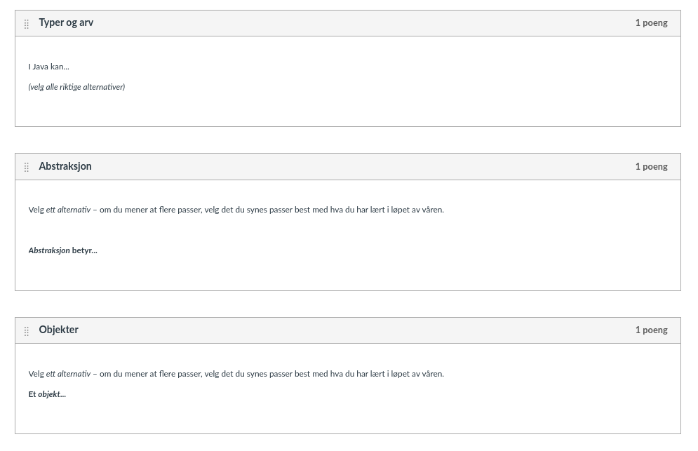
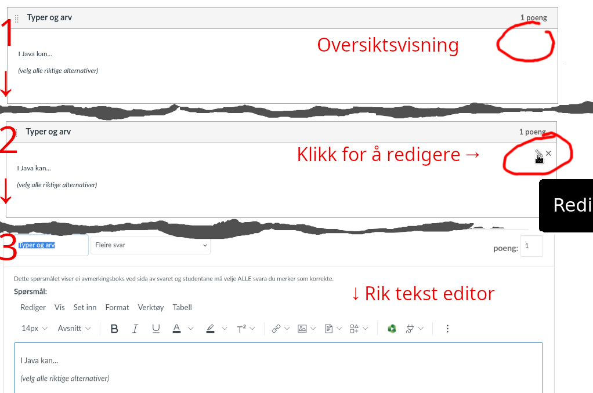
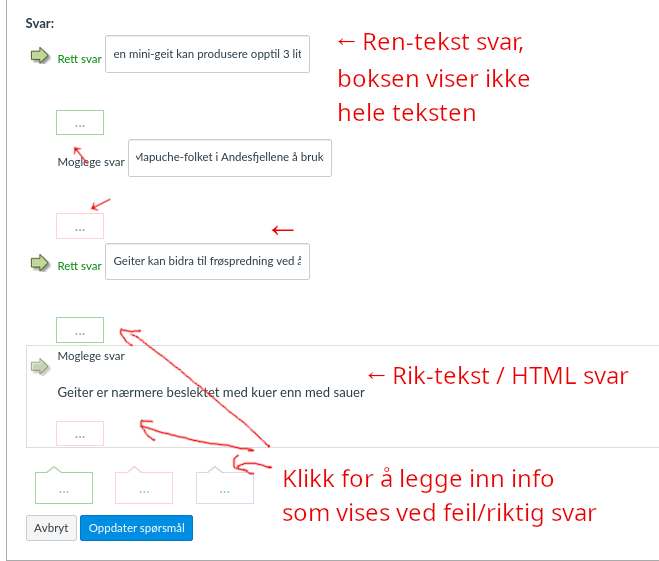
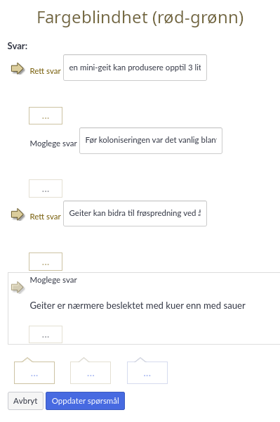
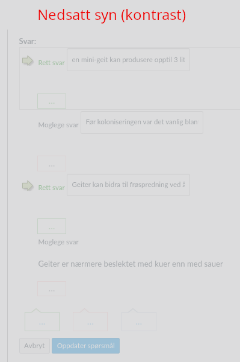
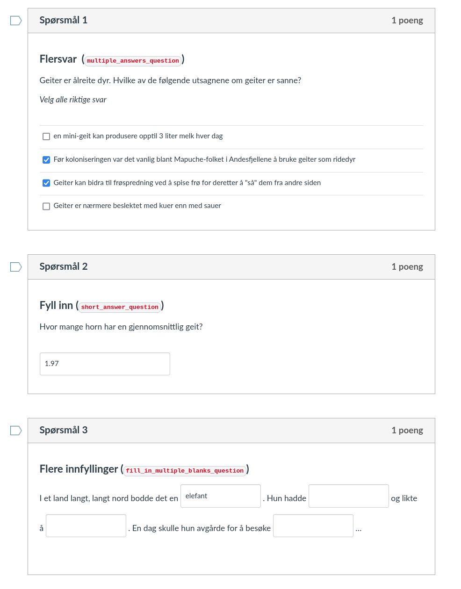

# Eksamen INF112 Våren 2024

**Universitetet i Bergen, Institutt for informatikk**

**05.06.2024, 09:00–12:00**

<div class="">
<fieldset>
<legend>Variant</legend>
<input type="radio" name="variant" id="uten-svar" ></input> <label for="uten-svar">Kun oppgave</label>
<input type="radio" name="variant" id="med-svar" checked="true"></input> <label for="med-svar">Med løsningsforslag/sensorveiledning</label>
</fieldset>
<fieldset>
<legend>Målform</legend>
<input type="radio" name="lang" id="lang-nbnn" checked="true"></input> <label for="lang-nbnn">Begge</label>
<input type="radio" name="lang" id="lang-nb"></input> <label for="lang-nb">Bokmål</label>
<input type="radio" name="lang" id="lang-nn"></input> <label for="lang-nn">Nynorsk</label>
</fieldset>
## Generell info om eksamen

<div class="oppgave">
<div lang="nb">

***Oppgaver:*** Oppgavesettet består av 4 oppgaver («Oppgave» 5 skal ikke besvares).

***Lese oppgaver:*** **Uthevet skrift** brukes for å markere konkrete ting du skal gjøre eller svare på i oppgavene. Les hver (del)oppgåve nøye!

***Besvare deloppgaver:*** Hver oppgave har flere deloppgaver. Del opp svaret på oppgavene slik at det er lett å skille de ulike delene av besvarelsen fra hverandre (du står fritt til å bruke feks overskrifter og punktlister om du ønsker det).

***Bonusoppgaver:*** En oppgave har en ekstra deloppgave (merket *z*). Du kan gjøre denne hvis du har god tid, eller (i praksis) i stedet for andre deloppgaver.

***Vekting:*** Alle oppgavene utgjør tilsammen 40%, og aktiviteter fra semesteret utgjør de siste 60% av karaktergrunnlaget. Bonusdeloppgaven gir inntil +4 poeng, men du kan likevel ikke få mer enn totalt 40 poeng på selve eksamen.

***Hjelpemidler:*** Alle skrevne og trykte hjelpemidler er tillatt.

***Jukselapp:*** Blant vedleggene nederst på skjermen finner du følgende fra pensum: pensumoversikten, referat fra gruppepresentasjonene, og Kanban/Scrum boken. Merk: At disse ressursene er vedlagt betyr ikke nødvendigvis at de vil være nyttige for å løse oppgavene. De følger med så du skal slippe å skrive de ut og ta dem med selv.
**OBS!** Selv om du har tilgang på hjelpemidler/vedlegg, så betyr ikke det at du kan kopiere svarene derfra – vanlige regler for sitering, plagiat og fusk gjelder fortsatt, og du må skrive hele besvarelsen selv.

***Tid:*** Bruk gjerne tid i begynnelsen på å få oversikt over alle oppgavene. Selv om oppgavene er vektet likt, vil noen ta lengre tid enn andre. Pass på å ikke svare for mye på noen oppgaver slik at du slipper opp for tid før du er ferdig! Du har kun tre timer til rådighet.

***Spørsmål:*** Jeg (Anya) stikker innom etter 1–2 timer for å svare på spørsmål om noe er uklart. Les alle oppgavene på forhånd så du vet om du trenger å spørre om noe. Om det er krise kan også eksamensvaktene ta kontakt per telefon.

***Uklarheter:*** Oppfatter du oppgaven som uklar, oppgi hvilke antagelser du gjør i besvarelsen.

***Ark for håndskrift/tegning (Scantron-papir):*** På denne eksamenen vil det være mulig å legge ved håndtegnede skisser/illustrasjoner eller håndskrevet tekst til ditt digitale eksamenssvar.

##### Lykke til!


*Anya*

</div><div lang="nn">

***Oppgåver:*** Oppgåvesettet består av 4 oppgåver («Oppgåve» 5 skal ikkje svarast på).

***Lese oppgåver:*** **Utheva skrift** vert nytta for å markera konkrete ting du skal gjere eller svara på i oppgåvene. Les kvar (del)oppgåve nøye!

***Svare på deloppgåver:*** Kvar oppgåve har fleire deloppgåver. Del opp svaret på oppgåvene slik at det er lett å skilje dei ulike delane av besvarelsen frå kvarandre (du står fritt til å bruke f.eks. overskrifter og punktlister om du ønskjer det).

***Bonusoppgåver:*** Ei oppgåve har ei ekstra deloppgåve (merka *z*). Du kan gjere denne viss du har god tid, eller (i praksis) i staden for andre deloppgåver.

***Vekting:*** Alle oppgåvene utgjer til saman 40 %, og aktivitetar frå semesteret utgjer dei siste 60 % av karaktergrunnlaget. Bonusdeloppgåva gir inntil +4 poeng, men du kan likevel ikkje få meir enn totalt 40 poeng på sjølve eksamen.

***Hjelpemiddel:*** Alle skrivne og trykte hjelpemiddel er tillatne.

***Jukselapp:*** Blant vedlegga nederst på skjermen finn du følgjande frå pensum: pensumoversikta, referat frå gruppepresentasjonane, og Kanban/Scrum-boka. Merk: At desse ressursane er vedlagt betyr ikkje nødvendigvis at dei vil vere nyttige for å løyse oppgåvene. Dei følgjer med slik at du skal sleppe å skrive dei ut og ta dei med sjølv.
**OBS!** Sjølv om du har tilgang på hjelpemiddel/vedlegg, så betyr ikkje det at du kan kopiere svara derfrå – vanlege reglar for sitering, plagiat og fusk gjeld framleis, og du må skrive heile besvarelsen sjølv.

***Tid:*** Bruk gjerne tid i starten på å få oversikt over alle oppgåvene. Sjølv om oppgåvene er vekta likt, vil nokre ta lengre tid enn andre. Pass på å ikkje svare for mykje på nokre oppgåver slik at du går tom for tid før du er ferdig! Du har kun tre timar til disposisjon.

***Spørsmål:*** Eg (Anya) stikk innom etter 1–2 timar for å svare på spørsmål om noko er uklart. Les alle oppgåvene på førehand så du veit om du treng å spørje om noko. Om det er krise, kan også eksamensvaktene ta kontakt per telefon.

***Uklarleikar:*** Oppfattar du oppgåva som uklar, oppgi kva for antakingar du gjer i besvarelsen.

##### Lukke til!

*Anya*

</div>
</div>


## 1 – Erfaringer [8 poeng]

<div class="oppgave">
<div lang="nb">  <!---------------------------------------------------------------->

Tenk gjennom erfaringene dine fra vårens prosjektarbeid.

***a)** [4 poeng]*

**Hva synes du er de to viktigste tingene du har lært om programvareutvikling i løpet av arbeidet med prosjektet? Forklar.**

*(1–2 avsnitt)*

</div><div lang="nn">

Tenk gjennom erfaringane dine frå vårens prosjektarbeid.

***a)** [4 poeng]*

**Kva meiner du er dei to viktigaste tinga du har lært om programvareutvikling i løpet av arbeidet med prosjektet? Forklar.**

*(1–2 avsnitt)*

</div><div class="svar">

</div><div lang="nb">  <!---------------------------------------------------------------->

***b)** [4 poeng]*

**Nevn to ting du synes du bør lære mer om for å bli en god programvareutvikler, og forklar hvorfor de er viktige.**

*(1–2 avsnitt)*

</div><div lang="nn">

***b)** [4 poeng]*

**Nemn to ting du meiner du bør lære meir om for å bli ein god programvareutviklar, og forklar kvifor dei er viktige.**

*(1–2 avsnitt)*
</div><div class="svar">

</div>
</div>


## 2 – Quiz [16 poeng + 4 bonus]
<div class="oppgave">
<div lang="nb">

Quiz (eller *kviss* i moderne stavemåte) er ikke bare underholdning, men er også nyttig i undervisning – både for læring og vurdering. For eksempel har *Canvas* – læringsplattformen vi kjenner som *Mitt UiB* – innebygget quiz-funksjonalitet, i tillegg til systemet for oppgaver/innleveringer. 

Vi skal nå se på å designe quiz-programvare som kan egne seg for å lage quizer for informatikk-studenter som kan passe f.eks. for et programmeringsemne. Det vil si at, i tillegg til «vanlig» quiz-funksjonalitet, bør vi ha en god løsning for at spørsmål og svar kan inneholde kode. Her er noen eksempler på mulige spørsmål:

> * Hva er typen til dette Java-uttrykket: `2 + 2.5` ?
> * Hva blir resultatet av å kjøre denne koden? <br>*(…kodesnutt)*
> * Fyll inn den manglende typeparameteren: <br>`interface SortedList<`_________`> extends Collection<T>`
> * Hva er verdien til variabelen `x` på linje 4 i dette programmet? <br>*(…kodesnutt)*
> * Hvilke av disse uttrykkene kan tilordnes variabelen `List<String> y`? <br>*(…uttrykk av forskjellige typer)*

<sup>*(Quiz-spørsmålene over skal ikke besvares - de er bare eksempler!)*</sup>

På eksamensoppgaver har vi også utfordringen at spørsmålene gjerne må være tilgjengelige (med identisk mening!) på flere språk eller målformer – for enkelhets skyld ser vi bort fra det problemet her.

**Denne oppgaven har fire deloppgaver, *a*–*d*. Den siste oppgaven, *z*, er en bonusoppgave som er frivillig å svare på.**

</div><div lang="nn">

Quiz (eller *kviss* i moderne stavemåte) er ikkje berre underhaldning, men er òg nyttig i undervising – både for læring og vurdering. Til dømes har Canvas – læringsplattforma vi kjenner som *Mitt UiB* – innebygd quiz-funksjonalitet, i tillegg til systemet for oppgåver/innleveringar.

Vi skal no sjå på å designe quiz-programvare som kan eigna seg for å lage quizar for informatikkstudentar som kan passa til dømes for eit programmeringsemne. Det vil seia at, i tillegg til «vanleg» quiz-funksjonalitet, bør vi ha ei god løysing for at spørsmål og svar kan innehalda kode. Her er nokre døme på moglege spørsmål: 


> * Kva er typen til dette Java-uttrykket: `2 + 2.5` ?
> * Kva blir resultatet av å køyre denne koden? <br>*(…kodesnutt)*
> * Fyll inn den manglande typeparameteren: <br>`interface SortedList<`_________`> extends Collection<T>`
> * Kva er verdien til variabelen x på linje 4 i dette programmet? <br>*(…kodesnutt)*
> * Kva for nokre uttrykk kan tilordnast variabelen `List<String> y`? <br>*(…uttrykk av ulike typar)*

<sup>*(Quiz-spørsmåla over skal ikkje svarast på - dei er berre døme!)*</sup>

På eksamensoppgåver har vi òg utfordringa at spørsmåla gjerne må vere tilgjengelege (med identisk meining!) på fleire språk eller målformer – for enkelheits skuld ser vi bort frå det problemet her.

**Denne oppgåva har fire deloppgåver, *a*–*d*. Den siste oppgåva, *z*, er ei bonusoppgåve som er frivillig å svare på.**

</div><div lang="nb">  <!---------------------------------------------------------------->

***a)** [4 poeng]*

To opplagte roller i systemet er *foreleser* (eller quiz-forfatter) og *student* (person som skal svare på quiz-spørsmålene). For hver av foreleser og student, **lag to brukerhistorier** (fire totalt) som du mener vil være sentrale for quiz-systemet (dvs. ting som du gjerne ville prioritert i et *Minimum Viable Product (MVP)*). Du kan anta at systemet vil bli brukt liknende til Mitt UiB, til både vurdering (med tellende karakter) og øvelse/repetisjon.

*(Noen setninger på hver)*

</div><div lang="nn">

***a)** [4 poeng]*

To opplagte roller i systemet er *førelesar* (eller quiz-forfattar) og *student* (person som skal svare på quiz-spørsmåla). For kvar av førelesar og student, **lag to brukarhistorier** (fire totalt) som du meiner vil vere sentrale for quiz-systemet (dvs. ting som du gjerne ville prioritert i eit *Minimum Viable Product (MVP)*). Du kan anta at systemet vil bli brukt liknande til både vurdering (med teljande karakter) og øving/repetisjon.

*(Nokre setningar på kvar)*

</div><div class="svar">

*For eksempel:*

* Som foreleser vil at systemet kan evaluere kode i spørsmålene, slik at jeg ikke gjør feil når jeg skriver inn riktig svar.
* Som foreleser vil jeg ha tydelig oversikt over spørsmål og riktige/feile svar, så jeg lett kan sjekke at quizen er korrekt.
* Som student vil jeg at programkode i spørsmål og svar er formattert med farger, så det er lett å lese.
* Som student vil jeg svar-interaksjonene er store og tydlige, så jeg ikke bommer/svarer feil ved uhell.

*(Opptil ett poeng for hver. Skal ha med både rolle, hva man ønsker, og hvorfor.)*

</div><div lang="nb">  <!---------------------------------------------------------------->

***b)** [4 poeng]*

For **hver** av de fire brukerhistoriene, **formuler et krav til funksjonaliteten, og et tilhørende akseptansekriterium**.

*(Noen setninger på hver)*

</div><div lang="nn">

***b)** [4 poeng]*

For **kvar** av dei fire brukarhistoriene, **formuler eit krav til funksjonaliteten, og eit tilhøyrande akseptansekriterium**.

*(Nokre setningar på kvar)*

</div><div class="svar">

*For eksempel:*

* Evaluere kode-funksjonalitet: Vi lager egen spørsmålstype for «hva blir resultatet av å evalure denne koden?». Systemet skal evaluere koden i spørsmålet, og sette inn resultatet som riktig svar (evt. med fornuftige varianter). Foreleser fyller inn feile svar. Akseptansekriterium: når spørsmålsteksten er endret, plukkes koden ut, kjøres. Svaret settes inn under som korrekt svaralternativ (evt. erstatning for tidligere korrekt svar); ved feil i koden, eller kode som ikke terminerer skal spørsmålet blir markert som «ugyldig».
* Oversikt: Systemet skal kunne vise gi tydelig oversikt over spørsmål og svaralternativer. Akseptansekriterium: Når foreleser trykker «Forhåndsvis (utfylt)» skal spørsmål og svar vises, formattert slik studentene ser de, men med korrekt svar fylt inn. Korrekt/feil svar skal i tillegg markeres med farge. Visningen skal følge anbefalingene i [WCAG 2.0](https://www.uutilsynet.no/wcag-standarden/wcag-standarden/86)
* Formattert kode: Foreleser markerer kode og velger språk i HTML-editor eller med Markdown-instruksjoner. Koden formatteres med standard verktøy. Akseptansekriterium: markert Java- eller Python-kode blir vist i skrivemaskinfont, med fargelagte nøkkelord og identifiers. Innrykk og kodetekst er identisk med opprinnelig kode.
* Tydelige interaksjoner: Tydelig forskjell på knapper for flervalg og flersvar, hele svaralternativet er klikkbart. Akseptansekriterium: når jeg beveger muspekeren til et svaralternativ markeres hele feltet med endret bakgrunn; hvis jeg klikker blir alternativet valgt. Tilhørende knapper er minst like store som en «O» i valgt skriftstørrelse, og kontrast mellom avkrysset/ikke avkrysset er minst 4,5:1.

*(Opptil ett poeng for hver. Trenger kun ett krav og ett akseptansekriterium på hver (eksemplet over har flere).)*

*(Konkrete krav til utforming av interaksjoner finnes hos [UU-tilsynet](https://www.uutilsynet.no/regelverk/regelverk/266) – for offentlig virksomhet (Universitet, f.eks.) er mange av kravene lovpålagte. Man må f.eks. tenke på at kode skal kunne leses av en skjermleser, så å bruke bilder vil være en dårlig løsning.)*

</div><div lang="nb">  <!---------------------------------------------------------------->


***c)** [4 poeng]*

Nederst på siden finner du skjermbilder fra redigering av quiz med verktøyet i Canvas / Mitt UiB. Hva tenker du om **funksjonalitet og brukeropplevelse**, sett i lys av brukerhistoriene og kravene du har laget (i oppg. *a* og *b*)? Har du og Canvas-utviklerne lagt vekt på **liknende ting** – eller hva er **eventuelt forskjellig**? **Forklar.**

*(1–2 avsnitt)*

</div><div lang="nn">

***c)** [4 poeng]*

Nederst på sida finn du skjermbilete frå redigering av quiz med verktøyet i Canvas / Mitt UiB. Kva tenkjer du om **funksjonalitet og brukaroppleving**, sett i lys av brukarhistoriene og krava du har laga (i oppg. *a* og *b*)? Har du og Canvas-utviklarane lagt vekt på **liknande ting** – eller kva er **eventuelt forskjellig**? **Forklar.**

*(1–2 avsnitt)*

</div><div class="svar">

*For eksempel:*

* Ser ikke ut som det er lagt vekt på programmeringsspørsmål – de har nok heller lagt vekt på funksjonalitet som passer for mange forskjelige fag.
* De har tydligvis ikke tenkt så mye på å gi foreleser oversikt over spørsmål og svar: «Spørsmåloversikt» mangler svar, «Redigering av svar» har for lite tekstfelt til å vise mer enn noen få ord. *(Det kan godt være de fleste brukerne skriver lange spørsmål med korte svar, og da er dette gjerne en fornuftig måte å gjøre det på. Det finnes et eget valg for å vise spørsmål med svar, men det er lett å overse.)*
* I editoren blir riktige svar markert med grønn pil – men pilen dukker også opp når muspekeren hviler over et svaralternativ. Det er ikke helt opplagt hva boksene med prikker i er ment for (tekst som skal vises hvis studenten velger det svaret), eller hvilket svar de hører til (svaret over, ikke det under som er nærmest). Det er også mange tynne linjer og duse farger som kan være vanskelig å se hvis man har nedsatt syn.¹
* Designet i editoren ser veldig annerledes ut enn hvordan spørreskjema vanligvis ser ut (også i Canvas). Hvorfor har de ikke brukt vanlige radiobox/checkbox-elementer?
* (Det er ærlig talt litt vanskelig å skjønne hva de *har* lagt vekt på når det gjelder brukeropplevelse...)


*(Nevn noen relevante ting. Vedlegget viser bare forelesers synspunkt (og det er ikke nødvendigvis opplagt fra bildene hvordan det fungerer), men de kan evt. referere til egen erfaring med å bruke det som student. Det er selvfølgelig OK å mene noe annet enn løsningsforslaget – det viktige er å ha et gjennomtenkt og begrunnet svar er viktigst.)*

<sup>¹ Det er ikke helt opplagt at skjermbildene viser hvordan ting ser ut i nettleserens «nedsatt (farge)syn» simulering, og ikke er en egen modus i Canvas. I eksemplet er det mulig å se forskjell på rødt og grønt, men forskjellen mellom dem er liten: kontrasten er 1,33:1; [anbefalt kontrast er minimum 3:1](https://www.w3.org/WAI/WCAG21/Understanding/use-of-color.html). Dårlig kontrast er en gjenganger i både Mitt UiB og Inspera, men bruker kan velge «Høy kontrast» i innstillingene. En positiv ting i Mitt UiB er at editoren sjekker for slike ting automatisk og advarer bruker om tilgjengelighetsproblemer, så det er mest et problem i brukergrensesnittet.</sup>

</div><div lang="nb">  <!---------------------------------------------------------------->

***d)** [4 poeng]*

Et potensielt viktig designmål for grensesnittet til et system er at det skal være *vanskelig å gjøre feil*, men *lett å oppdage feil*. Dette gjelder både når vi designer API (for utviklere) og brukergrensesnitt (for sluttbrukere). 
Studer skjermbildene (nederst på siden) av brukergrensesnittet for quiz-redigering, og vurder:

*  **Hva slags** feil foreleser tenkes å gjøre ved inntasting av quiz-spørsmål?
*  **Hvordan** legger systemet til rette for at eventuelle feil oppdages?
*  **Hva** kunne eventuelt gjøres annerledes for å minske sjansen for feil i quiz-spørsmål/svar?

**Besvar spørsmålene og forklar tankegangen din.**

*(2–3 avsnitt)*

</div><div lang="nn">

***d)** [4 poeng]*

Eit potensielt viktig designmål for grensesnittet til eit system er at det skal vere *vanskeleg å gjere feil*, men *lett å oppdage feil*. Dette gjeld både når vi designar API (for utviklarar) og brukargrensesnitt (for sluttbrukarar). Studer skjermbileta (nederst på sida) av brukargrensesnittet for quiz-redigering, og vurder:

* **Kva slags** feil kan ein sjå føre seg at førelesar kan gjere ved inntasting av quiz-spørsmål?
* **Korleis** legg systemet til rette for at eventuelle feil blir oppdaga?
* **Kva** kunne eventuelt gjerast annleis for å minske sjansen for feil i quiz-spørsmål/svar?

**Svar på spørsmåla og forklar tankegangen din.**

*(2–3 avsnitt)*

</div><div class="svar">

* Foreleser kan f.eks.: formulere spørsmålet feil, formulere svaralternativ feil eller velge sette feil svaralternativ som riktig/galt. 
* Riktig svar blir markert med «Rett svar» i grønt og grønn pil, mens feile svar merkes med «Mogelege svar / Mulige svar» i sort. Boksen under gir også et hint – den er grønn for riktig og rød for feil.
* Generelt gir systemet lite hjelp til spørsmålforfatter, så det er vankselig å peke på at det legger til rette for å oppdage feil. Det er mulig å få se hele svaret i stedet for en liten input-boks – men da må man bytte til «rik tekst» ved å trykke på en skjult knapp. Layouten gjør også at det er vanskelig å se hva som hører sammen.
* (Et annet vanlig problem med rik-tekst editorer er at formatteringen henger med når man limer inn tekst – det kan være en fordel (f.eks. ved at man kan lime inn forhåndsformattert kode, selv om editoren ikke har mulighet for kode-formattering), men også gjøre at man ender opp med inkonsistent/forvirrende formattering (tekst som bytter font eller størrelse midt i setningen, osv).)

For å minske sjansen for feil:

* Tydelig vertikalt mellomrom mellom hvert svar.
* Standard merking av riktig/galt – eller kanskje bruk av fargelagt bakgrunn.
* Vise *hele* svarene – helst slik at spørsmål og alle tilsvarende svar vises på skjermen samtidig.
* Mer kreative løsninger: egne verktøy som kan sjekke programkode/matematikk. Kanskje sende alt til ChatGPT og se om den er enig?


*(Påpek noen mulige feil, og mulige løsninger; på «hvordan legger systemet til rette for å oppdage feil» er det også rimelig si at det ikke gjør det.)*

</div><div lang="nb">  <!---------------------------------------------------------------->

***z)** [bonus, +4 poeng]*

Det har vært ganske å designe IT-systemer slik at brukeropplevelsen likner veldig på hvordan man pleide å løse samme problemet på papir. For eksempel, tidlige utgaver av digital skattemelding (selvangivelse) var i praksis bare en digital kopi av papirskjemaet, og mange av Skatteetatens andre skjemaer er fremdeles slik.

Tilsvarende viser Quiz-verktøyet i Canvas flervalgsoppgaver og fyll-inn oppgaver tilnærmet likt til et papirskjema, og redigeringen skjer også ved hjelp av skjema. Dette er ikke nødvendigvis en dårlig idé – avkryssing/innfylling er en velkjent og praktisk løsning, og skjema-funksjonaliteten er innebygget i nettleseren – men som skjermbildene illustrer, har ihvertfall redigeringsgrensesnittet  en del svakheter.

Hvis du sto *helt fritt* til å designe systemet for å forfatte/redigere quizer (dvs. uten at det trenger å skje i nettleseren eller ved hjelp av skjema) – hva ville du gjort? **Forklar.** Du kan anta at målgruppen er informatikk-forelesere/gruppeledere som er villige til å bruke tid på å sette seg inn i hvordan redigeringssystemet fungerer. Du kan inkludere et eksempel om du vil, eller legge ved en tegning.

*(1–2 avsnitt, evt et eksempel)*

</div><div lang="nn">
***z)** [bonus, +4 poeng]*

Det har vore ganske vanleg å designe IT-system slik at brukaropplevinga liknar veldig på korleis ein pleidde løysa same problemet på papir. Til dømes, tidlege utgåver av digital skattemelding (selvangiving) var i praksis berre ein digital kopi av papirskjemaet, og mange av Skatteetatens andre skjema er framleis slik.

På same måte viser Quiz-verktøyet i Canvas fleirvalspørsmål og fyll-ut oppgåver tilnærma likt eit papirskjema, og redigeringa skjer også ved hjelp av skjema. Dette er ikkje nødvendigvis ein dårleg idé – avkryssing/utfylling er ein velkjent og praktisk løysing, og skjema-funksjonaliteten er innebygd i nettlesaren – men som skjermbilda illustrerer, har i alle fall redigeringsgrensesnittet  nokre svakheiter.

Om du sto *heilt fritt* til å designe systemet for å skrive/redigere quizar (dvs. utan at det treng å skje i nettlesaren eller ved hjelp av skjema) – kva ville du gjort? **Forklar.** Du kan gå ut frå at målgruppa er informatikk-forelesarar/gruppeleiarar som er villige til å bruke tid på å setje seg inn i korleis redigeringssystemet fungerer. Du kan inkludere eit døme om du vil, eller leggje ved ei teikning.

*(1–2 avsnitt, evt eit døme)*

</div><div class="svar">

En mulig løsning for forelesere som er vant til slike verktøy er å skrive alt i Markdown e.l., og kanskje ha støtteverktøy som kan gjør fag-spesifikk feilsjekking.

*(Her er vi ute etter kreative løsninger, og det er ikke nødvendigvis sikkert at det finnes noen bedre løsning enn den vanlige.)*

</div>
</div>


<div class="vedlegg">

### Skjermbilder fra redigering av quiz-spørsmål i Canvas
*Eksempelet viser et såkalt flersvar-spørsmål («velg ett eller flere av alternativene»).*

##### Spørsmåloversikt

Slik vises spørsmålene når man går inn på «Spørsmål»-taben i Canvas. Det er også en avkryssingsboks for «Vis spørsmålsdetaljer» som viser svarene og gjør det lettere å identifisere svarene  som er merket «korrekt»



#### Begynn å redigere et spørsmål:

For å åpne editoren, (1) flytt muspekeren til øverste høyre hjørne av spørsmålet, (2) da dukker det om en «rediger spørsmålet»-knapp (et blyant-symbol) man kan trykke på. (3) Når man trykker på knappen åpnes en teksteditor.



#### Redigere svaralternativer (for flervalg/flersvar)

De små boksene med … gjør det mulig å legge inn informasjon som blir vist til studenten hvis hen velger det alternativet. Her er første og tredje alternativ riktig, mens andre og fjerde alternativ er feil.

Input-boksene er beregnet på svar i ren tekst –  hvis svaralternativet er langt vil deler av det bli skjult. Ved å trykke på den usynlige blyant-knappen i øverste høyre hjørne på et spørsmål kan man bytte til rik-tekst editor og legge inn svaralternativer med formattering.



#### Redigering med nedsatt (farge)syn

 

</div>


## 3 – API I [4 poeng]

<div class="oppgave">
<div lang="nb">  <!---------------------------------------------------------------->

***Bakgrunn***

Som vi nevnte i forrige oppgave er «god brukeropplevelse» (der «brukerne» er utviklerene) også viktig i selve programmeringen. «Brukergrensesnittene» vi forholder oss til som utviklere er APIer (Application Programming Interface). Gode APIer gjør det lett å gjenbruke store og små biter med kode, og bygge store systemer ved å sette sammen mindre komponenter. Et lite gjennomtenkt API kan gjøre det vanskelig å forstå hvordan koden skal brukes, og føre til misforståelser og feil. Noen vanlige problemer (code smells) er for eksempel:

* lange parameterlister – f.eks.,  LibGDX sin `batch.draw(tex, x, y, ox, oy, w, h, sclX, sclY, r, sx, sy, sw, sh, fx, fy)`
* metoder som må kalles i en spesiell rekkefølge – f.eks. må man kalle `batch.begin()`/`batch.end()` før/etter `batch.draw()`
* innfløkte avhengigheter, så en endring ett sted gjør at man må gjøre endringer over hele programmet
* kode som gjør overraskende ting – f.eks. endrer globale variabler
* uklare navn på metoder og parametre, og manglende dokumentasjon
* bruk av for spesifikk type – f.eks. «jeg har en Collection, men du vil ha en ArrayList»
* … mye annet

Flere av punktene over er også eksempler på *connascence*. Pensumboken *Agile Technical Practices Distilled* har et kapittel om *connascence*, som de definerer som:

> Two or more elements (fields, methods, classes, parameters, variables, but also build
> steps, procedures of any kind, etc.) are *connascent* if a change in one element would
> require also a change in the others in order for the system to keep working correctly.

I INF112 har vi blant annet sett på SOLID designprinsippene, som kan være nyttige for å gi andre utviklere en god opplevelse, og lage kode som har *high cohesion* (relaterte ting er plassert sammen) og *low coupling* (få unødvendige avhengigheter mellom deler av programmet).

**Denne oppgaven har én deloppgave, *a*.**
</div><div lang="nn">

***Bakgrunn***

Som vi nemnde i førre oppgåve, er «god brukaroppleving» (der «brukarane» er utviklarane) også viktig i sjølve programmeringa. «Brukargrensesnitta» vi forheld oss til som utviklarar er APIar (Application Programming Interface). Gode APIar gjer det lett å gjenbruke store og små bitar med kode, og byggje store system ved å setje saman mindre komponentar. Eit lite gjennomtenkt API kan gjere det vanskeleg å forstå korleis koden skal brukast, og føre til misforståingar og feil. Nokre vanlege problem (code smells) er til dømes:

* lange parameterlister – til dømes, LibGDX sin `batch.draw(tex, x, y, ox, oy, w, h, sclX, sclY, r, sx, sy, sw, sh, fx, fy)`
* metodar som må kallast i ein spesiell rekkefølgje – til dømes må ein kalle `batch.begin()`/`batch.end()` før/etter `batch.draw()`
* innfløkte avhengigheiter, slik at ei endring ein stad gjer at ein må gjere endringar over heile programmet
* kode som gjer overraskande ting – til dømes endrar globale variablar
* uklare namn på metodar og parameter, og manglande dokumentasjon
* bruk av for spesifikk type – til dømes «eg har ein Collection, men du vil ha ein ArrayList»
* … mykje anna

Fleire av punkta over er også døme på *connascence*. Pensumboka *Agile Technical Practices Distilled* har eit kapittel om *connascence*, som dei definerer som:

> Two or more elements (fields, methods, classes, parameters, variables, but also build
> steps, procedures of any kind, etc.) are *connascent* if a change in one element would
> require also a change in the others in order for the system to keep working correctly.

I INF112 har vi blant anna sett på SOLID designprinsippa, som kan vere nyttige for å gi andre utviklarar ei god oppleving, og lage kode som har *high cohesion* (relaterte ting er plassert saman) og *low coupling* (få unødvendige avhengigheiter mellom delar av programmet).

**Denne oppgåva har éin deloppgåve, *a*.**


</div><div lang="nb">  <!---------------------------------------------------------------->


***a)** [4 poeng]*

Tenk tilbake på utviklingsarbeidet du og teamet ditt har gjort å prosjektet i vår. **Gi eksempel på én god og én dårlig «brukeropplevelse» du har hatt med et API som noen andre har laget.** Det kan f.eks. være noe noen i teamet ditt har laget, eller et bibliotek som dere har brukt (LibGDX, for eksempel).

*(Hvis du er usikker: En «dårlig opplevelse» kan f.eks. være at du kastet bort mye tid på debugging, eller å forstå hvordan du skulle gjøre noe, eller at det var lett å gjøre feil, eller at du satt igjen med en følelse av at det var mer bry enn det var verd. «God opplevelse» er kanskje et API som er lett og naturlig å bruke, eller som gjør det vanskelig å gjøre slurvefeil, eller inspirerer deg med «sånn er det lurt å programmere!»)*

*(2–4 avsnitt)*

</div><div lang="nn">

***a)** [4 poeng]*

Tenk tilbake på utviklingsarbeidet du og teamet ditt har gjort på prosjektet i vår. **Gi døme på éi god og éi dårleg «brukaroppleving» du har hatt med eit API som nokon andre har laga.** Det kan til dømes vere noko nokon i teamet ditt har laga, eller eit bibliotek som de har brukt (LibGDX, for eksempel).

*(Hvis du er usikker: Ei «dårleg oppleving» kan til dømes vere at du kasta bort mykje tid på debugging, eller på å forstå korleis du skulle gjere noko, eller at det var lett å gjere feil, eller at du satt igjen med ei kjensle av at det var meir bry enn det var verdt. Ei «god oppleving» er kanskje eit API som er lett og naturleg å bruke, eller som gjer det vanskeleg å gjere slurvefeil, eller inspirerer deg med «sånn er det lurt å programmere!»)*

*(2–4 avsnitt)*

</div><div class="svar">

</div>
</div>

## 4 – API II [8 poeng]
<div class="oppgave">
<div lang="nb">

**Denne oppgaven har to deloppgaver, *a*–*b*. Begge skal besvares.**

</div><div lang="nn">

**Denne oppgåva har to deloppgåver, *a*–*b*. Begge skal svarast på.**

</div><div lang="nb">  <!---------------------------------------------------------------->

***a)** [4 poeng]*

Vi skal se litt mer på quiz-systemet fra Oppgave 2, og designe et API for å opprette quiz og lage spørsmål. La oss konsentrere oss om MVP – dvs. å støtte quiz med flervalg/svar og fyll-inn, og formattert kode i spørsmålene – og ikke bekymre oss over å holde rede på brukere og karakterer og slike ting. Se eksempel på quiz-funksjonalitet i figuren nederst på siden.

Hvis vi tenker tilbake på hva vi ønsket oss fra quiz-systemet, så er det en del forskjellige konsepter involvert, for eksempel: *quiz*, *spørsmål*, *svar*, *flervalg vs. flersvar vs. fyll-inn vs. …*, *poeng*, *tekst*, *kode*, *(student)*, *(foreleser)*, ting som dukket opp i brukerhistoriene dine, osv. Tenk gjennom hvilke av konseptene som bør være egne abstraksjoner – for eksempel, bør *svar* representeres av egne `Answer`-objekter, eller er det bedre å bruke `String`?¹

**Lag en liste med relevante abstraksjoner, med noen stikkord om hva slags funksjonalitet de bør ha.** For eksempel: *`Quiz` – bør ha navn, brukerveiledning, kunne finne/legge til/fjerne/omorganisere spørsmål, osv.* 

<sup>¹ *Generelt har vi anbefalt god bruk av abstraksjon og objektorientering i INF112, og det gjelder også i denne oppgaven. Men det ville forsåvidt ikke vært helt urealistisk å modellere «svar» som en rekke i en SQL-tabell*</sup
>

</div><div lang="nn">

***a)** [4 poeng]*

Vi skal sjå litt meir på quiz-systemet frå Oppgåve 2, og designe eit API for å opprette quiz og lage spørsmål. La oss konsentrere oss om MVP – dvs. å støtte quiz med fleirval/svar og fyll-inn, og formatert kode i spørsmåla – og ikkje bekymre oss over å halde oversikt over brukarar og karakterar og slike ting. Sjå døme på quiz-funksjonalitet i figuren nederst på sida.

vis vi tenker tilbake på kva vi ønskte oss frå quiz-systemet, så er det ein del forskjellige konsept involvert, for eksempel: *quiz*, *spørsmål*, *svar*, *fleirval vs. fleirsvar vs. fyll-inn vs. …*, *poeng*, *tekst*, *kode*, *(student)*,*(forelesar)*, ting som dukka opp i brukarhistoriene dine, osv. Tenk gjennom kva for konsept som bør vere eigne abstraksjonar – for eksempel, bør *svar* representerast av eigne `Answer`-objekt, eller er det betre å bruke `String`?¹

**Lag ei liste med relevante abstraksjonar, med nokre stikkord om kva slags funksjonalitet dei bør ha.** For eksempel: *`Quiz` – bør ha namn, brukarrettleing, kunne finne/legge til/fjerne/omorganisere spørsmål, osv.*

<sup>¹ Generelt har vi anbefalt god bruk av abstraksjon og objektorientering i INF112, og det gjeld også i denne oppgåva. Men det ville forsåvidt ikkje vore heilt urealistisk å modellere «svar» som ei rad i ein SQL-tabell.</sup>


</div><div class="svar">

*(En grei teknikk for å finne relevante abstraksjoner er å se på hvilke ord vi bruker når vi beskriver/diskuterer. Ordene vi er interesserte i er gjerne de vi føler behov for å definere nærmere eller som har en spesifikk betydning i den aktuelle sammenhenger – «svar» har f.eks. litt forskjellig betydning i quiz-sammenheng og når vi diskuterer nettverksprotokoller eller politikk. Substantiv blir gjerne til klasser, verb blir til metoder, adjektiv er gjerne del av tilstanden til et objekt, og adverb er flagg eller opsjoner i metodekall. For objektorientering er det gjerne substantiv som er de mest interessante ordene å se etter. Denne delen av designarbeidet er forsåvidt like aktuell i andre sammenhenger enn programutvikling, f.eks. hvis man lager lover, kontrakter, instruksjoner, eller bare vil diskutere quiz-teori med andre quiz-nerder.)*

Noen av begrepene dukker opp i flere sammenhenger. F.eks., for flervalg/flersvar, så kan «svar» være både «et av de mulige valgene studenten kan velge» og «svaret studenten faktisk valgte» - det er kanskje lurt å skille disse ved å kalle den første for (f.eks.) `AnswerSpec`.

* **Quiz** – en samling av `Question`s, med navn og beskrivelse – og kanskje en del forskjellige valg, som «med/uten karakter», «frist» osv.
    * `addQuestion()`, `moveQuestion()`, `removeQuestion()`, `listQuestions()` 
* **QuestionSpec** – i flere varianter (`MultipleChoiceQuestionSpec`, `MultipleAnswerQuestionSpec`, etc) – har spørsmåltekst, kanskje navn og poeng, og et eller flere `Answer`s
    * `listAnswers()`, `checkAnswer()`
* **AnswerSpec** – også i flere varianter (`TextAnswerSpec`, `ChoiceAnswerSpec`, etc) – kan være riktig/feil, 
* **Answer** – det faktiske svare fra brukeren; vil variere veldig med typen spørsmål
* **Text** – kanskje med forskjellige varianter som `FormattedText`, `ProgramText`, `PlainText`
* i et komplett system har vi også brukere, poengsystemer, tidsfrister osv, og andre typer interaksjoner som «museklikk» osv, men det kan vi droppe her

*(Bør nevne minst quiz, spørsmål og svar – listen over er noe mer utfyllende enn det som er nødvendig for 4 poeng. 2 poeng for valg av relevante abstraksjoner, 2 poeng for stikkord/beskrivelse.)*

</div><div lang="nb">  <!---------------------------------------------------------------->

***b)** [8 poeng]*

Med utgangspunkt i listen  fra *a*, **design et enkelt Java API for å opprette quiz-spørsmål.** APIet bør støtte disse spørsmålstypene:

* **1)** vanlig flersvar – *ett spørsmål, flere svarmuligheter, hvert svar kan være enten riktig eller feil (dvs. som i eksempelet over)*
* **2)** fyll inn det riktige svaret – *ett spørsmål, flere riktige svar-varianter (for å ta høyde for at det riktige svaret kanskje kan skrives på flere måter)*
* **3)** fyll inn flere svar i en tekst – *her trenger vi tekst, en måte å indikere hvor innfyllingen skal være, og korrekte svar for hver innfylling*

Du skal *kun* lage grensesnitt, du trenger ikke implementere noe. Svaret kan f.eks. være et eller flere grensesnitt med noen metoder, med litt dokumentasjon eller et eksempel på bruk. APIet bør være er *enkelt og naturlig* i bruk, og *gi lesbar* kode. Du kan finne på relevante typer, hvis du f.eks. vil ha `Text`, `HTMLString` e.l., og anta at de er definert et annet sted – det holder å ha et fornuftig navn eller en forklarende setning.  

*(Du kan se et eksempel på hver spørsmålstype nederst på siden, inkludert hva Canvas kaller spørsmålstypene i sitt API.)*

</div><div lang="nn">

***b)** [8 poeng]*

Med utgangspunkt i lista frå *a*, **design eit enkelt Java API for å opprette quiz-spørsmål.** API-et bør støtte desse spørsmålstypane:

* **1)** vanleg fleirval – *eit spørsmål, fleire svaralternativ, kvart svar kan vere anten riktig eller feil (dvs. som i dømet over)*
* **2)** fyll inn det riktige svaret – *eit spørsmål, fleire riktige svarvariantar (for å ta høgde for at det riktige svaret kanskje kan skrivast på fleire måtar)*
* **3)** fyll inn fleire svar i ein tekst – *her treng vi tekst, ein måte å indikere kvar innfyllinga skal vere, og korrekte svar for kvar innfylling*

Du skal *kun* lage grensesnitt, du treng ikkje implementere noko. Svaret kan til dømes vere eit eller fleire grensesnitt med nokre metodar, med litt dokumentasjon eller eit døme på bruk. API-et bør vere *enkelt og naturleg* i bruk, og *gi lesbar* kode. Du kan finne på relevante typar, dersom du til dømes vil ha `Text`, `HTMLString` e.l., og anta at dei er definerte ein annan stad – det held å ha eit fornuftig namn eller ei forklarande setning.

*(Du kan sjå eit døme på kvar spørsmålstype nederst på sida, inkludert kva Canvas kallar spørsmålstypane i sitt API.)*

</div><div class="svar">

```java
interface Quiz extends Iterable<QuestionSpec> {
    static Quiz createQuiz(String name);
    Quiz description(Text newDescription);
    Text description();
    QuestionBuilder newQuestion();
    QuestionSpec getQuestion(int index);
    Quiz moveQuestion(int fromIndex, int toIndex);
    Quiz removeQuestion(int index);
    Quiz addQuestion(QuestionSpec newQuestion);
}

interface QuestionBuilder<T extends QuestionSpec> {
    QuestionBuilder<T,U> name(String name);
    QuestionBuilder<T,U> question(Text text);
    QuestionBuilder<MultipleChoiceQuestionSpec, ChoiceAnswerSpec> multipleChoice();
    QuestionBuilder<MultipleAnswerQuestionSpec, ChoiceAnswerSpec> multipleAnswer();
    QuestionBuilder<FillInQuestionSpec, WordAnswerSpec> fillIn();
    AnswerBuilder<T,U> newAnswer();
}

interface AnswerBuilder<T extends QuestionSpec, U extends AnswerSpec> {
    AnswerBuilder<T, U> correct();
    AnswerBuilder<T, U> incorrect();
    AnswerBuilder<T, U> answerText(Text text);
    QuestionBuilder<T, U> done();
}


```
</div>
</div>

<div class="vedlegg">



</div>


</div>

<!-- 
Her er et eksempel på (begynnelsen på) et veldig lavnivå quiz-API, som nok faller i flere av dårlig-design fellene nevnt over:
```java
interface SimpleQuiz {
    // eksempel på et mulig, men dårlig svar på oppgave c1:
    int addMultiAnswerQuestion(int id, String title, String text,
        String[] answer_texts, boolean[] answer_is_correct, int[] answer_points)
    /* … */
}
// eksempel på å legge til spørsmål
int newId = quiz.addMultiAnswerQuestion(0, "Spørsmål 1",
    "Hva er typen til Rowlet?",
    new String[] {"grass/ghost", "grass/flying", "normal/flying"},
    new boolean[] {false, true, false},
    new int[] {0, 1, 0})
```

Det er ikke helt uvanlig å finne slik kode, f.eks. når den underliggende implementasjonen er laget i C – du finner liknende kode i OpenGL-backended til LibGDX.


*(Noen metodedeklarasjoner med forklaring og/eller eksempler på bruk)*
-->


<!--
La oss se litt nærmere på grafikk-APIer – nærmere bestemt 

```java
    // Tegne bilde på skjermen i LibGDX. Dette er den mest kompliserte
    // varianten av draw(); i beste fall holder det å oppgi (tex, x, y)
    // x,y,w,h definerer området som skal tegnes til, mens
    // sx,sy,sw,sh spesifiserer et utsnitt av bildet.
    // De andre argumentene definerer skalering (sclX/Y), rotering (r), osv.
    batch.draw(tex, x, y, ox, oy, w, h, sclX, sclY, r, sx, sy, sw, sh, fx, fy);
```
Grunnen til at `draw()`-metoden til LibGDX er komplisert er for å gi programmøren fleksibilitet. En `draw()`-metode med mange parametere er kanskje litt upraktisk, men ikke så upraktisk som en metode som ikke kan rotere bildet hvis du trenger å tegne et rotert bilde. Metoden finnes også i flere overlastede varianter, så i mange tilfeller kan man klare seg med å si `batch.draw(img, x, y)`. 

Andre biblioteker har løst problemene på andre måter. JavaFX har et `Canvas`-API (til å tegne på, ikke som en læringsplattform) basert på HTML5 Canvas. Hver `Canvas` har en `GraphicsContext` som holder rede på mange av tegne-parameterne, f.eks. farger, linjetykkelse – og rotering og skalering. For å tegne rotert med JavaFX ville man gjort noe slik (litt forenklet)t:

```java
ctx.save() // lagre nåværende innstillinger
ctx.rotate(45) // roter hele verden
ctx.draw(sx, sy, sw, sh, x, y, w, h); // tilsvarende til batch.draw()
// draw a nice red border
ctx.setStroke(Color.RED); ctx.setLineWidth(3);
ctx.moveTo(x, y); ctx.lineTo(x+w, y); /* … */ ctx.stroke()
ctx.restore() // tilbakestill rotering, farge osv.
```

*Konteksten* (`ctx`) er en (i praksis) global variabel som 
På forelesning har vi også sett litt på et annet grafikk-API, TurtleDuck. Tilsvarende kode ville vært noe slikt som:

```java
turtle.spawn() // lag ny "turtle" som ikke påvirker den gamle
    .at(x,y).turn(45) // posisjon og rotatsjon
    .drawImage(img, w, h) // tegn bilde
    .stroke(RED, 3) // rød bord
    // linjer (kan) tegnes relativt til forrige posisjon/retning
    .draw(w).turn(90).draw(h).turn(90).draw(w).turn(90).draw(h); // et rektangel
turtle.do_something() // er uendret
```


For eksempel, kodelinjen under tegner et bilde på skjermen ved hjelp av LibGDX og JavaFX – men det kan være vanskelig å holde oversikt over argumentene, særling hvis vi bruker tall og uttrykk og ikke variabelnavn.

```java
    // Tegne bilde på skjermen i LibGDX. Dette er den mest kompliserte
    // varianten av draw(); i beste fall holder det å oppgi (tex, x, y)
    // x,y,w,h definerer området som skal tegnes til, mens
    // sx,sy,sw,sh spesifiserer et utsnitt av bildet.
    // De andre argumentene definerer skalering, rotering, osv.
    batch.draw(tex, x, y, ox, oy, w, h, sclX, sclY, r, sx, sy, sw, sh, fx, fy);
    // Tilsvarende i JavaFX – men her ligger skalering/rotering/osv i konteksten
    context.drawImage(img, sx, sy, sw, sh, x, y, w, h);
```

JavaFX har litt kortere parameterliste (identisk med `drawImage()`-metoden i HTML5 Canvas):
```java
```

I JavaFX kan man også tegne linjer og figurer. For eksempel:
````java
    // Tegne med koordinater i array
    double xPoints[] = …, yPoints[] = …;
    context.strokePolygon(xPoints, yPoints, xPoints.length)

    // Tegne steg-for-steg
    context.beginPath()
    context.moveTo(50,50);
    context.lineTo(60,50);
    context.lineTo(100,25);
    context.stroke();
```


</div><div lang="nn">

</div>
</div>
<div class="oppgave">
## 4 – API 
</div>
-->
