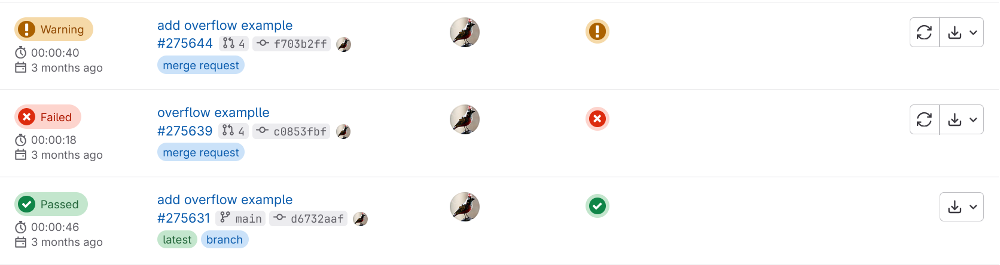
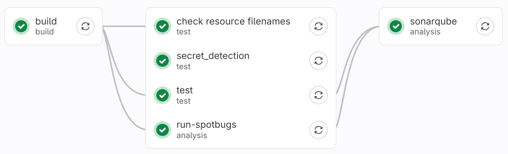
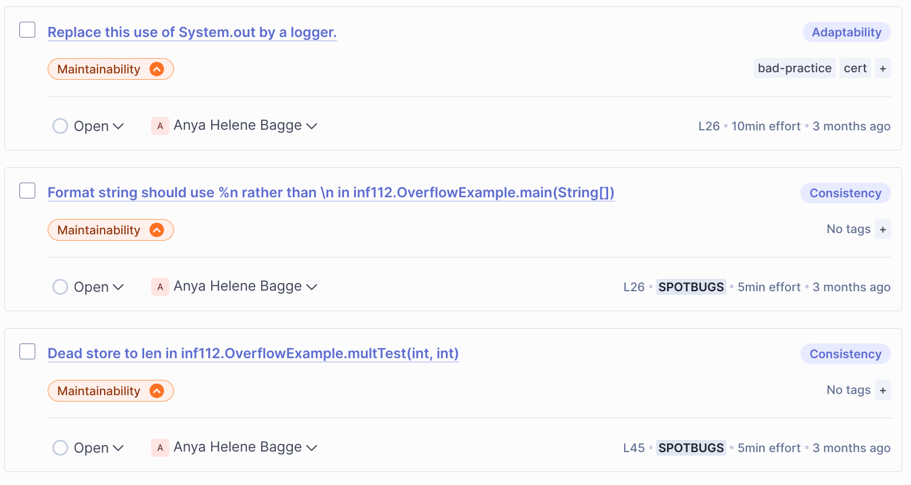

# Eksamen INF112 Våren 2025 {- .lang-nb}

**Universitetet i Bergen, Institutt for informatikk**

**11.06.2024, 09:00–12:00**

<fieldset>
<legend>Variant</legend>
<input type="radio" name="variant" id="uten-svar" ></input> <label for="uten-svar">Kun oppgave</label>
<input type="radio" name="variant" id="med-svar" checked="true"></input> <label for="med-svar">Med løsningsforslag/sensorveiledning</label>
</fieldset>
<fieldset>
<legend>Målform</legend>
<input type="radio" name="lang" id="lang-nbnn"></input> <label for="lang-nbnn">Begge</label>
<input type="radio" name="lang" id="lang-nb"  checked="true"></input> <label for="lang-nb">Bokmål</label>
<input type="radio" name="lang" id="lang-nn"></input> <label for="lang-nn">Nynorsk</label>
</fieldset>

### Generell info om eksamen {-}
###### {- lang=nb}

***Oppgaver:*** Oppgavesettet er inndelt i 4 oppgaver, som hver har flere deloppgaver.

***Lese oppgaver:*** **Uthevet skrift** brukes for å markere konkrete ting du skal gjøre eller svare på i oppgavene. Les hver (del)oppgave nøye!

***Besvare oppgaver:*** Det er lurt å formatere svaret så det blir lettlest og oversiktlig. Det står i oppgavene ca. hvor langt svar som er forventet. Bruk gjerne overskrifter og punktlister om du ønsker det. Du kan evt. også legge ved tegninger med Scantron-ark. Der hvor en oppgave har flere punkter *a*, *b*, *c* osv., marker hvert punkt tydelig i svaret ditt.

***Vekting:*** Alle oppgavene utgjør til sammen 60%, og aktiviteter fra semesteret utgjør de siste 40% av karaktergrunnlaget («Oppgave» 5.1).

***Hjelpemidler:*** Alle skrevne og trykte hjelpemidler er tillatt.

***Jukselapp:*** Blant vedleggene nederst på skjermen finner du pensumoversikten og Kanban/Scrum boken. Merk: At disse ressursene er vedlagt betyr ikke nødvendigvis at de vil være nyttige for å løse oppgavene. De følger med så du skal slippe å skrive de ut og ta dem med selv.
**OBS!** Selv om du har tilgang på hjelpemidler/vedlegg, så betyr ikke det at du kan kopiere svarene derfra – vanlige regler for sitering, plagiat og fusk gjelder fortsatt, og du må skrive hele besvarelsen selv.

***Tid:*** Bruk gjerne tid i begynnelsen på å få oversikt over alle oppgavene. Pass på å ikke svare for mye på noen oppgaver slik at du slipper opp for tid før du er ferdig! Du har kun tre timer til rådighet.

***Spørsmål under eksamen:*** Anya er bortreist, men Martin stikker innom etter 1–2 timer for å svare på spørsmål om noe er uklart. Les alle oppgavene på forhånd så du vet om du trenger å spørre om noe. Om det er krise kan også eksamensvaktene ta kontakt per telefon.

***Uklarheter:*** Oppfatter du oppgaven som uklar, oppgi hvilke antagelser du gjør i besvarelsen.

***Ark for håndskrift/tegning (Scantron-papir):*** På denne eksamenen vil det være mulig å legge ved håndtegnede skisser/illustrasjoner eller håndskrevet tekst til ditt digitale eksamenssvar.

***Lykke til!***


*Anya*

###### {- lang=nn}

***Oppgåver:*** Oppgåvesettet er delt i 4 oppgåver, som kvar har fleire deloppgåver.

***Lese oppgåver:*** **Utheva skrift** blir brukt for å markere konkrete ting du skal gjere eller svare på i oppgåvene. Les kvar (del)oppgåve nøye!

***Besvare oppgåver:*** Det er lurt å formatere svaret slik at det blir lett å lese og oversiktleg. Det står i oppgåva omtrent kor langt svar som er forventa. Bruk gjerne overskrifter og punktlister om du ønskjer det. Du kan eventuelt legge ved teikningar med Scantron-ark. Der ei oppgåve har fleire punkt *a*, *b*, *c* osv., marker kvart punkt tydeleg i svaret ditt.

***Vekting:*** Alle oppgåvene utgjer til saman 60 %, medan aktivitetar frå semesteret utgjer dei siste 40 % av karaktergrunnlaget («Oppgåve» 5.1).

***Hjelpemiddel:*** Alle skrivne og trykte hjelpemiddel er tillatne.

***Jukselapp:*** Blant vedlegga nederst på skjermen finn du pensumoversikta og Kanban/Scrum-boka. Merk: At desse ressursane er vedlagt betyr ikkje nødvendigvis at dei er nyttige for å løyse oppgåvene. Dei er med slik at du slepp å skrive ut og ta dei med sjølv.  
**OBS!** Sjølv om du har tilgang på hjelpemiddel/vedlegg, betyr ikkje det at du kan kopiere svar derfrå – vanlege reglar for sitering, plagiat og fusk gjeld framleis, og du må skrive heile svaret sjølv.

***Tid:*** Bruk gjerne tid i starten til å få oversikt over alle oppgåvene. Pass på at du ikkje skriv for mykje om nokre oppgåver, slik at du går tom for tid før du er ferdig! Du har berre tre timar til rådigheit.

***Spørsmål under eksamen:*** Anya er bortreist, men Martin kjem innom etter 1–2 timar for å svare på spørsmål om noko er uklart. Les alle oppgåvene på førehand, så du veit om du treng å spørje om noko. Om det er krise kan eksamensvaktene ta kontakt på telefon.

***Uklarheiter:*** Oppfattar du oppgåva som uklar, oppgi kva for antakingar du gjer i besvarelsen.

***Ark for handskrift/teikning (Scantron-papir):*** På denne eksamenen kan du legge ved handteikna skisser/illustrasjonar eller handskriven tekst til ditt digitale eksamenssvar.

***Lukke til!***

*Anya*


###### {- .svar}

Forslag til løsning på oppgavene er markert på denne måten.

**Viktig:** Løsningsforslaget er bare et forslag. Selv om du har svart noe annet, kan det godt være at ditt svar er like bra – eller bedre! Løsningsforslaget er ikke nødvendigvis perfekt.

I tillegg inneholder løsningsforslaget av og til ekstra forklaringer eller flere alternativer som vi ikke regner med vil være med i et virkeligeksamenssvar.

###### {- .vurdering}

Notater til sensorveiledningen er markert på denne måten. Dette er bare et foreløpig utkast; veiledningen blir tilpasset underveis (f.eks. når vi ser svar vi ikke hadde tenkt på).

## Erfaringer

###### {- .vurdering}
For oppgave 1.1 – 1.3:

1. **Relevans i svarene (2 poeng)**
   - Kandidaten nevner to konkrete ting..
   - Poeng gis for at svaret faktisk besvarer oppgavens eksplisitte spørsmål, ikke bare generelle refleksjoner.

2. **Begrunnelse (2 poeng)**
   - Hvert eksempel har en klar og forståelig begrunnelse.
   - Poeng gis for at begrunnelsene viser refleksjon og innsikt, heller enn bare utsagn uten forklaring.

3. **Klarhet og struktur (1 poeng)**
   - Svaret har god struktur, dvs. tydelig skille mellom de to tingene
   - Språklig forståelighet og sammenheng vurderes, men god språkføring er ikke hovedkriteriet.

**Poengfordeling:**
- Fullt poeng for å gi to relevante og godt begrunnede eksempler.
- Delvis poeng for ett godt eksempel og/eller eksempler med svake begrunnelser.
- 0 poeng dersom svaret ikke svarer på oppgaven eller er helt irrelevant.

**Merknader:**
- Poeng gis selv ved enkle formuleringer hvis innhold og refleksjon er tydelig.
- Dersom all begrunnelse mangler eller er helt uklar trekkes poeng betydelig.

### Bakgrunn {poeng=5}
###### {- lang=nb}

Det kan være krevende å sette seg inn i et nytt prosjekt. Ofte må du lære mange verktøy, biblioteker og teknologier. I tillegg må du kanskje jobbe på nye eller uvante måter.

* **Tenk gjennom erfaringene dine, og nevn to ting...**
    * *a)* ...som du føler du eller teamet ditt hadde hatt nytte av å kunne bedre før dere begynte på prosjektet,
    * *b)*. ...eller som du trodde ville være viktige på starten av semesteret, men som viste seg ikke å være så nødvendige.
* Du kan velge to ting fra *a* eller *b*, eller gi ett eksempel fra hver. Husk å begrunne svaret.

*(Ca. et avsnitt på hver ting)*

###### {- lang=nn}

Det kan vere krevjande å setje seg inn i eit nytt prosjekt. Ofte må du læra mange verktøy, bibliotek og teknologiar. I tillegg må du kanskje jobbe på nye eller uvande måtar.

* **Tenk gjennom erfaringane dine, og nemn to ting ...**
    * *a)*  ...som du meiner du eller laget ditt hadde hatt nytte av å kunne betre før de starta på prosjektet,
    * *b)*  ...eller som du trudde kom til å bli viktige i starten av semesteret, men som viste seg å ikkje vere så nødvendige.
* Du kan velje to ting frå *a* eller *b*, eller gi eitt døme frå kvar. Hugs å grunngje svaret ditt.

*(Omtrent eitt avsnitt på kvar ting)*

### Teamarbeid {poeng=5}
###### {- lang=nb}

Tenk gjennom erfaringene dine fra vårens prosjektarbeid.

* **Hva synes du er de to viktigste tingene du har lært om teamarbeid i løpet av arbeidet med prosjektet? Forklar.**

*(Ca. et avsnitt på hver ting)*

###### {- .svar}

###### {- lang=nn}

Tenk gjennom erfaringane dine frå prosjektarbeidet i vår.

* **Kva meiner du er dei to viktigaste tingene du har lært om teamarbeid i løpet av prosjektet? Forklar.**

*(Omtrent eitt avsnitt på kvar ting)*

###### {- .svar}

### Fremtid {poeng=5}
###### {- lang=nb}

**Nevn to ting du synes du bør lære mer om for å bli en god programvareutvikler, og forklar hvorfor de er viktige.**

*(Ca. et avsnitt på hver ting)*

###### {- lang=nn}

**Nemn to ting du meiner du bør lære meir om for å bli ein god programvareutviklar, og forklar kvifor dei er viktige.**

*(Omtrent eitt avsnitt på kvar ting)*


###### {- .svar}
 

## Verktøy
### Git arbeidsflyt {poeng=6}
###### {- lang=nb}

Se for deg at du og noen andre studenter skal begynne på et nytt programmeringsprosjekt (f.eks. som del av INF218/219). Dere er et lite team på 4–6 utviklere. Gruppen skal kode i Java. Du er valgt som teamets Git-ekspert

a. **Hvordan ville du lagt opp Git arbeidsflyten slik at dere kan samarbeide best mulig, både med vedlikehold og videreutvikling?** F.eks. med tanke på branch-struktur, navngiving og bruk av branches, om man skal pushe direkte til `main` eller bruke merge requests osv.

b. Et av de andre teammedlemmene kan ikke så mye om Git, og spør deg om hjelp med en merge konflikt. **Forklar kort hvordan hen bør gå frem for å løse merge konflikten.**
 
*(2–3 avsnitt)*

###### {- lang=nn}

Sjå føre deg at du og nokre andre studentar skal begynne på eit nytt programmeringsprosjekt (til dømes som del av INF218/219). De er eit lite team på 4–6 utviklarar. Gruppen skal skrive kode i Java. Du er vald som lagets Git-ekspert.

a. **Korleis ville du lagt opp Git-arbeidsflyten slik at de best mogleg kan samarbeide både om vedlikehald og vidareutvikling?** Til dømes med tanke på branch-struktur, namn på branchar og bruken av desse, om ein skal pushe direkte til `main` eller bruke merge requests, og så vidare.

b. Eit av dei andre lagmedlemmene kan ikkje så mykje om Git, og spør deg om hjelp med ein merge-konflikt. **Forklar kort korleis vedkommande bør gå fram for å løyse konflikten.**

*(2–3 avsnitt)*

###### {- .svar}

a. For eksempel:

* Feature branches: lag en ny branch for hver ny feature / bugfix / ting man skal gjøre. En eller flere personer kan samarbeide på samme branch. Når man er ferdig, merger man til hovedgrenen og (eventuelt) sletter feature-grenen.
    * F.eks. Gitflow: med main, develop, feature, release og hotfix branches; nye features merges to develop, 
* Personlige branches: en gren per person, hvor man jobber og så merger med main jenvlig
* Evt. regler for at all merging til main / develop / e.l. må skje gjennom merge requests som noen andre enn forfatteren godkjenner

b. Hvis vi antar at vedkommende har gjort `git pull` eller `git merge` og fått konflikt i en fil:

   * git har allerede gjort endringene som ikke er i konflikt, og lagt inn begge varianter av endringen i filen som har konflikter. 
   * `git status` vil vise en oversikt over endringene, inkludert filer med konflikter. For å gå videre må vi åpne filen i editoren.
   * Konflikter er markert med `<<<<<<< ref1`, `=======` `>>>>>>> ref2` (hvor `ref1` og `ref2` refererer til grener eller commits – typisk er den første koden slik den var hos oss fra før ("ours"), og den andre er koden vi prøver å merge ("theirs"))
   * Vi må redigere koden slik vi enten velger den ene eller den andre varianten, eller slår sammen endringene manuelt. 
   * Når vi har gjort endringene, legg til filen med `git add`.
   * Hvis det var konflikt i flere filer, fiks de også og legg de til med `git add`.
   * Til slutt, gjør `git commit` for å fullføre (gir oss en *merge commit* som smelter sammen endringene, inkludert våre endringer)

###### {- .vurdering}


**Kriterier for vurdering:**

a. **Inntil 3 poeng.**
   - Vi er ikke ute etter en spesifikk arbeidsflyt, kandidaten står fritt til å velge det de mener er fornuftig.
   - Legg vekt på relevant og begrunnet svar, og at kandidaten kjenner begrepene godt nok til å diskutere dem.
   - Bør forklare hva branches skal brukes til (feature, personlig, feks). Evt kan man gå inn på gitflow, develop-branch osv, men det er ikke nødvendig.

b. **Inntil 3 poeng.**
   - Her er vi ute etter konkrete instrukser for å løse en Git merge konflikt
   - Instruksjonene bør være korrekte (2 poeng) og rettet mot noen som ikke kan særlig mye om Git fra før (1 poeng)
   - Svaret kan godt være kort, og det er ikke nødvendig med begrunnelse.
   - Må ha med: redigere koden mellom `<<<<<<<`, `=======`, `>>>>>>>`; legge til endringer med `git add`, fullføre med `git commit`. "Bonus" for å nevne hvordan man avbryter merge, velger vår/deres e.l.


### IDE {poeng=4}
###### {- lang=nb}

Java-kode er vanlig tekst og kan skrives i en vanlig teksteditor. Likevel velger de fleste å bruke et integrert utviklingsmiljø *(Integrated development environment – IDE)*, spesielt i større prosjekter. IDE-er har mange nyttige hjelpemidler, for eksempel autofullføring, navigasjon, dokumentasjonsvisning og *mye* annet. De gjør det også enklere å holde orden på prosjektet. Med støtte fra en IDE blir det enklere å skrive korrekt kode, finne frem i ukjent kode og gjøre endringer eller vedlikehold. Eksempler på vanlige IDE-er for Java er Eclipse, IntelliJ IDEA, NetBeans og VSCode.

a. **Hvilken IDE (eller editor) brukte du vanligvis til å redigere koden i semesterprosjektet? Brukte alle på teamet samme IDE?**

b. **Hva tenker du er de nyttigste tingene å se etter når du skal velge IDE, slik at du får best mulig hjelp og støtte i utviklingsarbeidet?**

*(1–2 avsnitt)*

###### {- lang=nn}

Java-kode er vanleg tekst og kan skrivast i ein vanleg tekstredigerar. Likevel vel dei fleste å bruke eit integrert utviklingsmiljø *(Integrated Development Environment – IDE)*, spesielt i større prosjekt. IDE-ar har mange nyttige hjelpemiddel, til dømes autofullføring, navigasjon, vising av dokumentasjon og mykje anna. Dei gjer det òg enklare å halde orden på prosjektet. Med støtte frå ein IDE blir det lettare å skrive rett kode, finne fram i ukjend kode og gjere endringar eller vedlikehald. Døme på vanlege IDE-ar for Java er Eclipse, IntelliJ IDEA, NetBeans og VSCode.

a. **Kva IDE (eller redigerar) brukte du som oftast til å redigere koden i semesterprosjektet? Brukte alle på laget same IDE?**

b. **Kva synest du er dei viktigaste tinga å sjå etter når du skal velje IDE, slik at du får best mogleg hjelp og støtte i utviklingsarbeidet?**

*(1–2 avsnitt)*

###### {- .svar}

a. F.eks: *VSCode, noen på teamet brukte IntelliJ*.

b. Nyttigste hjelpemidler er f.eks.: 
   * kodenavigering – hjelper med å ha oversikt og å utforske
   * autofullføring – raskere utvikling, gjør at man ikke trenger å pugge API-ene
   * automatisk refaktorering (omnavning, flytte kode, mm) – sparer arbeid, og unngår feilene man får ved manuelle endringer
   * kodegenerering (f.eks. hashCode/equals) – sparer arbeid, kan hjelpe med ting som man ville glemt
   * integrasjon med verktøy for debugging og profilering, og mye annet – veldig nyttig for vedlikehold

###### {- .vurdering}


a. **Inntil 1 poeng.**
   - Et kort svar (bare nevne navnet på IDEen) er tilstrekkelig.

b. **Inntil 3 poeng.**
   - Legg vekt på relevans, at kandidaten trekker frem andre eksempler enn de som er nevnt i oppgaven, og at det er en kort begrunnelse eller beskrivelse av funksjonaliteten.

### CI/CD {.oppgave poeng=3}
###### {- lang=nb}

Under vårens prosjektarbeid var GitLab satt opp med kontinuerlig integrasjonstesting (*CI/CD – Continuous Integration / Deployment* – vi brukte bare CI), slik at hver gang du pushet endringer til `git.app.uib.no` ble det startet en såkalt *pipeline* på serveren, som sjekket ut den nyeste koden, kompilerte den og kjørte JUnit-tester og evt. andre tester. Resultatet av testkjøringen ble deretter gjort tilgjengelig på prosjektsiden.

a. Når du utvikler kjører du vanligvis testene selv på din egen maskin før du committer og pusher. **Hvorfor kan det likevel være nyttig å også ha kontinuerlig integrasjonstesting når du pusher til serveren? Forklar.**

b. **Opplevde du i løpet av semesteret at CI-serveren fant feil / problemer du ikke var klar over før du pushet?**

*(1–2 avsnitt)*

###### {- lang=nn}

Under prosjektarbeidet i vår var GitLab sett opp med kontinuerleg integrasjonstesting (*CI/CD – Continuous Integration / Deployment* – vi brukte berre CI), slik at kvar gong du pusha endringar til `git.app.uib.no` blei det starta ein såkalla *pipeline* på serveren, som sjekka ut den nyaste koden, kompilerte han og køyrde JUnit-testar og eventuelt andre testar. Resultatet av testkøyringa vart deretter gjort tilgjengeleg på prosjektsida.

a. Når du utviklar, køyrer du vanlegvis testane sjølv på di eiga maskin før du commit-ar og pushar. **Kvifor kan det likevel vere nyttig å også ha kontinuerleg integrasjonstesting når du pushar til serveren? Forklar.**

b. **Opplevde du i løpet av semesteret at CI-serveren fann feil eller problem som du ikkje var klar over før du pusha?**

*(1–2 avsnitt)*

###### {- .svar}

a. 
   * Dette har ikke vært så aktuelt i INF112, men hovedgrunnen til å ha CI er *integrasjonstesting* –  man kan teste hvordan dette prosjektet fungerer sammen med en eller flere andre prosjekter (f.eks. nyeste versjon av spillet vårt mot nyeste pre-release av LibGDX)
   * Ellers er den viktigste fordelen kanskje at CI kan kjøre tester på ting man har tenkt å merge, f.eks. for en merge request, teste hvordan systemet vil være *etter* merge.
   * Utover det, CI vil oppdage om man har glemt å committe nødvendige filer, og kan evt også kjøre tester på andre plattformer (f.eks., vi kjørte CI på Linux, mens de fleste studentene brukte Windows eller Mac)
   * Det går også an å kjøre andre verktøy, f.eks. SonarQube (og like før innlevering, et verktøy som sjekket navn på bildefiler)
b.
   * De fleste problemene var knyttet til: at testene brukte grafikk eller at tester krevde interaksjon, eller at filer manglet / hadde feil navn (små/store bokstaver), 

###### {- .vurdering}


**Kriterier for vurdering:**

a. **Inntil 3 poeng.**
   - Vi har ikke gått så veldig nøye inn på dette i undervisningen, så det er akseptabelt å gjette seg frem til svaret, f.eks et eller to av forslagene over. Det har vært nok snakk om at testene ikke alltid virker på serveren selv om de virker hjemme til at de fleste burde kunne spekulere om det. For maks uttelling, nevn integrasjonstesting eller merge request testing (var aktivt på prosjektene, og kunne sees på websiden for merge request)


b. **Inntil 2 poeng.** (men maks 3 poeng totalt for oppgaven)
   - "Nei" er et ok svar. Evt kan et mer innsiktsfullt svar her veie opp for svakheter i *a*.
   - Dersom studenten har fått mindre enn 3 poeng på *a*, kan vi evt. gi poeng for *b*. Ellers skal det *ikke* trekkes for negativt eller uinteressant svar på *b*.


###### {- lang=no} 






### Statisk analyse {poeng=2}
###### {- lang=nb}

I løpet av semesteret satte vi også opp noen *statiske analyseverktøy* – *SpotBugs* og *SonarQube*.
Slike verktøy analyserer koden – dvs. teksten og de kompilerte klassefilene – uten å kjøre den. Målet er å finne feil og potensielle problemer – samt ting som ikke egentlig er feil men kan være dårlig praksis eller føre til vedlikeholdsproblemer. SonarQube presenterer funnene på en nettside, sammen med litt statistikk (blant annet test coverage).
Eksempler på ting SpotBugs og SonarQube sjekker etter er: metoder som er for kompliserte, literaler som burde defineres som konstanter, feltnavn som kan misforstås, definisjoner som burde vært `private`, `protected` eller `final` osv. Java-kompilatoren gjør også litt statisk analyse – blant sjekker den for typefeil, variabler som ikke blir brukt osv.

a. **Tittet du på SonarQube-siden i løpet av semesteret? I så fall, var noen av tilbakemeldingene nyttige?** *(SonarQube-oppsettet var litt eksperimentelt, så det er helt rimelig om du ikke sjekket det.)*

Du la antakelig mye arbeid i å skrive JUnit-tester i løpet av semesteret. Men trenger vi egentlig å skrive enhetstester når vi har fancy analyseverktøy som SonarQube – eller trenger vi SonarQube når vi har tester?

b. **Gi et eksempel på feil/problemer som statisk analyse kan oppdage, men som er vanskelig å oppdage med enhetstester.**

c. **Gi et eksempel på feil/problemer som er greit å oppdage med tester, men som vil være vanskelig for et statisk analyseverktøy å oppdage.**

*(Noen setninger om hvert punkt.)*



###### {- lang=nn}

I løpet av semesteret sette vi òg opp nokre *statiske analyseverktøy* – *SpotBugs* og *SonarQube*.
Slike verktøy analyserer koden – altså sjølve teksten og dei kompilerte klassefilene – utan å køyre programmet. Målet er å finne feil og potensielle problem, samt ting som ikkje nødvendigvis er feil, men som kan vere dårleg praksis eller føre til vedlikehaldsproblem. SonarQube presenterer funna på ei nettside, saman med litt statistikk (mellom anna testdekning).
Døme på ting SpotBugs og SonarQube ser etter: metodar som er for kompliserte, literalar som burde vore definerte som konstantar, feltnamn som kan misforståast, definisjonar som burde vore `private`, `protected` eller `final`, og så vidare. Java-kompilatoren gjer òg litt statisk analyse, for eksempel ved å sjå etter typefeil, variablar som ikkje blir brukte, og slikt.

a. **Sjekka du på SonarQube-sida i løpet av semesteret? I så fall, var nokre av tilbakemeldingane nyttige?** *(SonarQube-oppsettet var litt eksperimentelt, så det er heilt greitt om du ikkje brukte det.)*

Du brukte sannsynlegvis mykje tid på å skrive JUnit-testar gjennom semesteret. Men, treng vi eigentleg å skrive einingstestar viss vi har avanserte analyseverktøy som SonarQube – eller treng vi SonarQube når vi har testar?

b. **Gi eit døme på feil eller problem som statisk analyse kan oppdage, men som er vanskeleg å finne med einingstestar.**

c. **Gi eit døme på feil eller problem som lett kan oppdagast med testar, men som det vil vere vanskeleg for eit statisk analyseverktøy å finne.**

*(Nokre setningar om kvart punkt.)*


###### {- .svar}

Vi har ikke snakket spesielt mye om dette, men det at testing *kjører programmet og sjekker om resultatet er som forventet* mens statisk analyse bare *leser programmet ved kompileringstid* gir et klart hint om hva begrensingene er:

b. Tester kan oppdage om koden ikke gjør som den skal, men kan ikke oppdage om koden er dårlig skrevet, ikke følger konvensjoner, osv. Tingene som er nevnt over er eksempler på det (metoder som er for kompliserte, literaler som burde defineres som konstanter, feltnavn som kan misforstås, definisjoner som burde vært `private`, `protected` eller `final` osv.)

c. Statisk analyse har som regel ikke tilgang til inputdata eller spesifikasjonen, så man kan vanligvis ikke bruke det til å sjekke om koden gjør som den skal. Uten data vil vi ikke kunne kjøre programmet, og selv om vi kunne kjøre det ville vi ikke visst hva svaret skal være. Et unntak er hvis man har en formell spesifikasjon av programmet, da er det potensielt mulig å gjøre *formell verifisering*  av programmet (dvs. bevise at programmet gir riktig output for alle mulige inputs).

###### {- .vurdering}

Som nevnt har vi ikke snakket så mye om statisk analyse, og jeg antar at relativt få studenter har tittet på SonarQube-siden. Men, studentene bør ha gjort mye testing, og bør ha en god følelse for hva som er mulig å teste for, og at eksemplene i oppgavene er vanskelig å sjekke for med JUnit-tester. 

a. "Nei" er et helt akseptabelt svar. Evt kan et mer innsiktsfullt svar her veie opp for svakheter i *b* og *c*.
b. 1 poeng.
c. 1 poeng.


## API-design
### Introduksjon {- .oppgave}
###### {- lang=nb}

Forskere ved Institutt for biovitenskap ønsker å vite mer om hvordan geiter beveger seg på beite, og har ansatt deg for å utvikle en ny *geitesimulator*. Mange planter kan spre seg ved å bli spist av dyr, som så transporterer frøene i fordøyelsessystemet og «planter» dem på et nytt sted. Ved å modellere hvor geitene spiser og hvor de legger fra seg avføring, håper de å finne ut om geitene kan hjelpe ville planter med å migrere oppover fjellsidene etterhvert som klimaet blir varmere.

###### {- lang=nn}

Forskare ved Institutt for biovitskap ønskjer å vite meir om korleis geiter beveger seg på beite, og har tilsett deg for å utvikle ein ny *geitesimulator*. Mange plantar kan spreie seg ved å bli etne av dyr, som så transporterer frøa i fordøyingssystemet og «plantar» dei ein annan stad. Ved å modellere kvar geitene et og kvar dei legg frå seg avføring, håpar dei å finne ut om geitene kan hjelpe ville plantar å migrere oppover fjellsidene etter kvart som klimaet blir varmare.


#### Krav {-}
###### {- lang=nb}
Simuleringen skal fungere som følger:

* Vi har et 2D-kart som representerer fjellsiden som et rutenett.
* Hver rute på kartet er en `MapSquare`, som holder rede på tilgjengelig mat og frø som geitene kan spise, hvilke frø som er plantet osv
* Vi har en mengde geiter, hvor hver geit trenger å holde rede på posisjon, retning, hva den holder på med, hva den har spist osv. For hvert steg i simuleringen skal hver geit:
   * fortsette med det den holder på med, eller
   * se seg ut et nytt mål (spise- eller hvilested) og begynne å gå i den retningen, eller
   * begynne/slutte å spise/hvile/etc, eller
   * «plante» frøene den har spist.
* Biologene er litt usikre på detaljene – et av målene med modelleringen er å se om de kan beskrive oppførselen på en måte som samsvarer med virkeligheten.
* Etterhvert er det meningen å legge til flere dyr, for eksempel sauer.

Du har fått i oppdrag å designe API-et til **kartet og evt. tilhørende abstraksjoner**. Det er viktig å ha et godt API for dette, slik at biologene relativt lett kan forstå og justere koden som beskriver geitens oppførsel og hvordan den orienterer seg i verden.

*Du skal bare designe selve grensesnittet – en junior programmør vil ta hånd om implementasjonen.*

###### {- lang=nn}

Simuleringa skal fungere slik:

* Vi har eit 2D-kart som representerer fjellsida som eit rutenett.
* Kvar rute på kartet er ein `MapSquare`, som held oversikt over tilgjengeleg mat og frø som geitene kan ete, kva slags frø som er planta osv.
* Vi har fleire geiter, der kvar geit må halde styr på posisjon, retning, kva ho held på med, kva ho har ete osv. For kvart steg i simuleringa skal kvar geit:
   * fortsetje med det ho allereie gjer, eller
   * velje seg ut eit nytt mål (mat- eller kvileplass) og starte å gå i den retninga, eller
   * starte/slutte å ete/kvile/osv, eller
   * «plante» frøa ho har ete.
* Biologane er litt usikre på detaljane – eit av måla med modelleringa er å sjå om dei kan beskrive åtferda på ein måte som samsvarer med røynda.
* Etter kvart er det meint å leggje til fleire dyr, til dømes sauer.

Du har fått i oppdrag å designe API-et til **kartet og eventuelle tilhøyrande abstraksjonar**. Det er viktig å ha eit godt API for dette, slik at biologane relativt lett kan forstå og justere koden som beskriv geita si åtferd og korleis ho orienterer seg i verda.

*Du skal berre designe sjølve grensesnittet – ein juniorutviklar vil ta hand om implementasjonen.*

###### {- .vurdering}

Legg merke til at beskrivelsen av simuleringen forteller litt om hva som trengs: geiten må kunne «se» seg rundt og finne retningen til et sted den vil gå. Vi har også i praksis fått en brukerhistorie fra biologene – de vil ha et lettvint og naturlig API for dette.

#### Oversikt {-}
###### {- lang=nb}

Denne oppgaven er delt opp i seks deloppgaver:

* 3.1 – finn ut hvilke abstraksjoner du trenger å lage
* 3.2 – vurder om noe bør være *immutable*
* 3.3 – lag selve API-et i form av Java interfaces
* 3.4 – vurder hvordan geite-koden ser ut uten ditt API
* 3.5 – løs et konkret problem med det nye API-et
* 3.6 – vurder om løsningen din er en forbedring

For å gjøre det enklere å ha oversikt, er alle deloppgavene også samlet som én PDF (*Oppgave 3 i PDF*, nederst på skjermen).

###### {- lang=nn}

Denne oppgåva er delt opp i seks deloppgåver:

* 3.1 – finn ut kva for abstraksjonar du treng å lage
* 3.2 – vurder om noko bør vere *immutable*
* 3.3 – lag sjølve API-et i form av Java-interfaces
* 3.4 – vurder korleis geitekoden ser ut utan ditt API
* 3.5 – løs eit konkret problem med det nye API-et
* 3.6 – vurder om løysinga di er ei betring

For å gjere det enklare å ha oversikt, er alle deloppgåvene også samla som éin PDF (*Oppgåve 3 i PDF*, nederst på skjermen).


### Valg av abstraksjoner {poeng=5}
###### {- lang=nb}

En viktig designavgjørelse er hvilke ting som skal være egne abstraksjoner (egne `interface`s), og hva som kan representeres direkte med primitive typer og klasser fra Java-biblioteket eller andre vanlige biblioteker. Førstnevnte kan gi et API som er bedre tilpasset bruken, mens sistnevnte har fordelen at folk gjerne kjenner det fra før (og det blir mindre jobb for deg). For eksempel:

* Vi kan lage en egen type `Map` for kartet, eller vi kan bruke Javas `MapSquare[][]` eller en generell grid-datastruktur `Grid<MapSquare>`.
* Posisjoner kan enkelt representeres som tall, *x* og *y* – men kanskje det er lurt å ha metoder for å regne ut retninger og avstander? Burde vi i så fall lage en egen `Position`, eller heller bruke f.eks. LibGDX sin `Vector2`?
* Retninger kan være tall (i grader) eller vektorer – men det er også mulig det er nyttig med en egen `Direction` abstraksjon


* **Hvilke designvalg ville du gjort for *kart*, *posisjon* og *retning*?** Husk å begrunne svaret.

*(1–3 avsnitt)*

###### {- lang=nn}

Eit viktig designval er kva som skal vera eigne abstraksjonar (eigne `interface`), og kva som kan representerast direkte med primitive typar og klassar frå Java-biblioteket eller andre vanlege bibliotek. Det første kan gi eit API som er betre tilpassa bruken, medan det andre har fordelen av at folk gjerne kjenner det frå før (og det blir mindre arbeid for deg). Til dømes:

* Vi kan lage ein eigen type `Map` for kartet, eller vi kan bruke Java sitt `MapSquare[][]` eller ein generell grid-datastruktur `Grid<MapSquare>`.
* Posisjonar kan enkelt representerast som tal, *x* og *y* – men kanskje det er lurt å ha metodar for å rekne ut retning og avstand? Bør vi i så fall lage ein eigen `Position`, eller heller bruke til dømes LibGDX sin `Vector2`?
* Retning kan vere tal (i grader) eller vektorar – men det er òg mogleg at det er nyttig med ein eigen `Direction`-abstraksjon.

* **Kva designval ville du gjort for *kart*, *posisjon* og *retning*?** Hugs å grunngje svaret ditt.

*(1–3 avsnitt)*

###### {- .svar contenteditable=}

Som hovedregel bør vil lage egne abstraksjoner for hver ting som inngår i domenet; ting som er substantiv eller adjektiv vil ofte bli til typer, mens verb gjerne blir til metoder.

* Vi har kart, posisjon og retning – for disse bør vi lage `Map`, `Position` og `Direction`.
* Det er snakk om å "velge mål" (søke på kartet), "finne retning" (fra en posisjon til en annen), "gå i en retning" (finne ny posisjon gitt retning og kart), så vi trenger metoder som støtter opp om dette. (Geiten har selvfølgelig mer oppførsel som trenger flere metoder, men vi trenger ikke tenke på geiten i denne oppgaven.)
* `Position` *kan* til nød være (x,y), men det er antakelig en dårligere løsning – f.eks. funker det greit som argument, men vi kan ikke returnere (x,y) i Java
* `Direction` kan evt. være et tall (en vinkel) eller en vektor, det er mer en smaksak.

*Muligens er `Map` et dårlig navnevalg siden det kræsjer med `java.util.Map`.*

**Alternativt:**

* Vi kan bruke `Vector2` (e.l.) som posisjon, og `Vector2` eller vinkel som retning. Det gir oss alle tingene vi trenger for å gjøre utregninger, men vi får ikke et "språk" som er tilpasset det vi jobber med.
* Det kan også være OK å bruke et bibliotek med en generisk 2D-datastruktur for å implementere kartet, f.eks `Grid<MapSquare>` – men her går vi kanskje glipp av ting vi trenger, f.eks. metode for å lete etter noe på kartet (om ikke biblioteksforfatteren har tenkt så langt allerede.)

(En grei løsning hvis vi allerede har `Vector2` og `Grid<>` er å bruke disse til å implementere ting, evt. arve fra dem.)


###### {- .vurdering}

Dette er selfølgelig en vurderingssak, men noen vurderinger kan klart regnes som "feil"; f.eks. er `MapSquare[][]` en veldig dårlig løsning for kartet.

En del av designvalgene taes i 3.2 og 3.3, så sensor må ta høyde for det.

De trenger ikke inkludere noe som har med Goat eller resten av systemet å gjøre, kun ting direkte relatert til kartet. (Jeg har f.eks. antatt at det finnes en `Goat` og en  `Seed`, og en `MapSquare` med metoder `int food()`, `Seed eatPortion()` og `void depositDroppings(Seed seed)` – bare førstnevnte vil være nyttig for oppgaven)

Legg mest vekt på kartet (2–3 poeng). Det er tilstrekkelig å si hva man vil ha og hvorfor; detaljer om metoder osv kan komme senere.

### Å mutere eller ikke mutere? {poeng=2}
###### {- lang=nb}

Et annet valg er om vi skal kunne oppdatere objektene (de er muterbare, *mutable*), eller om hver utregning gir et nytt objekt (de er ikke-muterbare, *immutable*, og kan ikke endres etter at de er opprettet). For eksempel er LibGDX sin `Vector2` *mutable*, mens Java sin `String` er *immutable*.

* **Hvorfor kan det være nyttig å bruke ikke-muterbare objekter?** Forklar kort.
* **Hva ville du valgt for dine abstraksjoner?** Forklar kort.

*(Ca. 1 avsnitt)*

###### {- lang=nn}

Eit anna val er om vi skal kunne oppdatere objekta (at dei er muterbare, *mutable*), eller om kvar utrekning gir eit nytt objekt (dei er ikkje-muterbare, *immutable*, og kan ikkje endrast etter at dei er oppretta). Til dømes er LibGDX sin `Vector2` *mutable*, medan Java sin `String` er *immutable*.

* **Kvifor kan det vere nyttig å bruke ikkje-muterbare objekt?** Forklar kort.
* **Kva ville du valt for dine abstraksjonar?** Forklar kort.

*(Ca. 1 avsnitt)*

###### {- .svar}

* Immutable objekter er mye lettere å resonnere om, særlig når det er flere referanser til samme objekt: en endring gjennom èn referanse kan komme helt uventet på andre deler av koden (i praksis blir alle deler av koden som holder referanse til objektet *koblet* sammen). 
* `Position` og `Direction` bør nok være immutable, `Map` passer antakelig bra som mutable.
* (I visse tilfeller er det ekstra nyttig med immutable kart; f.eks. fordi vi vil at alle geitene skal ta avgjørelsene basert på tilstanden på begynnelsen av tidssteget – med mutable kart spiller plutselig rekkefølgen på geitene en rolle. Celleautomater som Conway's Game of Life (og geitesimuleringen har likheter med celleautomater) funker gjerne best på immutable kart.)

###### {- .vurdering}

* Første spørsmål: bør nevne resonnering/kodeforståelse
* Andre spørsmål: dette er en vurderingssak, så begrunnelsen er det viktige

### Java interface {poeng=6}
###### {- lang=nb}

**Skriv Java-kode (kun `interface`) for eventuelle abstraksjoner (*kart*, *posisjon* og *retning*) du valgte å ha med i designet i de første deloppgavene.**

* Ta med metoder du mener er nødvendige, og metoder du tenker vil være nyttige for de som implementerer geite-oppførselen.

* Skriv *kort* JavaDoc-dokumentasjon – en linje eller to om hva metodene gjør. Du trenger ikke ha med full `@param` beskrivelse av parameterne, men ta med eventuell informasjon brukeren må være oppmerksom på – spesielle krav til parametre, at en metode kan returnere `null`, om metoder må kalles i en spesiell rekkefølge osv.

###### {- lang=nn}

**Skriv Java-kode (berre `interface`) for dei abstraksjonane (*kart*, *posisjon* og *retning*) du valde å ta med i designet i dei første deloppgåvene.**

* Ta med metodar du meiner er nødvendige, og metodar du trur vil vere nyttige for dei som skal implementere geiteåtferda.

* Skriv *kort* JavaDoc-dokumentasjon – ei line eller to om kva metodane gjer. Du treng ikkje ha med full `@param`-beskriving av parameterane, men ta med eventuell informasjon brukaren må vere merksam på – spesielle krav til parameterar, at ein metode kan returnere `null`, om metodar må kallast i ei spesiell rekkefølgje osv.

###### {- .svar}

* Map med div. metoder, inkl `findFood(Position pos, double maxDist)` e.l.
* Position med `directionTo(Position pos)`, `move(Direction dir, double dist)`, osv
* Direction

###### {- .vurdering}

* Svaret på denne oppgaven vil avhenge av 3.1 og 3.2 – teknisk sett kan man slippe unna uten å lage interface i det hele tatt (hvis man har tatt dårlige valg i 3.1). 
* Inntil 3 poeng for grensesnitt med opplagte metoder.
* 1–2 poeng for god JavaDoc
* Inntil 3 poeng for god design som gir god støtte til utviklerne (cf. hint om at det skal være enkelt for biologene å programmere oppførsel)
* Bra:
   * design som tar utgangspunkt i *bruken* fremfor dataene (f.eks. `move` heller enn `setX`/`setY`)
   * generiske features, f.eks. `search(pos, distance, predicate)`, `forEach(pos, distance).map(…)` e.l.
* Mindre bra:
   * Unødvendige metoder som burde være på et lavere abstraksjonsnivå
   * Bruk av konkrete ting (`ArrayList`, f.eks.) i stedet for abstrakte ting
   * Ting som lukter av å bryte innkapsling (`MapSquare[][] getGrid()`, f.eks.)


### Gammel kode {poeng=3 .break}
###### {- lang=nb}

En annen gruppe studenter laget en prototype av geitesimuleringen i fjor. De hadde ikke tatt INF112, og kunne betydelig mindre om programutvikling enn deg. I kodeeksempelet (se vedlagt PDF) kan du se deres implementasjon av `Goat::findFood()`, som skal lete etter mat i nærheten og snu geiten i riktig retning om den finner mat. Studer koden – du trenger ikke bruke tid på alle detaljene i hvordan den virker, det holder å forstå hva den gjør.

* Tenk gjennom designprinsippene (SOLID, osv.) og det du har lært om kodekvalitet og vedlikeholdbarhet. **Hva tenker du om implementasjonen av `findFood()`? Er dette et bra grunnlag for vedlikehold og fremtidige utvidelser?**

*(Ca. 1 avsnitt)*

###### {- lang=nn}

Ei anna gruppe studentar laga ein prototype av geitesimulatoren i fjor. Dei hadde ikkje tatt INF112, og kunne betydeleg mindre om programutvikling enn deg. I kodeeksemplet (sjå vedlagd PDF) kan du sjå deira implementasjon av `Goat::findFood()`, som skal leite etter mat i nærleiken og snu geita i rett retning viss ho finn mat. Studer koden – du treng ikkje bruke tid på alle detaljane i korleis den fungerer, det held å forstå kva den gjer.

* Tenk gjennom designprinsippa (SOLID, osv.) og det du har lært om kodekvalitet og vedlikehald. **Kva synest du om implementasjonen av `findFood()`? Er dette eit godt grunnlag for vedlikehald og framtidige utvidingar?**

*(Om lag 1 avsnitt)*

###### {- .svar}

* Generelt veldig dårlig bruk av abstraksjon.
* Bryter helt klart *Single responsibility principle* – kode for å aksessere kartet og regne ut retning er blandet inn i Goat.
* Vanskelig å vedlikeholde, f.eks. hvis vi vil endre datastrukturen til kartet (ha mer informasjon per rute) eller legge til Sheep
* (Det hadde nok kanskje være naturlig å bruke hjelpemetoder til implementasjonen, f.eks. en `static double directionTo(x, y)`)
* Utover det er selve implementasjonen av algoritmen helt fin.


For kompletthets skyld, her er en kjapp vurdering mot SOLID:

* S – se over
* O – er ikke utvidtbart, f.eks. hvis vi vil gjøre noe annet enn å finne mat, eller andre dyr trenger samme algoritme
* L – ingen subtyping her, så ikke aktuelt
* I – vi er forsåvidt ikke avhengig av grensesnitt vi ikke bruker, så det er heller ikke aktuelt. 
* D – helt klart et problem, vi er veldig avhengig av konkrete ting (`int[][]`, `double x,y`, `Math.atan2` etc)

###### {- .vurdering}

* Bør nevne dårlig abstraksjon, dårlig ansvarsfordeling (Goat gjør jobben til Map og Position)
* Selv om det forsåvidt er en subjektiv vurdering, skal det godt gjøres å begrunne et ja-svar på *Er dette et bra grunnlag for vedlikehold og fremtidige utvidelser?*

###### {- lang=no .allow-break}

```java
public class Goat {
	double direction; // direction we're facing
	double x, y;      // current position
	int destX, destY; // destination grid square, if any

    // … lots of code omitted

	/**
	 * Find accessible food within `maxDist` distance. If found, change direction
	 * to face food and return true.
     * 
     * @param foodMap map of goat-edible plants; value > 0 means food is available
     * @param maxDist max distance to search from current position
	 */
	public boolean findFood(int[][] foodMap, int maxDist) {
		int gridX = (int) Math.round(x);
		int gridY = (int) Math.round(y);

		// start in the center and search outwards
		for (int dist = 0; dist <= maxDist; dist++) {
			// look at all grid spaces in the search area...
			for (int lookY = gridY - dist; lookY <= gridY + dist; lookY++) {
				for (int lookX = gridX - dist; lookX <= gridX + dist; lookX++) {
					// ...but ignore those that aren't at the right distance
					if (Math.abs(gridY - lookY) == dist ||
                        Math.abs(gridX - lookX) == dist) {
						// do we have food?
						if (foodMap[lookY][lookX] > 0) {
							// great! go there!
							destX = lookX;
							destY = lookY;
							direction = Math.atan2(lookY - y, lookX - x);
							return true;
						}
					}
				}
			}
		}

		return false;
	}
    public void step(double deltaTime) {
        if(alreadyDoingSomething()) { … }
        else if(eatFood(foodMap)) { … }
        else if(findFood(foodMap, 5)) { … }
        else if(FindSleepingSpot(terrainMap, 5)) { … }
        else { … }
    };
    …
}
```

### Renovasjon {poeng=4}
###### {- lang=nb}

Anta at noen allerede har implementert og testet API-et du laget, og at `Goat`-klassen er oppdatert til å bruke det nye API-et i stedet for `int[][] foodMap` o.l. 

* **Lag en ny implementasjon av `findFood()` som bruker API-et ditt.** Du står fritt til å endre argumenter og gjøre passende antakelser om feltvariabler og andre metoder i `Goat`.

###### {- lang=nn}

Anta at nokon alt har implementert og testa API-et du laga, og at `Goat`-klassen er oppdatert til å bruke det nye API-et i staden for `int[][] foodMap` o.l.

* **Lag ein ny implementasjon av `findFood()` som brukar API-et ditt.** Du står fritt til å endre argument og gjere passande antakingar om feltvariablar og andre metodar i `Goat`.


###### {- .svar}

For eksempel (det finnes mange løsninger):

```java
var foodPos = map.search(pos, maxDist, sq -> sq.food() > 0);
if(foodPos != null) {
    turnTo(currentPosition.directionTo(foodPos));
    startWalking();
}
```

Vi kunne også gjort det ennå mer "naturlig" i språket, avhengig av hva biologene synes er lettvint og lesbart. F.eks.:

```java
map.search(pos, maxDist, sq -> sq.food() > 0).then(foodPos -> walkTowards(foodPos)).otherwise(…);

// eller

if(target == null)
    target = map.findFoodNear(pos, maxDist);
if (target == null)
    // … andre alternativer
if(target != null)
    direction = currentPosition.directionTo(target);
```
###### {- .vurdering}

* 4 poeng for komplett implementasjon med god bruk av abstraksjon
* 1–3 trekk for å unødvendige konkrete detaljer
* 1–2 trekk for konkrete detaljer pga dårlig API-design – kan evt. kompenseres for med innsiktsfullt svar på 3.6.

### Refleksjon {poeng=3}
###### {- lang=nb}

* **Hva tenker du om din implementasjon av `findFood()`? Er den en forbedring i forhold til den gamle?**
 
*(Noen få setninger)*

###### {- lang=nn}

* **Kva synest du om di eiga implementasjon av `findFood()`? Er den ein betring samanlikna med den gamle?**

*(Nokre få setningar)*

###### {- .svar}

* Mye kortere og lettere å forstå
* Mekanikken for å utforske kartet ligger i `Map`, og mekanikken for å finne retning ligger i `Position` (Single Responsibility Principle).
* Avhengig av hva brukerne synes, kunne vi kanskje prøvd å bli kvitt `null`-sjekkene (se første linje av alternativ løsning).

###### {- .vurdering}

* Inntil 3 poeng for evaluering av egen løsning.

## Brukeropplevelse og universell utforming {.oppgave}

### Brukerhistorier {poeng=3}
###### {- lang=nb}

Som UiB-student har du erfaring som bruker (i student-rollen) i den digitale eksamensløsningen Inspera. Tenk gjennom erfaringene dine, brukeropplevelsen og hva som er viktigst for deg som student når du bruker Inspera til å besvare eksamen. 

* Med utgangspunkt i student-rollen og deg selv som *persona*, **skriv to brukerhistorier for en digital eksamensløsning.** For eksempel noe du synes fungerer spesielt godt eller dårlig, eller noe du savner i dagens løsning.

*(To punkter)*

###### {- lang=nn}

Som UiB-student har du erfaring som brukar (i studentrolla) i den digitale eksamensløysinga Inspera. Tenk gjennom eigne erfaringar, brukaropplevinga og kva som er viktigast for deg som student når du brukar Inspera til å gjennomføre eksamen.

* Med utgangspunkt i studentrolla og deg sjølv som *persona*, **skriv to brukarhistorier for ei digital eksamensløysing.** Til dømes noko du meiner fungerer spesielt godt eller dårleg, eller noko du saknar i dagens løysing.

*(To punkt)*

###### {- .svar}

Brukerhistorie: *Som ROLLE ønsker jeg å NOE_JEG_VIL_GJØRE_I_PROGRAMMET slik at jeg kan MÅL_JEG_VIL_OPPNÅ* 

Noen eksempler:

* Som student ønsker jeg å ha oversikt over hva jeg har gjort hittil, vektet etter poeng, slik at jeg lettere kan se hvor mye tid jeg har igjen.
* Som student med ADHD vil jeg gjerne kunne notere og kommentere på oppgavene, slik at jeg ikke glemmer noe jeg kommer på underveis eller glemmer å gjøre ferdig et svar.
* Som svaksynt informatikkstudent vil jeg ha programkode presentert som tekst og ikke så bilder, slik at skjermleseren kan lese koden for meg.

###### {- .vurdering}

* Inntil 1,5 poeng for hver brukerhistorie:
   - Har studenten skrevet to brukerhistorier?
   - Er historiene formulert i korrekt format?
   - Er rolle, ønske/funksjon og mål tydelige?
   - Er innholdet relevant og forståelig?

* 3 poeng for to klare, komplette og relevante brukerhistorier.
* Ca 1,5 poeng for én god brukerhistorie eller to ufullstendige/uklare.
* 0-1 poeng for besvarelser som mangler klare brukerhistorier eller der begge brukerhistorier er svært svake.

### Universell utforming {poeng=4}
###### {- lang=nb}

*Universell utforming* av programvare er viktig for at så mange som mulig skal kunne delta i samfunnet på en likeverdig måte, uavhengig av eventuell funksjonsnedsettelse, kulturell bakgrunn, kjønnsidentitet, alder osv. Både EU, USA, Norge og andre land har regler om dette – i Norge er det regulert gjennom *Likestillingsloven* og *Forskrift om universell utforming av IKT-løsninger*, og *UU-tilsynet* fører tilsyn med og gir råd om universell utforming.


a. **Hva slags konsekvenser kan det eventuelt få for en virksomhet (privat eller offentlig) hvis de tilbyr en nett-tjeneste som ikke oppfyller minimumskravene til universell utforming?** *(Svar kort.)*

b. Universell utforming av eksamen er viktig for å sikre like muligheter i samfunnet – det er noe både utviklere og forelesere må være oppmerksom på. Tenk gjennom brukeropplevelsen på eksamen i dag og eventuelt andre eksamener du har tatt.
   * **Kommer du på et tilfelle der du føler at brukeropplevelsen kunne være til hinder for enkelte studenter, selv om den kanskje er grei for de fleste? Forklar kort.**
   * *(Det trenger ikke være snakk om et faktisk brudd på regler eller retningslinjer, bare at **du** tenker det kan være til hinder for noen. Hvis du ikke kommer på noe eksamensrelatert, kan du eventuelt tenke på andre tjenester/applikasjoner du bruker.)*

*(1–2 avsnitt)*

###### {- lang=nn}

*Universell utforming* av programvare er viktig for at så mange som mogleg skal kunne delta i samfunnet på lik linje, uavhengig av eventuell funksjonsnedsetjing, kulturell bakgrunn, kjønnsidentitet, alder osv. Både EU, USA, Noreg og andre land har reglar om dette – i Noreg er det regulert gjennom *Likestillingsloven* og *Forskrift om universell utforming av IKT-løysingar*, og *UU-tilsynet* fører tilsyn med og gir råd om universell utforming.

a. **Kva slags konsekvensar kan det få for ei verksemd (privat eller offentleg) dersom dei tilbyr ei nett-teneste som ikkje oppfyller minstekrava til universell utforming?** *(Svar kort.)*

b. Universell utforming av eksamen er viktig for å sikre like moglegheiter i samfunnet – det er noko både utviklarar og førelesarar må vere merksame på. Tenk gjennom brukaropplevinga på eksamen i dag og eventuelt andre eksamenar du har tatt.
   * **Kjem du på eit tilfelle der du meiner brukaropplevinga kan vere til hinder for enkelte studentar, sjølv om ho kanskje er grei for dei fleste? Forklar kort.**
   * *(Det treng ikkje vere snakk om eit faktisk brot på reglar eller retningslinjer, berre at **du** meiner det kan vere til hinder for nokon. Viss du ikkje kjem på noko eksamensrelatert, kan du eventuelt tenkje på andre tenester/applikasjonar du brukar.)*

*(1–2 avsnitt)*

###### {- .svar}

a. Man kan få pålegg og evt dagmulkt fra UU-tilsynet. F.eks. for noen år siden fikk UiB pålegg om utbedring, og tilslutt ble de ilagt 100000 kr i dagmulkt.

b. F.eks.: Inspera har tradisjonelt hatt veldig liten avstand mellom avsnitt, dette kan gjøre det vanskeligere for folk med dysleksi eller konsentrasjonsvansker å lese en lang oppgave.

###### {- .vurdering}

a. 1–2 poeng – trenger ikke å nevne konkrete konsekvenser (vi har ikke gått nærmere inn på dette i emnet), bare at de vet at brudd på reglene kan føre til en reaksjon

b. Opptil 4 poeng. Et godt svar viser innsikt i hvordan andre opplever bruk av programvare.
