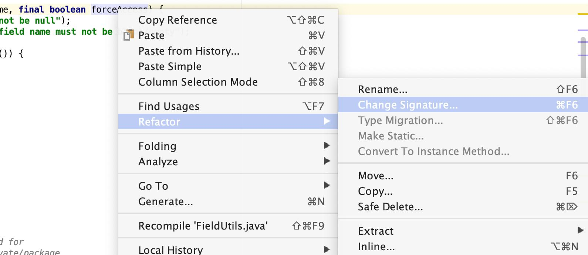

 
## Ressurser

* [En kort oversikt over refaktorering](../pdf/eilertsen-2021_background.pdf) – les 2.1, 2.2, og evt mer
* Den klassiske boken om **refaktorering**: Martin Fowler, [*Refactoring: Improving the Design of Existing Code*](https://martinfowler.com/books/refactoring.html)
* Den klassiske boken om **design patterns**: «Gang of Four», [*Design Patterns*](https://en.wikipedia.org/wiki/Design_Patterns)
* [refactoring.guru](https://refactoring.guru/) har bra oversikt over både [refaktorering](https://refactoring.guru/refactoring) og [design patterns](https://refactoring.guru/design-patterns) (som vist på forelesning)
* Mer info om hvordan profesjonelle utviklere gjør refaktorering: Anna Maria Eilertsen, [*Improving the Usability of Refactoring Tools for Software Change Tasks*](https://bora.uib.no/bora-xmlui/handle/11250/2834069)

## Automatisk refaktorering

I Eclipse, IntelliJ, VSCode og de fleste andre IDEer: **høyreklikk på den aktuelle delen av koden, velg *Refactor →* fra kontekstmenyen**.



* IntelliJ og Eclipse har bra støtte for de fleste vanlige refaktoreringer.
* VSCode henger etter – internt bruker den Eclipse sin implementasjon, men ikke all funksjonaliteten er tilgjengelig.

## Når bør du refaktorere?

* Når du implementerer nye ting, blir koden ofte litt rotete:
    * du må gjerne prøve ut ting litt før du vet hva som er den beste løsningen
    * du bruker kanskje «copy/paste-programmering» når du legger til funksjonalitet, og ender opp med duplisert kode
    * den «gamle» delen av systemet er kanskje ikke laget med tanke på den nye funksjonaliteten, så den nye implementasjonen blir mer komplisert enn strengt tatt nødvendig
* Det er helt greit å fokusere på å få ting til å funke først – men hvis du ikke rydder opp (refaktorerer) etterpå, blir systemet gradvis verre å vedlikeholde (dvs. endre, legge til funksjonalitet, finne/fikse feil, osv):
    * Hver gang du legger til / endre funksjonalitet uten å refaktorere etterpå, opparbeider du deg *technical debt* – hvis du ikke «betaler» gjelden (ved å rydde opp / refaktorere), blir fremtidig utvikling og vedlikehold dyrere
    * Slik kode er gjerne full av [«code smells»](https://refactoring.guru/refactoring/smells) – ingen har lyst til å jobbe med kode som stinker!
    * Et typisk eksempel på en code smell er metoder som fyller mer enn én skjerm.
* SonarQube, FindBugs og andre verktøy kan ofte hjelpe med å finne code smells.
    * Hvis du titter på *Measures*-tabben i [SonarQube](https://inf112.puffling.no/sonarqube/), kan du se hvor du har mest technical debt, og hvor lang tid det (estimert) vil ta å fikse det.
    * Du kan også få oversikt over duplisert kode, kode som er veldig komplisert (mange nøstede `if` for eksempel), kode som kan være vanskelig å vedlikeholde, osv.

**Hvis du refaktorere ofte, blir jobben enklere, og koden er enklere å jobbe med.** Første gangen du implementere noe, vet du som regel ikke helt hva du holder på med – men når du er «ferdig» har du bedre oversikt, forstår problemet bedre og kan finne gode løsninger. Da er tiden inne for å refaktorere (evt. reimplementere ting du er misfornøyd med), mens du ennå har ting friskt i minne. **Husk også å dokumentere!** (Alt som hører til *APIet* skal dokumenteres – hvis du er flink å bruke `interface` betyr det i praksis alle metoder i alle interfaces.)


## Essensielle automatiske refaktoreringer du bør kjenne til

* ***Rename*** – hjemmelekse: sjekk hvilken hurtigtast som gjør *Rename* i din IDE.
* ***Extract Interface*** – lager interface basert på klasse, og kan erstatte all bruk av klassen (i variabel- og parameterdeklarasjoner, f.eks.) med det nye interfacet.
* *Change Method Signature* – lar deg enkelt legge til, fjerne, eller flytte parametre.
* *Extract Method / Local Variable / Constant*
* *Move* – klasser fra en pakke til en annen, metoder fra en klasse til en annen, nøstede klasser til egen fil, etc
* + **kodegenerering** (som ikke er refaktorering, men likevel er et nyttig verktøy): f.eks. *Generate hashCode() and equals()*, og *Generate Delegate Methods* under *Source*-menyen i Eclipse.

Utforsk *Refactor*-menyen og [Refactoring Guru](https://refactoring.guru/refactoring) for flere nyttige ting.

## Eksempler


### Lage grensesnitt fra klasse

Anta at vi har en [klasse `Dog`](), og en mer eller mindre identisk [klasse `Penguin`]():

```java
public class Dog {
	private double x, y;
	private List<Texture> animationFrames = new ArrayList<>();

	public Dog(double x, double y) {
		this.x = x;
		this.y = y;
	}

	public void act(double deltaTime, double currentTime) {
		// do dog stuff
	}

	public void initialize() {
		animationFrames.add(new Texture(Gdx.files.internal("apple-1.png")));
		animationFrames.add(new Texture(Gdx.files.internal("apple-2.png")));
		animationFrames.add(new Texture(Gdx.files.internal("apple-3.png")));
		animationFrames.add(new Texture(Gdx.files.internal("apple-4.png")));
	}

	public void move(double dx, double dy) {
		x += dx;
		y += dy;
	}

	public void draw(SpriteBatch batch, double currentTime) {
		int frameNo = (int) (currentTime * 10);
		frameNo = frameNo % animationFrames.size();
		if (batch != null)
			batch.draw(animationFrames.get(frameNo), (float) x, (float) y);
	}
}
```

Applikasjonen vår oppretter objektene slik:

```java
	private Dog dog;
	private Penguin penguin;

    public void create() {
		dog = new Dog(50, 50);
		penguin = new Penguin(200, 200);

        dog.initialize();
		penguin.initialize();
        …
    }
```

Vi har lyst til å abstrahere vekk de konkrete klassene og gjemme de bak et grensesnitt, slik at vi slipper å ha egne variabler for alle de forskjellige typene objekter i systemet vårt. (Og fordi Anya sier vi skal bruke `interface`-navn i deklarasjoner!)

* **Kjør *Refactor → Extract interface* på `Dog`**.
    * Kall det nye grensesnittet `Actor` (e.l.)
    * Pass på at det er krysset av på *Use the extracted interface type where possible*, og *Use the extracted interface in `instanceof` expressions*.
    * Velg alle metodene, og klikk **Ok**

Applikasjonskoden endrer seg slik at `Dog`-variablen nå har type `Actor`:

```java
	private Actor dog;
	private Penguin penguin;
```


### Bruke grensesnitt i stedet for klasse

Selv om `Penguin` i praksis implementerer samme grensesnittet, må vi gi beskjed om det manuelt. Hvis vi endrer `Penguin` til:

```java
public class Penguin implements Actor { … }
```

så kan vi høreklikke på klassen, velge *Refactor → Use Supertype Where Possible*, og `penguin` variabelen får endret typen til `Actor`:

```java
	private Actor dog;
	private Actor penguin;
```

Vi kan så bli kvitt enkeltvariablene, og bruke en liste av `Actor` i stedet:

```java
	private List<Actor> actors;

	@Override
	public void create() {
		actors.add(new Dog(50, 50));
		actors.add(new Penguin(200, 200));
		
		actors.forEach(actor -> actor.initialize());
	}
```

### Bli kvitt `new KlasseNavn()`

Vi bruker fremdeles klassenavnet i `new Dog()` og `new Penguin()`, så applikasjonen er fremdeles avhengig av *konkrete klasser* i stedet for å bygge mest mulig på *abstraksjoner*.

Vi kan fikse dette med et par refaktoreringssteg:

* **Lag en ny, tom klasse `Actors`**
* **Høyreklikk på *navnet til konstruktøren*, og velg *Refactor → Introduce Factory...***
    * Velg `Actors` som *Factory class*
    * Kryss av for *Make constructor private*
* **Gjør dette for både `Dog` og `Penguin`

Klassen `Actors` har nå fått fylt inn:

```java
public class Actors {

	public static Dog createDog(double x, double y) {
		return new Dog(x, y);
	}

	public static Penguin createPenguin(double x, double y) {
		return new Penguin(x, y);
	}
}
```

mens `create()`-metoden har endret seg til:

```java
	public void create() {
		actors.add(Actors.createDog(50, 50));
		actors.add(Actors.createPenguin(200, 200));
        …
    }
```

* Vi kan putte fabrikkmetodene i en egen klasse `Actors`, slik vi har gjort her – som Java gjør i f.eks. `Streams`, `Collections`,  som inneholder en god del fabrikkmetoder.
* Eller vi kan putte de i samme klassen som objektet vi lager – på samme måte som f.eks. `Integer.valueOf()`. (Hvis du prøver deg på `new Integer(42)` får du vite at *The constructor `Integer(int)` has been deprecated since version 9 and marked for removal* – nå bør man bruke fabrikkmetoden `Integer.valueOf(42)` i stedet.)
    * Da er vi fremdeles avhengig av navnet på den konkrete klassen, men vi har i det minste litt mer kontroll over objektene som blir opprettet. F.eks. vil `Integer.valueOf(42)` alltid gi samme objektet (gjelder for små tall).
* Eventuelt kan vi putte dem i grensesnittet – se f.eks. `List.of(…)`. Det er en grei løsning hvis vi har et grensesnitt med bare én eller bare noen få implementasjoner.


### Felles superklasse

Legg til en ny, tom abstrakt klasse `AbstractActor`, og la `Dog` og `Penguin` arve fra den:

```java
public abstract class AbstractActor implements Actor { }
public class Dog extends AbstractActor implements Actor { … }
public class Penguin extends AbstractActor implements Actor { … }
```

Vi kan nå bruker *Pull Up* for å flytte ting fra subklassene opp i superklassen:

* Høyreklikk på `Penguin`-klassen, og velg *Refactor → Pull Up…*
* Marker alle metodene som skal være felles
* Trykk *Add Required* for å få med evt. feltvariabler og andre metoder som brukes av metodene du vil flytte
* Trykk *Next*
* Velg metoder som skal fjernes fra subklassene – her kan vi f.eks. velge `Dog` og få fjernet de felles metodene derfra.

Vi har nå fått fylt inn metoder og feltvariabler i `AbstractActor`:

```java
public abstract class AbstractActor implements Actor {
	protected double x;
	protected double y;
	private List<Texture> animationFrames = new ArrayList<>();

	public void act(double deltaTime, double currentTime) {
		// do penguin stuff
	}

	public void initialize() {
		animationFrames.add(new Texture(Gdx.files.internal("apple-1.png")));
		animationFrames.add(new Texture(Gdx.files.internal("apple-2.png")));
		animationFrames.add(new Texture(Gdx.files.internal("apple-3.png")));
		animationFrames.add(new Texture(Gdx.files.internal("apple-4.png")));
	}

	public void move(double dx, double dy) {
		x += dx;
		y += dy;
	}

	public void draw(SpriteBatch batch, double currentTime) {
		int frameNo = (int) (currentTime * 10);
		frameNo = frameNo % animationFrames.size();
		if (batch != null)
			batch.draw(animationFrames.get(frameNo), (float) x, (float) y);
	}
}
```

...og fjernet dem fra `Penguin`:

```java
public class Penguin extends AbstractActor implements Actor {
	Penguin(double x, double y) {
		this.x = x;
		this.y = y;
	}
}
```

*Men*, siden vi valgte å også fjerne metodene fra `Dog` så har vi mistet evt. kode som var forskjellig der – metoden med *do dog stuff*  er vekke:

```java
public class Dog extends AbstractActor implements Actor {
	private double x, y;
	private List<Texture> animationFrames = new ArrayList<>();

	Dog(double x, double y) {
		this.x = x;
		this.y = y;
	}

    // ingen act() med *do dog stuff*
}

```

Det er kanskje smartere å la metodene i `Dog` være, og så ordne opp i det som er duplisert kode etterpå. Eclipse fjerner (dessverre?) heller ikke feltvariablene som ble «pulled up» fra andre klasser enn den vi kjørte *Pull Up* på. Dvs. `Penguin` vil bruke `x`, `y`, og `animationFrames` som den arver fra `AbstractActor`, mens `Dog` har sine egne `x`, `y`, og `animationFrames` som overskygger de fra `AbstractActor`.

Dvs. vi må antakelig gjøre litt manuell refaktorering, og…

* Fjerne unødvendige feltvariabler fra subklassene
* Legge til en konstruktør i den abstrakte superklassen, som tar hånd om å initalisere de felles variablene.
* Justere de felles metodene slik at de får ønsket funksjonalitet – f.eks., kanskje vi trenger ekstra parametre eller en `protected` metode som forteller `initialize()` om den skal laste inn `penguin-X.png` eller `dog-X.png`.

Hvis *Pull Up*  er vanskelig å forstå (eller ikke tilgjengelig), går det an å flytte én og én metode, eller rett og slett bare klippe/lime koden fra subklasse til superklasse.

### Fikse flere problemer

Denne metoden er «smelly»:

```java
	public void initialize() {
		animationFrames.add(new Texture(Gdx.files.internal("apple-1.png")));
		animationFrames.add(new Texture(Gdx.files.internal("apple-2.png")));
		animationFrames.add(new Texture(Gdx.files.internal("apple-3.png")));
		animationFrames.add(new Texture(Gdx.files.internal("apple-4.png")));
	}
```

Et problem er at det gjentar (nesten) samme linjen flere ganger – vi bør bruke en løkke i stedet. Enten:

```java
public abstract class AbstractActor implements Actor {
	protected void initialize(List<String> fileNames) {
		for(String file : fileNames) {
			animationFrames.add(new Texture(Gdx.files.internal(file)));
		} // eller tilsvarende med List.of().foreach(file -> {})
    // …
}

public class Penguin extends AbstractActor implements Actor {
	public void initialize() {
		super.initialize(List.of("penguin-1.png", "penguin-2.png", "penguin-3.png", "penguin-4.png"));
	}
    // …
}
```

eller:

```java
public abstract class AbstractActor implements Actor {
	protected void initialize(String baseName, int numFrames) {
		for(int i = 1; i <= numFrames; i++>)
			animationFrames.add(new Texture(Gdx.files.internal(baseName + "-" + numFrames + ".png")));
		} 
    // …
}

public class Penguin extends AbstractActor implements Actor {
	public void initialize() {
		super.initialize("penguin", 4);
	}
    // …
}
```

### Et større problem

Koden over har et annet veldig stort problem: **vi bør definitivt ikke laste inn filer og opprette teksturer for hvert enkelt objekt**. Teksturene bør opprettes kun én gang, og gjenbrukes av alle objekter (på tvers av klasse) som skal bruke samme bilde.
