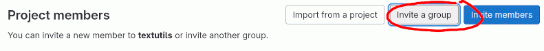
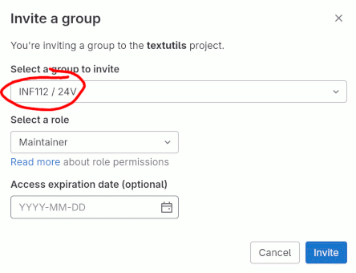
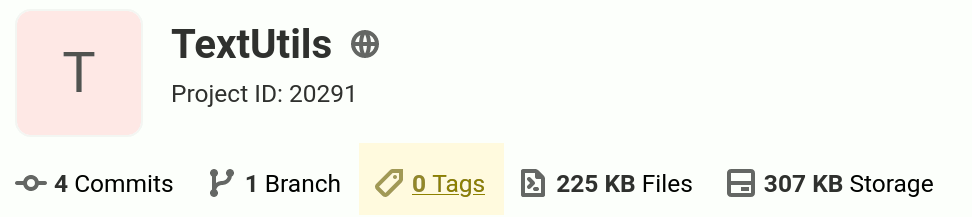
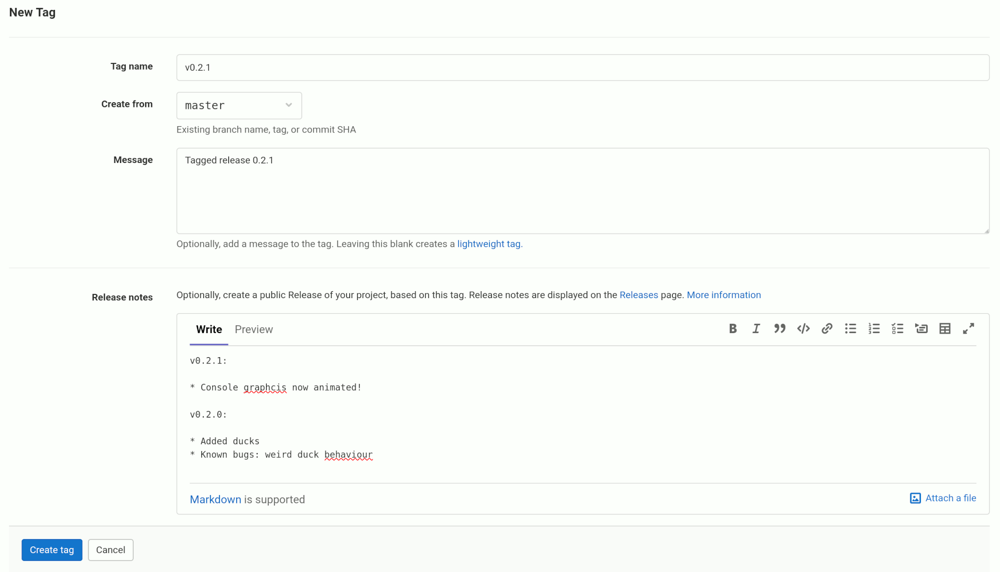

# Innlevering av inf112-prosjekt

Det er tre viktige steg:

* Dere må gi gruppelederne tilgang til prosjektet
* Dere må tagge committen som er «innleveringen»
* Send en melding til gruppeleder med lenke til prosjektet

Pass ellers på at tekst-delen av innleveringen er med og i Markdown-format (`doc/obligX.md`), og at den inneholder navnet på alle team-medlemmene og hvilken gruppe dere er på.

[Lag en GitLab gruppe](https://git.app.uib.no/groups/new) med alle team-medlemmene, og legg prosjektet der. GitLab har innebygget issue tracker, Wiki etc, som vi anbefaler at dere bruker. **VIKTIG:** sørg for at git-repoet ligger under gruppen deres, og ikke direkte under en av brukerne. Dvs. `git.app.uib.no/TEAMNAVN/PROSJEKTNAVN`. Prosjektet skal ha et relevant navn (ikke bare `libgdx-template` e.l.).

Todo-liste for prosjektoppsett:

1. [ ] Logg inn på [git.app.uib.no](https://git.app.uib.no/) med Feide / Dataporten. (Brukere som har logget inn med GitHub har færre rettigheter.)
2. [ ] Lag en [ny GitLab-gruppe](https://git.app.uib.no/groups/new), sett *Visibility* til *Private*.
3. [ ] Gå til *Manage → Members*, velg *Invite members* øverst til høyre, og legg til alle team-medlemmene (som *Owner* eller *Maintainer*)
4. [ ] Velg *Invite a group* øverst til høyre og legg til gruppen [INF112 / 25V](https://git.app.uib.no/inf112/25v), helst som *Maintainer*, men minimum som *Reporter* (*Guest* er ikke tilstrekkelig). Se bilde under.
    * Hvis dette av en eller annen grunn ikke virker, legg til bruker [Anya.Bagge](https://git.app.uib.no/Anya.Bagge) som *Maintainer*, så kan hun ordne korrekt tilgang automatisk
5. [ ] Fork en prosjekt-mal ([LibGDX](https://git.app.uib.no/inf112/25v/inf112.25v.libgdx-template/-/forks/new), [JavaFX](https://git.app.uib.no/inf112/25v/inf112.25v.javafx-template/-/forks/new)); under *Project URL*, velg gruppen som *Namespace*. (Alternativt, lag et nytt prosjekt og sett det opp manuelt.)

Hvis dere har valgt en Git-arbeidsflyt dere hver av dere har deres egen fork av prosjektet, pass på å gi tilgang til «hovedprosjektet», og pass på at alle team-medlemmene har merget inn sine endringer.

#### *Invite a group* – skjermbilde

## Tag innleverings-commit

*Først:* pass på at alt er pushet til GitLab og dere har integrert alle endringene dere vil ha med fra alle team-medlemmene.

For å lage ny tag i GitLab, trykk på `Tags` på linjen under overskriften på prosjektforsiden:

På neste side, velg *New Tag*, og fyll så inn informasjonen:

Det går også an å tagge fra kommandolinjen (push i såfall etterpå, og se at taggen er synlig i GitLab) med f.eks. `git tag -a v1.4 -m 'version 1.4'`. Pass på at du står på `master`-grenen og er oppdatert med alle endringer fra team-medlemmene.

